# Shopify 网站开发系统教程

> 面向有 2–3 年前端开发经验、但没有 Shopify 开发经验的前端工程师
>
> 目标：不是只会“改 Liquid”，而是建立 **Shopify 平台架构 → Theme → Liquid → Commerce Data Model → Market / Discount → App / Admin GraphQL → Webhook / Function → Headless / Hydrogen → Enterprise 扩展** 的完整心智模型。

---

> **课程精讲 + 平台开发者版（2026-09）**：这份文档已经从“Theme 课程笔记”升级为“学习教程 + 开发参考手册 + Shopify 平台开发者进阶课程”。
>
> Shopify Admin 的 UI 会持续迭代，并且部分功能会分批 rollout。文中给出的 Admin 路径以当前官方 Help Center 为依据；如果你的后台文字略有差异，请优先根据资源名称定位，并参考每章附带的官方链接。


### 本版每个核心对象都按同一套方式讲解

为了避免“知道概念，但不知道后台在哪、代码怎么写”，Product、Variant、Collection、Metafield、Metaobject、Inventory、Cart、Order 等核心对象会尽量包含以下模块：

| 模块 | 解决的问题 |
|---|---|
| **一句话定义** | 它到底是什么？ |
| **Admin 位置** | 商家在 Shopify 后台哪里看到它？ |
| **创建 / 配置流程** | 从零怎么创建？ |
| **数据关系图** | 它和其他对象怎么连接？ |
| **常用属性表** | Theme / API 开发最常用哪些字段？ |
| **示例代码** | Liquid / JavaScript 中怎么用？ |
| **易混淆对比** | 它和相似概念有什么本质区别？ |
| **常见场景** | 什么时候应该使用它？ |
| **官方文档** | 去哪里查看完整、最新定义？ |

## 阅读方式

这份教程由我们前面的完整学习过程重新整理而成，不是聊天记录的简单拼接。内容做了三件事：

1. **去重并重新排序**：把中途追问拆出来的知识重新放回最适合的位置。
2. **统一术语和边界**：例如 Product / Variant / Option、Cart / Cart Drawer、Metafield / Metaobject、App / Function。
3. **按当前 Shopify 官方文档修正细节**：例如一个 Product 最多 3 个 Options、最多 2,048 Variants；Search 的完整结果类型与 Predictive Search 的结果类型并不完全相同。

文中关键知识点尽量附 Shopify 官方文档，方便你从“理解”继续进入“查 API / 看实现”。

---

## 图解索引

如果某个概念第一次看比较抽象，可以先看对应图，再回到文字：

| 图 | 最适合解决的困惑 |
|---|---|
| [平台全局地图](content/assets/01-shopify-platform-map.png) | Shopify / Theme / App / Headless 到底什么关系 |
| [Theme 渲染流水线](content/assets/02-theme-rendering-pipeline.png) | Liquid 在哪运行、JS 在哪运行 |
| [Product / Option / Variant](content/assets/03-product-option-variant.png) | Option 与 Variant 为什么不是一回事 |
| [购买生命周期](content/assets/04-commerce-lifecycle.png) | Cart / Checkout / Order / Fulfillment |
| [多仓库存模型](content/assets/05-inventory-multi-location.png) | InventoryItem / Level / Location |
| [Section Rendering 时序](content/assets/06-section-rendering-sequence.png) | 为什么局部更新但 Liquid 仍在服务端执行 |
| [Collection URL State](content/assets/07-collection-url-state.png) | Filter / Sort / Pagination 与 URL |
| [Metafield / Metaobject](content/assets/08-metafield-metaobject.png) | 自定义字段与自定义对象的区别 |
| [Canonical](content/assets/09-seo-canonical.png) | 多 URL 与规范 URL |
| [Theme Performance](content/assets/10-theme-performance.png) | eager / lazy / JS / third-party 的优先级 |
| [Variant Selector 状态流](content/assets/11-variant-selector-state.png) | selectedOptions / selectedVariant / 可售状态如何联动 |
| [Add to Cart 完整链路](content/assets/12-add-to-cart-flow.png) | 从选中 Variant 到 Shopify Cart 的完整状态变化 |
| [Cart Drawer 架构](content/assets/13-cart-drawer-architecture.png) | Cart 数据、Section Rendering 与 Theme UI 的职责边界 |
| [价格解析链](content/assets/14-price-resolution-stack.png) | 基础价格、Market 价格、Discount、Checkout 最终金额 |
| [App 与认证架构](content/assets/15-app-oauth-architecture.png) | Merchant / Embedded UI / Backend / Admin API / Token 的关系 |
| [Admin GraphQL 心智模型](content/assets/16-admin-graphql-mental-model.png) | Query / Mutation / GID / Cursor / Cost |
| [Webhook 事件驱动同步](content/assets/17-webhook-event-driven.png) | Webhook、Queue、幂等与本地投影 |
| [Functions 执行边界](content/assets/18-functions-execution-boundary.png) | Theme JS、App Backend、Function 的可信边界 |
| [Theme 项目重构](content/assets/19-theme-refactor-boundaries.png) | Liquid / Component / Browser JS / Platform 分层 |
| [Headless / Hydrogen](content/assets/20-headless-hydrogen-stack.png) | Hydrogen、Storefront API 与 Shopify Commerce Backend |
| [Plus / Enterprise 扩展地图](content/assets/21-plus-enterprise-extension-map.png) | Checkout、B2B、Functions、Organization 等能力边界 |

# 目录

- [Part 0：先建立 Shopify 全局地图](#part-0先建立-shopify-全局地图)
- [Part 1：Theme 与 Liquid 基础架构](#part-1theme-与-liquid-基础架构)
- [Part 2：Product、Option 与 Variant](#part-2productoption-与-variant)
- [Part 3：Metafield 基础与自定义数据](#part-3metafield-基础与自定义数据)
- [Part 4：购买链路：Add to Cart、Cart Drawer、Checkout](#part-4购买链路add-to-cartcart-drawercheckout)
- [Part 5：活动价、Discount、Function 与 App 的边界](#part-5活动价discountfunction-与-app-的边界)
- [Part 6：Theme 深入：Collection](#part-6theme-深入collection)
- [Part 7：Theme 深入：Product Media](#part-7theme-深入product-media)
- [Part 8：Theme 深入：Search 与 Predictive Search](#part-8theme-深入search-与-predictive-search)
- [Part 9：Theme 深入：Filtering、Sort、Pagination 与 URL State](#part-9theme-深入filteringsortpagination-与-url-state)
- [Part 10：Theme SEO](#part-10theme-seo)
- [Part 11：Theme Performance](#part-11theme-performance)
- [Part 12：Shopify Commerce 数据模型深入](#part-12shopify-commerce-数据模型深入)
- [Part 13：Metafield 与 Metaobject 数据模型深入](#part-13metafield-与-metaobject-数据模型深入)
- [Part 14：核心对象速查](#part-14核心对象在哪里怎么建代码怎么拿速查)
- [Part 15：常见技术选型决策表](#part-15常见到底该用哪个决策表)
- [Part 16：综合实战：一个商品详情页如何把知识串起来](#part-16综合实战一个商品详情页如何把知识串起来)
- [Part 17：课程式精讲——保留原对话的逐步推导](#part-17课程式精讲保留原对话的逐步推导)
- [Part 18：从 Theme 开发者升级到 Shopify 应用与平台开发者](#part-18从-theme-开发者升级到-shopify-应用与平台开发者)
- [附录 A：Theme / App / Function / Headless 的职责表](#附录-atheme--app--function--headless-的职责表)
- [附录 B：常用 Shopify 官方文档索引](#附录-b常用-shopify-官方文档索引)
- [附录 C：你现在应该具备的心智模型](#附录-c你现在应该具备的心智模型)

---

# Part 0：先建立 Shopify 全局地图

## 0.1 Shopify 不是“一个模板系统”


### 从一个真实需求判断应该改哪一层

这是学习 Shopify 最值得尽早建立的能力。面对需求时，先判断“这个需求属于哪一层”，而不是先想着写 JavaScript。

| 需求 | 首选位置 | 为什么 |
|---|---|---|
| 商品页新增一个可配置 Banner | Theme Section / Block | 纯 Storefront UI，商家需要在 Theme Editor 配置 |
| 商品增加“材质”字段 | Product Metafield | 属于 Product 的结构化业务数据 |
| 多个商品共用一个“尺码表”对象 | Metaobject + reference Metafield | 数据是一个可复用、多字段对象 |
| 加购后无刷新打开 Cart Drawer | Theme JS + Ajax Cart API + Section Rendering | 属于前台交互 |
| 满 3 件打 8 折 | Discount / Shopify Function | 价格规则必须由 Shopify 可信后端执行 |
| ERP 同步库存 | App + Admin GraphQL API | 需要后台权限、认证、持久集成 |
| 完全用 Next.js 做商店 | Headless + Storefront API | 不再由 Liquid Theme 负责页面 |

> **判断口诀**：UI 看 Theme；业务数据看 Metafield / Metaobject；后台集成看 App；交易规则看 Function；完全自定义前端看 Headless。


很多前端第一次接触 Shopify，会把它理解成：

```text
Shopify = Liquid + HTML + CSS
```

这个理解太窄。

更准确的模型是：

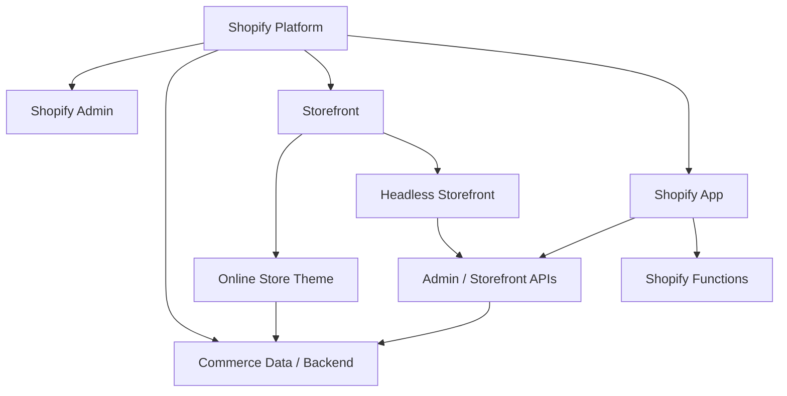

你可以先这样记：

- **Theme**：消费者看到的店铺前台体验。
- **Admin**：商家管理商品、订单、内容、设置的后台。
- **App**：给商家或 Shopify 平台扩展完整业务能力。
- **Function**：嵌入 Shopify 后端特定业务节点执行的规则逻辑。
- **Storefront API**：给 Headless / React / Hydrogen 等自定义 Storefront 使用。
- **Admin GraphQL API**：给 App、ERP、OMS、PIM、WMS 等后台系统管理 Shopify 数据。

官方入口：

- [Theme architecture](https://shopify.dev/docs/storefronts/themes/architecture)
- [Liquid reference](https://shopify.dev/docs/api/liquid)
- [About Shopify Functions](https://shopify.dev/docs/apps/build/functions)

---

## 0.2 Shopify 最核心的商业生命周期


### 先区分“资源对象”和“UI”

Shopify 教程里最容易把 UI 名称和数据对象混在一起。例如：

| 名称 | 是 Shopify 数据对象吗？ | 说明 |
|---|---:|---|
| Product | 是 | 商品主体 |
| Variant | 是 | 可购买规格 |
| Cart | 是 | 购物上下文 |
| Cart line | 是 | Cart 中的一条购买记录 |
| Cart Drawer | **不是** | Theme 自己实现的一种购物车 UI |
| Checkout | 是平台交易流程 | Shopify 托管的结账流程 |
| Order | 是 | 成交后的订单资源 |
| Product Card | **不是** | Theme 的展示组件 |

以后看到一个 Shopify 名词，先问自己：**它是数据资源、平台能力，还是 Theme UI？** 很多架构问题会立刻变简单。


先不要考虑代码，先把这一条链背下来：

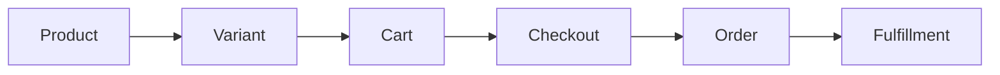

含义：

- **Product**：这是什么商品？
- **Variant**：具体买哪个规格？
- **Cart**：用户准备买什么？
- **Checkout**：用户正在完成交易。
- **Order**：交易完成后形成的订单。
- **Fulfillment**：订单如何拣货、包装、发货、履约。

后面所有 Theme、库存、订单、App 的知识，最终都会回到这条链。

---

# Part 1：Theme 与 Liquid 基础架构

## 1.0 在 Admin 哪里能看到 Theme？

**当前常见入口：** `Shopify Admin → Online Store → Themes`。

你会用到两个入口：

1. **Edit theme / Customize**：进入 Theme Editor，面向商家配置 Section、Block、颜色、字体、App embeds 等。
2. **Edit code**：进入代码编辑器，查看 `layout/`、`templates/`、`sections/`、`blocks/`、`snippets/`、`assets/` 等文件。

官方 Help Center：

- [The theme editor](https://help.shopify.com/en/manual/online-store/themes/customizing-themes/theme-editor)
- [Editing theme code](https://help.shopify.com/en/manual/online-store/themes/customizing-themes/edit-code/edit-theme-code)
- [Theme architecture](https://shopify.dev/docs/storefronts/themes/architecture)

> 开发实践中，先复制一份 Theme 作为开发/备份副本，再改代码，比直接在 live theme 上试错安全得多。


## 1.1 Theme 的标准目录

### 现代 Theme 中 Section、Block、Snippet 到底差在哪？

它们都像“组件”，但职责不同：

| 概念 | 是否可被商家配置 | 是否有 Schema | 典型粒度 | 类比 |
|---|---:|---:|---|---|
| Section | 是 | 是 | 页面模块 | 页面级业务组件 |
| Theme Block | 是 | 是 | 可嵌套的小模块 | 可视化编辑器中的可复用组件 |
| Section block | 是 | 由 Section schema 定义 | Section 内项目 | 组件内部的配置项 |
| Snippet | 否（自身没有编辑器配置） | 否 | 代码复用 | React helper component / partial |
| Template | 间接 | JSON 描述组合 | 页面类型 | route composition |
| Layout | 否 | 否 | 全站外壳 | Root Layout |

一个实用判断：

- 商家需要在编辑器里“添加/删除/排序/配置” → 优先考虑 **Section / Block**。
- 只是开发者想复用一段渲染逻辑 → 用 **Snippet**。
- 想决定 Product 页面由哪些 Sections 组成 → 看 **`templates/product.json`**。

> 新版 Shopify Theme 架构里还存在独立的 `blocks/` 目录，不要只停留在早期 “Section + Section blocks” 的认知。


Shopify Theme 使用固定的目录结构。典型结构：

```text
theme/
├── layout/
│   └── theme.liquid
├── templates/
│   ├── index.json
│   ├── product.json
│   ├── collection.json
│   ├── search.json
│   └── cart.json
├── sections/
│   ├── header.liquid
│   ├── footer.liquid
│   ├── main-product.liquid
│   └── main-collection-product-grid.liquid
├── snippets/
│   ├── product-card.liquid
│   └── price.liquid
├── assets/
│   ├── theme.css
│   ├── theme.js
│   └── product.js
├── config/
└── locales/
```

官方文档： [Theme architecture](https://shopify.dev/docs/storefronts/themes/architecture)

### 你应该怎样理解它们？

| 概念 | 类比前端框架 | 作用 |
|---|---|---|
| `layout/theme.liquid` | App Shell / Root Layout | 整个店铺 HTML 外壳 |
| Template | Route Page Composition | 决定某类页面由哪些 Section 组成 |
| Section | 可配置业务组件 | 商品主区域、Banner、Collection Grid |
| Block | Section 内的子组件 | 标题、价格、按钮等可配置块 |
| Snippet | 小型可复用组件 | Product Card、Price、Icon |
| Assets | 静态资源 | CSS / JS / 图片等 |
| Config | Theme 配置 | Theme Editor 设置 |
| Locales | i18n | 多语言文本 |

---

## 1.2 `theme.liquid` 是 Theme 的总入口


### `content_for_header` 为什么不能删？

`{{ content_for_header }}` 不是你自己配置的一段字符串，而是 Shopify 的平台注入点。它可能承载 Shopify 平台和 App 所需的 `<script>`、元信息以及运行时内容。你应该把它当成“平台保留插槽”，而不是依赖它当前输出的具体 HTML。

### `content_for_layout` 又是什么？

它负责把当前 URL 对应 Template 的主体内容放进 Layout。一个简化链路是：

```text
URL
 ↓
Shopify 判断页面类型
 ↓
选择 Template
 ↓
Template 组合 Sections
 ↓
Section 执行 Liquid
 ↓
content_for_layout
 ↓
theme.liquid 的 <body>
```

这也是为什么 `theme.liquid` 很像 Next.js 的 Root Layout，但 **Liquid 的渲染发生在 Shopify 服务器**，不是浏览器 hydration。


一个非常简化的骨架：

```liquid
<!doctype html>
<html>
<head>
  <meta charset="utf-8">
  <meta name="viewport" content="width=device-width, initial-scale=1">

  <title>{{ page_title }}</title>

  
    <meta name="description" content="{{ page_description | escape }}">
  

  <link rel="canonical" href="{{ canonical_url }}">

  {{ content_for_header }}
</head>
<body>
  

  <main>
    {{ content_for_layout }}
  </main>

  
</body>
</html>
```

这里有两个必须理解的特殊对象。

### `{{ content_for_header }}`

它是 Shopify 平台在 `<head>` 中的动态注入入口。官方定义为：动态返回 Shopify 所需脚本等内容，并且 **`theme.liquid` 中必须包含它**。

不要尝试解析、替换它内部输出，因为其内容可能变化。

官方文档： [content_for_header](https://shopify.dev/docs/api/liquid/objects/content_for_header)

### `{{ content_for_layout }}`

它动态返回当前 Template 对应的页面主体内容，应该位于 `<body>` 中。

官方文档： [content_for_layout](https://shopify.dev/docs/api/liquid/objects/content_for_layout)

可以把两者记成：

```text
theme.liquid
│
├── <head>
│     └── content_for_header
│          Shopify / 平台运行时内容
│
└── <body>
      └── content_for_layout
           当前页面 Template / Sections
```

---

## 1.3 Liquid 到底运行在哪里？

### 一次 Product 请求里发生了什么？

假设浏览器请求：

```text
/products/classic-shirt
```

Shopify 大致执行：

```text
1. 根据 handle 找到 Product
2. 建立当前请求上下文：product / cart / shop / request / localization ...
3. 选择 product template
4. 按 template 渲染 Sections
5. 执行 Liquid tags / filters
6. 生成最终 HTML
7. 浏览器下载 HTML、CSS、JS、图片
8. JavaScript 再接管 Variant 切换、Cart Drawer 等动态行为
```

因此以下代码：

```liquid
<h1>{{ product.title }}</h1>
```

浏览器实际拿到的是：

```html
<h1>Classic T-Shirt</h1>
```

浏览器**不会**拿到 `{{ product.title }}`。这条边界是理解 Liquid + JS 协作方式的基础。


这是 Shopify Theme 最重要的基础概念之一。

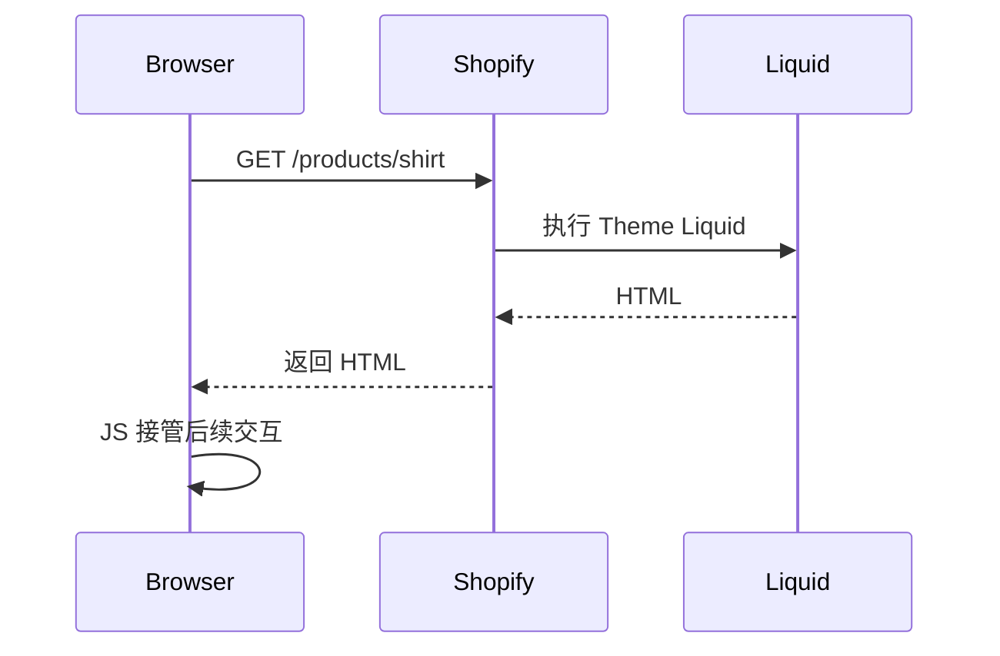

Liquid 是 **服务端模板语言**。

所以：

```liquid
{{ product.title }}
```

不是浏览器里的 JavaScript 在运行，而是在 Shopify 服务端渲染 HTML 时执行。

用户在浏览器中点击：

```text
Black → White
```

Liquid **不会自动重新执行**。之后的 Variant 切换、Gallery、Cart Drawer 等交互，要靠 JavaScript，或者重新请求 Shopify 的 HTML（例如 Section Rendering API）。

---

## 1.4 Liquid 三个核心概念

### 常见 Liquid 数据来源也要分层理解

| 来源 | 示例 | 生命周期 |
|---|---|---|
| 全局对象 | `shop`、`cart`、`request`、`routes`、`localization` | 多数页面可用 |
| 页面对象 | `product`、`collection`、`search`、`article` | 仅对应页面上下文存在 |
| Theme settings | `settings.xxx`、`section.settings.xxx` | 来自 Theme Editor |
| Block settings | `block.settings.xxx` | 当前 Block 配置 |
| Custom data | `product.metafields...`、`metaobjects...` | 来自 Admin 自定义数据 |

**常见错误：**在不是 Product 页面/上下文的位置，默认认为 `product` 一定存在。可复用 Snippet 最好显式传参：

```liquid

```

这样依赖更清楚，也更接近普通前端组件的 props 思维。


### Output

```liquid
{{ product.title }}
```

输出数据。

### Tags / Logic

```liquid

  In stock

```

控制逻辑。

### Filters

```liquid
{{ product.price | money }}
```

将数据转换成适合展示的格式。

官方总参考： [Liquid reference](https://shopify.dev/docs/api/liquid)

---

## 1.5 一个 Section 从代码到 Theme Editor 的完整过程

抽象地说“Section 是可配置组件”还不够。下面看它为什么能出现在 Theme Editor。

`sections/promo-banner.liquid`：

```liquid
<section class="promo-banner" style="--space: {{ section.settings.spacing }}px">
  
    <h2>{{ section.settings.heading | escape }}</h2>
  

  
    <a href="{{ section.settings.link }}">
      {{ 'general.shop_now' | t }}
    </a>
  
</section>


  .promo-banner {
    padding-block: var(--space);
  }



{
  "name": "Promo banner",
  "settings": [
    {
      "type": "text",
      "id": "heading",
      "label": "Heading"
    },
    {
      "type": "url",
      "id": "link",
      "label": "Link"
    },
    {
      "type": "range",
      "id": "spacing",
      "min": 0,
      "max": 80,
      "step": 4,
      "unit": "px",
      "label": "Vertical spacing",
      "default": 24
    }
  ],
  "presets": [
    {
      "name": "Promo banner"
    }
  ]
}

```

然后你会在 Theme Editor 中看到对应的 Heading、Link、Spacing 配置。

### 这里的三层数据不要混

```text
section.settings.heading
        ↑
Theme Editor 中这个 Section 实例的配置

product.title
        ↑
Shopify Product 数据

product.metafields.custom.subtitle.value
        ↑
Product 的 Custom Data
```

它们都能输出文本，但**数据所有者完全不同**。

> 生产级 Theme 还应把 schema labels、前台文案放入 locales，并遵循 Theme 的组件规范。上面示例重点是解释 Section → schema → Theme Editor 的连接。

官方：

- [Sections](https://shopify.dev/docs/storefronts/themes/architecture/sections)
- [Section schema](https://shopify.dev/docs/storefronts/themes/architecture/sections/section-schema)
- [Theme blocks quick start](https://shopify.dev/docs/storefronts/themes/architecture/blocks/theme-blocks/quick-start)

---

# Part 2：Product、Option 与 Variant


## 2.0 Product 在 Shopify Admin 的位置和创建流程

**Admin 位置：** `Products`。

创建一个最基础 Product：

1. 进入 `Shopify Admin → Products`。
2. 点击 **Add product**。
3. 输入 Title；根据业务补充 Description、Media、Category、Vendor、Pricing、Inventory、Shipping、Metafields 等。
4. 如果商品存在 Size / Color 等规格，在 Variants / Options 区域添加选项。
5. 设置 Publishing / Status 后保存。

官方 Help Center：

- [Adding and updating products](https://help.shopify.com/en/manual/products/add-update-products)
- [Products overview](https://help.shopify.com/en/manual/products)

开发文档：

- [Liquid `product` object](https://shopify.dev/docs/api/liquid/objects/product)
- [Liquid `variant` object](https://shopify.dev/docs/api/liquid/objects/variant)


## 2.1 Product 是什么？

### Product 常用 Liquid 属性

下面不是全部属性，而是 Theme 开发最常碰到的一组。完整定义以官方 `product` object 文档为准。

| 属性 | 含义 | 常见场景 |
|---|---|---|
| `product.id` | Product ID | DOM data 属性、调试、第三方集成 |
| `product.title` | 商品标题 | PDP 标题、Product Card |
| `product.handle` | URL 友好标识 | 构造/理解 `/products/:handle` |
| `product.url` | 当前 Product 相对 URL | 商品链接，优先于手拼 URL |
| `product.description` | HTML 商品描述 | PDP 详情区 |
| `product.vendor` | Vendor | 品牌/供应商展示、筛选 |
| `product.type` | Product type | 分类展示、业务规则 |
| `product.tags` | Tag 数组 | 标记、兼容旧业务逻辑 |
| `product.available` | 是否至少存在可购买 Variant | Product Card 售罄状态 |
| `product.price` | 当前语义下的商品价格值 | 起始价/基础价格展示 |
| `product.price_min` / `price_max` | Variant 最低/最高价 | “From $…” |
| `product.price_varies` | Variant 是否不同价 | 是否展示 price range |
| `product.options_with_values` | Option + values | Variant Selector |
| `product.variants` | Variant 集合 | 规格逻辑；高 Variant 商品要避免过度读取 |
| `product.variants_count` | Variant 总数 | 判断复杂商品 |
| `product.selected_variant` | URL 明确选中的 Variant | `?variant=` 场景 |
| `product.selected_or_first_available_variant` | 已选或第一个可售 Variant | PDP 初始化 |
| `product.featured_media` | 主 Media | 商品首屏 |
| `product.media` | 所有 Media | Gallery |
| `product.collections` | 所属 Collection | 面包屑/关联展示（注意不要据此假设唯一父级） |
| `product.metafields` | Product 自定义数据 | 材质、产地、内容扩展 |

一个典型商品头部：

```liquid


<article data-product-id="{{ product.id }}">
  <h1>{{ product.title | escape }}</h1>

  <p>
    {{ current_variant.price | money }}
  </p>

  
    <p>{{ product.vendor | escape }}</p>
  
</article>
```

> **性能提醒**：现代 Shopify 支持高 Variant 商品。不要因为 `product.variants` 可以访问，就默认把所有 Variant 的完整 JSON 输出到页面；只输出交互真正需要的数据。


Product 是消费者认知上的商品主体。

例如：

```text
Classic T-Shirt
```

它拥有：

```text
Product
├── title
├── description
├── vendor
├── product_type
├── tags
├── options
├── variants
├── media
├── collections
└── metafields
```

Liquid 官方对象： [product](https://shopify.dev/docs/api/liquid/objects/product)

---

## 2.2 Option 是“选择维度”

### Option 在 Admin 哪里配置？

进入：`Products → 打开某个 Product → Variants / Options`。

如果商品还没有 Option，通常点击类似 **Add options like size or color** 的入口。当前 Shopify 规则下，一个 Product 最多有 **3 个 Options**；例如：

```text
Color
Size
Material
```

Option 的 value 才是：

```text
Color: Black / White
Size: S / M / L
```

官方 Help Center：[Adding variants](https://help.shopify.com/en/manual/products/variants/add-variants)

### `product.options` 和 `product.options_with_values` 对比

| API | 返回重点 | 适合场景 |
|---|---|---|
| `product.options` | Option 名称 | 只想知道有哪些维度 |
| `product.options_with_values` | Option 名称、values、选中/可用信息 | Variant Selector |

Variant Selector 通常优先从 `options_with_values` 渲染 UI，而不是自己从 Variant title 字符串拆 `Black / M`。


例如 T-Shirt：

```text
Color
├── Black
└── White

Size
├── S
├── M
└── L
```

这里：

- `Color` 是一个 Option。
- `Black` / `White` 是 Option Values。
- `Size` 是另一个 Option。

Liquid 中常见：

```liquid
product.options
product.options_with_values
product.options_by_name
```

### `product.options`

概念上：

```json
["Color", "Size"]
```

只有 Option 名称。

### `product.options_with_values`

概念上：

```json
[
  {
    "name": "Color",
    "values": ["Black", "White"]
  },
  {
    "name": "Size",
    "values": ["S", "M", "L"]
  }
]
```

它更适合做 Variant Selector。

---

## 2.3 Variant 是真正可购买的具体规格

### Variant

在库存链路里 Variant 回答的是：**“哪个具体可购买规格？”**

例如：

```text
Classic T-Shirt / Black / M
SKU: TS-BLK-M
```

它有价格、Option values、SKU 等商品/交易信息，但多 Location 库存不应被简化成 Variant 上的一个全局 `stock` 数字。

#### 在 Admin 里是什么？

进入：`Products → 某个 Product → Variants`，点击具体 Variant 后可以编辑该规格自己的价格、库存、SKU、Barcode、Shipping/Customs 等信息。

Variant 不是“一个选项值”，而是所有选项值的一次具体组合：

```text
Color = Black
Size  = M
       ↓
Variant = Black / M
```

### Variant 常用 Liquid 属性

| 属性 | 含义 | 常见场景 |
|---|---|---|
| `variant.id` | Variant ID | **Add to Cart 最关键的 ID** |
| `variant.title` | 组合标题 | `Black / M` |
| `variant.price` | Variant 当前价格 | 切规格后更新价格 |
| `variant.compare_at_price` | 划线参考价 | Sale UI |
| `variant.available` | 当前是否可购买 | 禁用按钮/售罄状态 |
| `variant.sku` | 商家 SKU | ERP/WMS/后台展示 |
| `variant.barcode` | 条码 | POS、仓储扫描 |
| `variant.options` | 当前 Variant 的 option values | 匹配规格 |
| `variant.options_with_values` | 带结构的 option/value 信息 | 更现代的 Variant UI |
| `variant.featured_media` / `featured_image` | 规格关联媒体 | 选择颜色后切图 |
| `variant.inventory_management` | 库存管理方式 | 库存语义判断 |
| `variant.inventory_policy` | 售罄后是否允许继续售卖等策略 | 可售逻辑理解 |
| `variant.inventory_quantity` | Variant 库存数量语义 | 仅在明确理解库存模型时使用；不要替代多 Location 库存模型 |
| `variant.url` | 该 Variant 对应 URL | 保留规格选择状态 |

官方文档：[Liquid `variant` object](https://shopify.dev/docs/api/liquid/objects/variant)


Color + Size 的组合会形成 Variant：

```text
Black / S
Black / M
Black / L
White / S
White / M
White / L
```

每个 Variant 都可以拥有独立：

- ID
- SKU
- Barcode
- Price
- Compare-at Price
- Availability
- Inventory
- Media

Liquid 官方对象： [variant](https://shopify.dev/docs/api/liquid/objects/variant)

核心关系：

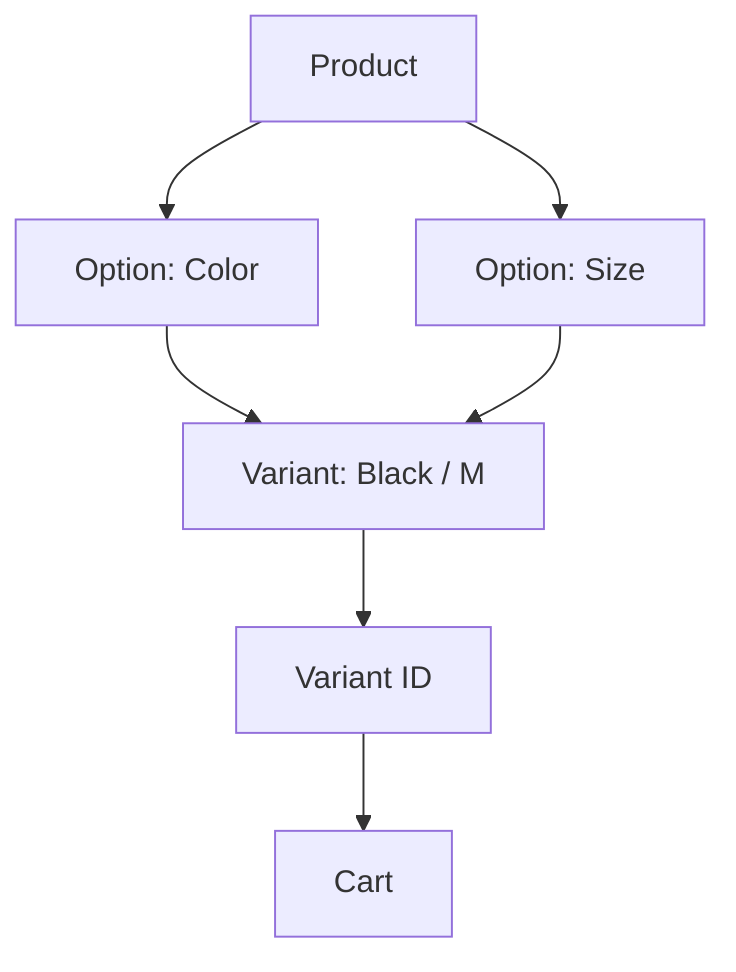

一句话：

> **Option 是用户选择规格的维度；Variant 是这些选择组合后真正可以购买的 SKU。**

---

## 2.4 Variant 数量限制

截至当前 Shopify 官方资料：

- 一个 Product 最多 **3 个 product options**。
- 一个 Product 最多 **2,048 Variants**。

官方：

- [Adding variants](https://help.shopify.com/en/manual/products/variants/add-variants)
- [2,048 variant limit changelog](https://shopify.dev/changelog/the-product-variant-limit-is-now-2048-for-all-merchants)

> 不要用旧教程里的“100 Variants 上限”继续做架构假设。


当前 Shopify：

- 一个 Product 最多 **3 个 Options**。
- 默认最多 **2,048 个 Variants**。

官方：

- [Support product variants](https://shopify.dev/docs/storefronts/themes/product-merchandising/variants)
- [Shopify Help - Adding variants](https://help.shopify.com/en/manual/products/variants/add-variants)

例如：

```text
Color = 10
Size = 10
Material = 10

10 × 10 × 10 = 1000
```

理论组合 1000，没有超过 2048。

但要注意：

> **Option 的理论组合空间，不一定等于实际创建的 Variant 数量。**

业务可以只创建部分有效组合。

---

## 2.5 `product.variants` 是什么？

`product.variants` 是当前 Product 的 Variant 集合。

```liquid

  {{ variant.id }}
  {{ variant.title }}
  {{ variant.price | money }}
  {{ variant.available }}

```

对于：

```text
Color = Black
Size = M
```

某个 Variant 概念上：

```js
{
  id: 102,
  title: 'Black / M',
  options: ['Black', 'M'],
  price: 2999,
  available: true
}
```

注意：这只是帮助理解，不是完整官方 JSON Schema。

---

## 2.6 第 7 课：Variant Selector 实战——从 Option 选择到唯一 Variant

> 这一节故意讲得比“API 速查”更慢。因为 Variant Selector 是 Shopify Theme 开发中第一个真正把 **Liquid 首屏渲染、浏览器状态、Product 数据模型、URL、Media、价格、库存和 Add to Cart** 串起来的功能。


官方参考：

- [Liquid `product` object](https://shopify.dev/docs/api/liquid/objects/product)
- [Liquid `variant` object](https://shopify.dev/docs/api/liquid/objects/variant)
- [Product template overview](https://shopify.dev/docs/storefronts/themes/architecture/templates/product/overview)
- [Avoid over-fetching product variants](https://shopify.dev/docs/storefronts/themes/best-practices/performance/avoid-variant-overfetching)

### 2.6.1 先明确：Variant Selector 到底在解决什么？

假设商品在 Admin 中配置：

```text
Product: Classic T-Shirt

Options:
Color: Black / White
Size: S / M / L
```

Shopify 真实可购买的是这些 Variant：

```text
Black / S
Black / M
Black / L
White / S
White / M
White / L
```

用户在 UI 里做的是：

```text
Color = Black
Size = M
```

但购物车真正需要的是：

```text
Variant ID = 102
```

所以 Variant Selector 的本质不是“做两个下拉框”，而是：

```text
Option Values
      ↓
selectedOptions
      ↓
解析为唯一 Variant
      ↓
selectedVariant
      ↓
同步价格 / 图片 / URL / 库存 / Add button
```

如果这一层关系没有想清楚，后面很容易出现“选择 UI 是对的，但加购加错 SKU”的问题。

---

### 2.6.2 第一步：Liquid 负责首屏，不要一开始就让 JS 接管整个商品页

Product 页面第一次打开时，Shopify 已经知道当前 Product，也可能通过 `?variant=` 知道当前 Variant。

所以首屏应该先由 Liquid 输出：

```liquid


<h1>{{ product.title | escape }}</h1>

<p data-product-price>
  {{ current_variant.price | money }}
</p>

<input
  type="hidden"
  name="id"
  value="{{ current_variant.id }}"
  data-variant-id
>
```

这一阶段浏览器即使 JavaScript 还没执行，用户也已经能看到：

```text
标题
价格
默认 Variant
```

这就是 Shopify Theme 常见的思想：

> **Liquid 负责首屏真实 HTML，JavaScript 负责后续交互增强。**

---

### 2.6.3 第二步：不要从 Variant title 拆字符串，应该从 Option 数据渲染选择器

不推荐把：

```text
Black / M
```

用 `split('/')` 拆回 Color 和 Size。

因为 Product 已经有结构化 Option 数据：

```liquid

  <fieldset data-option-position="{{ option.position }}">
    <legend>{{ option.name | escape }}</legend>

    
      <label>
        <input
          type="radio"
          name="option-{{ option.position }}"
          value="{{ option_value | escape }}"
          checked
          disabled
        >
        {{ option_value }}
      </label>
    
  </fieldset>

```

你应该理解为：

```text
product.options_with_values
        ↓
Theme 渲染 Option UI
        ↓
用户选择 Option Value
```

而不是：

```text
Variant title
↓
自己猜字符串结构
```

---

### 2.6.4 第三步：浏览器中需要一个 `selectedOptions` 状态

假设用户刚进入页面：

```js
const state = {
  selectedOptions: {
    Color: 'Black',
    Size: 'M'
  }
};
```

如果用 React 思维，它其实很像：

```text
Component State
└── selectedOptions
    ├── Color
    └── Size
```

Shopify Theme 没有 React 的 `useState`，但是 JavaScript 一样可以维护状态。

例如：

```js
const selectedOptions = {};

function readSelectedOptions() {
  document
    .querySelectorAll('[data-option-position]')
    .forEach((group) => {
      const checked = group.querySelector('input:checked');

      if (!checked) return;

      const optionName = group.querySelector('legend').textContent.trim();
      selectedOptions[optionName] = checked.value;
    });

  return selectedOptions;
}
```

教学上可以先这样写，真实项目建议不要依赖 `legend.textContent` 当业务 key，而是把 Option name / position 放进 `data-*`。

---

### 2.6.5 第四步：`selectedOptions` 还不是 `selectedVariant`

这是非常容易混淆的一步。

```js
selectedOptions = {
  Color: 'Black',
  Size: 'M'
};
```

只是：

> 用户目前选择了什么。

真正要加购的对象应该是：

```js
selectedVariant = {
  id: 102,
  title: 'Black / M',
  price: 2999,
  available: true
};
```

所以商品页实际上至少有两个不同状态：

```text
selectedOptions
      ↓ 解析
selectedVariant
```

如果再加 Quantity：

```js
const state = {
  selectedOptions: {
    Color: 'Black',
    Size: 'M'
  },

  selectedVariant: {
    id: 102,
    price: 2999,
    available: true
  },

  quantity: 1
};
```

React 思维：

```text
State
├── selectedOptions
├── selectedVariant
└── quantity
```

这就是为什么 Variant Selector 不只是一个 UI 控件，它实际上是商品页状态管理的一部分。

---

### 2.6.6 第五步：如何从 Option Values 找到 Variant？

为了讲清楚算法，可以先假设页面有少量 Variants，并输出必要数据。

教学版：

```liquid
<script type="application/json" data-product-variants>
  {{ product.variants | json }}
</script>
```

浏览器：

```js
const variants = JSON.parse(
  document.querySelector('[data-product-variants]').textContent
);
```

假设 Variant 数据：

```js
[
  {
    id: 101,
    options: ['Black', 'S'],
    price: 2999,
    available: true
  },
  {
    id: 102,
    options: ['Black', 'M'],
    price: 2999,
    available: true
  },
  {
    id: 103,
    options: ['Black', 'L'],
    price: 2999,
    available: false
  }
]
```

那么：

```js
function findVariant(selectedValues) {
  return variants.find((variant) =>
    variant.options.every(
      (value, index) => value === selectedValues[index]
    )
  );
}
```

调用：

```js
const variant = findVariant(['Black', 'M']);
```

得到：

```js
{
  id: 102,
  options: ['Black', 'M'],
  price: 2999,
  available: true
}
```

流程就是：

```text
['Black', 'M']
      ↓
遍历 Variants
      ↓
variant.options 完全匹配
      ↓
Black / M
      ↓
Variant ID = 102
```

---

### 2.6.7 但是实际项目不能这么简单：用户可能根本没有选完整

真实商品页首先要判断：

```text
variant
```

是否存在。

比如用户只选择了：

```text
Color = Black
Size = null
```

那么：

```text
selectedOptions
```

是不完整的。

最终：

```js
variant
```

可能是：

```js
undefined
```

这时候当然不能加购。

所以：

```js
if (!variant) {
  return;
}
```

但真实 UI 不应该只是静默 `return`，而应该把状态反馈给用户：

```js
if (!variant) {
  showProductError('Please select all options');
  return;
}
```

---

### 2.6.8 Variant 存在也不代表可以买：还要检查 `available`

比如：

```text
Black / L
```

Variant 确实存在，但库存/销售规则导致：

```js
variant.available === false
```

那么 Add to Cart 必须进入售罄状态。

```js
if (!variant.available) {
  showProductError('This variant is sold out');
  return;
}
```

所以判断顺序应该是：

```text
Option 是否选完整？
       ↓
是否能找到 Variant？
       ↓
Variant 是否 available？
       ↓
才允许 Add to Cart
```

---

### 2.6.9 Add to Cart 按钮不是一个固定按钮，它应该反映 Variant 状态

例如：

```js
function updateAddButton(variant) {
  const button = document.querySelector('[data-add-to-cart]');

  if (!variant) {
    button.disabled = true;
    button.textContent = 'Choose options';
    return;
  }

  if (!variant.available) {
    button.disabled = true;
    button.textContent = 'Sold out';
    return;
  }

  button.disabled = false;
  button.textContent = 'Add to cart';
}
```

这意味着按钮其实是：

```text
selectedVariant
      ↓
派生 UI 状态
      ↓
Add button
```

而不是按钮自己决定业务逻辑。

---

### 2.6.10 选择 Variant 后，至少应该同步哪些 UI？

一个成熟 Product 页面通常要同步：

| UI | 数据来源 | 为什么 |
|---|---|---|
| Price | `selectedVariant.price` | 不同 Variant 可能不同价 |
| Compare-at Price | `compare_at_price` | Sale UI |
| SKU | `selectedVariant.sku` | 商品信息展示 |
| Availability | `available` | 控制 Add button |
| Variant ID input | `variant.id` | Product Form / Cart 真正提交的 ID |
| Featured Media | Variant media | 颜色切换图片 |
| URL | Variant URL / `?variant=` | 刷新、分享、Back/Forward 保留状态 |

例如更新隐藏 input：

```js
function updateVariantInput(variant) {
  const input = document.querySelector('[data-variant-id]');
  input.value = variant ? variant.id : '';
}
```

价格：

```js
function updatePrice(variant) {
  const price = document.querySelector('[data-product-price]');

  if (!variant) {
    price.textContent = '';
    return;
  }

  price.textContent = formatMoney(variant.price);
}
```

这里 `formatMoney` 可以由 Theme 自己的 money formatter / Section Rendering 等方案实现；不要把示例函数名误认为 Shopify 内置浏览器 API。

---

### 2.6.11 为什么还要同步 URL？

假设用户选择：

```text
Black / M
```

页面 URL 可以变成：

```text
/products/classic-t-shirt?variant=102
```

这样有几个好处：

```text
刷新页面
→ 仍然是 Black / M

复制链接给别人
→ 对方打开同一个 Variant

浏览器 Back / Forward
→ 更容易保持用户状态
```

例如：

```js
function updateVariantUrl(variant) {
  if (!variant) return;

  const url = new URL(window.location.href);
  url.searchParams.set('variant', variant.id);

  history.replaceState({}, '', url);
}
```

为什么用：

```js
new URL()
```

而不是：

```js
location.href + '?variant=' + variant.id
```

因为当前 URL 可能已经有其它 query 参数，手工字符串拼接很容易产生：

```text
?foo=1?variant=102
```

或丢失已有参数。

---

### 2.6.12 Variant 选择通常还会影响 Media

例如：

```text
Color = Black
```

应该把 Gallery 切换到黑色商品图。

概念流程：

```text
Option Change
     ↓
selectedVariant
     ↓
selectedVariant.featured_media
     ↓
找到对应 Gallery item
     ↓
切换 / scroll / select media
```

这也是为什么 Product Media 和 Variant Selector 通常不是两个完全独立的组件。

---

### 2.6.13 一个更完整的浏览器状态模型

可以把商品页理解成：

```js
const productState = {
  selectedOptions: {},
  selectedVariant: null,
  quantity: 1,
  loading: false,
  error: null
};
```

其中：

```text
selectedOptions
→ 用户选了什么

selectedVariant
→ Shopify 中对应哪个 SKU

quantity
→ 用户买几个

loading
→ 当前是否正在加购

error
→ 选择/库存/网络是否出现问题
```

如果以后把同样逻辑移到 React / Hydrogen，你会发现状态模型几乎没变，只是状态管理工具换了。

---

### 2.6.14 Option Change 的完整处理过程

```js
function handleOptionChange() {
  const selectedValues = readSelectedValues();
  const variant = findVariant(selectedValues);

  productState.selectedOptions = selectedValues;
  productState.selectedVariant = variant ?? null;

  updatePrice(variant);
  updateVariantInput(variant);
  updateAddButton(variant);
  updateMedia(variant);
  updateVariantUrl(variant);
}
```

注意顺序：

```text
读取 UI
  ↓
算业务状态
  ↓
保存 state
  ↓
再同步多个 UI
```

不要让每个 UI 各自重新猜一次 Variant。

否则容易出现：

```text
价格认为当前是 Variant A
图片认为当前是 Variant B
Add button 又拿了旧 Variant ID
```

统一的 `selectedVariant` 可以避免这种状态漂移。

---

### 2.6.15 实际 Add to Cart 前仍然要重新做保护判断

即使按钮已经被禁用，也不要认为：

```text
用户绝对不可能触发 addToCart()
```

因为函数可能被其它逻辑调用，DOM 状态也不是可信业务边界。

所以 Add to Cart handler 仍然应该：

```js
async function handleAddToCart() {
  const variant = productState.selectedVariant;

  if (!variant) {
    showProductError('Please select an option');
    return;
  }

  if (!variant.available) {
    showProductError('This variant is sold out');
    return;
  }

  await addToCart(variant.id, productState.quantity);
}
```

这正是前端开发里常见的思想：

> **UI 禁用是体验层；函数内部判断是逻辑层。两层都需要。**

---

### 2.6.16 点击 Add to Cart 后真正发生什么？

完整流程：

```text
用户点击 Add to Cart
        ↓
JavaScript
        ↓
读取 selectedVariant
        ↓
检查 variant 是否存在
        ↓
检查 variant.available
        ↓
读取 quantity
        ↓
获取 variant.id
        ↓
POST /cart/add.js
        ↓
Shopify Cart
        ↓
返回真实 Cart / rendered sections
        ↓
更新 Cart Drawer / Cart Bubble
```

所以你会发现：

> **Variant Selector 的终点不是“选择样式变了”，而是把正确 Variant ID 安全地交给购买链路。**

---

### 2.6.17 Variant Selector 和 Product Form 怎么配合？

最常见做法是让 Product Form 里始终保留：

```liquid
<input
  type="hidden"
  name="id"
  value="{{ product.selected_or_first_available_variant.id }}"
  data-variant-id
>
```

当 JS 找到新 Variant 后：

```js
document.querySelector('[data-variant-id]').value = variant.id;
```

于是无论最终使用普通 Form Submit 还是 Ajax Cart：

```text
Option UI
  ↓
selectedVariant
  ↓
input[name="id"]
  ↓
Variant ID
```

数据都保持一致。

---

### 2.6.18 不可用 Option Value 和“当前 Variant 售罄”不是同一个问题

例如：

```text
Color: Black / White
Size: S / M / L
```

假设：

```text
Black / L 根本不存在
```

和：

```text
Black / L 存在，但 sold out
```

是两个不同情况。

第一个是：

```text
不存在这种 Variant 组合
```

第二个是：

```text
Variant 存在，但当前不可售
```

真实 Variant Picker 需要根据当前选择逐步计算其它 Option Values 的可用状态，而不是只在最终 Add button 上做判断。

Shopify 的 `product.options_with_values` / `product_option_value.available` 能帮助 Theme 渲染更准确的选择状态。高 Variant 商品尤其不要自己用深层嵌套循环反复遍历所有 Variants。

---

### 2.6.19 高 Variant 商品为什么不能无脑 `{{ product.variants | json }}`？

教学例子里这样做很直观：

```liquid
{{ product.variants | json }}
```

但高 Variant Product 可能有非常多规格。

如果页面首屏把所有 Variant 的完整对象塞进 HTML：

```text
Liquid 生成更多 HTML / JSON
        ↓
网络传输变大
        ↓
浏览器 parse 更多数据
        ↓
JavaScript 搜索 / 状态计算更重
```

所以真实项目应该：

- 只输出真正需要的数据；
- 优先利用 `options_with_values`；
- 对高 Variant Product 避免一次性 over-fetch；
- 必要时使用 Section Rendering / 按需获取最新 HTML 或数据。

官方专门有一篇：[Avoid over-fetching product variants](https://shopify.dev/docs/storefronts/themes/best-practices/performance/avoid-variant-overfetching)。

---

### 2.6.20 一个教学版的完整实现骨架

Liquid：

```liquid


<div data-product-root>
  
    <fieldset
      data-option-group
      data-option-position="{{ option.position }}"
    >
      <legend>{{ option.name | escape }}</legend>

      
        <label>
          <input
            type="radio"
            name="option-{{ option.position }}"
            value="{{ option_value | escape }}"
            checked
          >
          {{ option_value }}
        </label>
      
    </fieldset>
  

  <p data-product-price>{{ current_variant.price | money }}</p>

  <input
    type="hidden"
    name="id"
    data-variant-id
    value="{{ current_variant.id }}"
  >

  <button
    type="button"
    data-add-to-cart
    disabled
  >
    
      Add to cart
    
      Sold out
    
  </button>

  <p data-product-error hidden></p>

  <script type="application/json" data-product-variants>
    {{ product.variants | json }}
  </script>
</div>
```

JavaScript 教学骨架：

```js
const root = document.querySelector('[data-product-root]');
const variants = JSON.parse(
  root.querySelector('[data-product-variants]').textContent
);

const state = {
  selectedOptions: [],
  selectedVariant: null,
  quantity: 1
};

function readSelectedValues() {
  return [...root.querySelectorAll('[data-option-group]')]
    .map((group) => group.querySelector('input:checked')?.value ?? null);
}

function findVariant(values) {
  if (values.some((value) => !value)) {
    return undefined;
  }

  return variants.find((variant) =>
    variant.options.every(
      (value, index) => value === values[index]
    )
  );
}

function updateVariantInput(variant) {
  root.querySelector('[data-variant-id]').value = variant?.id ?? '';
}

function updateAddButton(variant) {
  const button = root.querySelector('[data-add-to-cart]');

  if (!variant) {
    button.disabled = true;
    button.textContent = 'Choose options';
    return;
  }

  if (!variant.available) {
    button.disabled = true;
    button.textContent = 'Sold out';
    return;
  }

  button.disabled = false;
  button.textContent = 'Add to cart';
}

function updateUrl(variant) {
  if (!variant) return;

  const url = new URL(window.location.href);
  url.searchParams.set('variant', variant.id);
  history.replaceState({}, '', url);
}

function handleOptionChange() {
  const selectedValues = readSelectedValues();
  const variant = findVariant(selectedValues);

  state.selectedOptions = selectedValues;
  state.selectedVariant = variant ?? null;

  updateVariantInput(variant);
  updateAddButton(variant);
  updateUrl(variant);
}

root
  .querySelectorAll('[data-option-group] input')
  .forEach((input) => {
    input.addEventListener('change', handleOptionChange);
  });
```

这个版本仍然是**教学骨架**，还没有处理：

```text
价格格式化
Compare-at price
Variant media
部分 Option value disable
History popstate
Section re-render
多 Product Section 实例
组件生命周期
高 Variant 性能
```

但它已经把 Variant Selector 最重要的状态关系讲完整了。

---

### 2.6.21 常见 Bug Checklist

**Bug 1：把 Product ID 当 Variant ID 加购**

```text
错误：product.id
正确：selectedVariant.id
```

**Bug 2：Option UI 改了，但是隐藏 `name="id"` 没改**

结果：用户看着选了 Black / M，实际提交的还是默认 Variant。

**Bug 3：只有按钮 disabled，没有 handler 内部保护**

结果：其它 JS 路径仍可能调用加购函数。

**Bug 4：用 Variant title 做字符串解析**

结果：规格名、语言、分隔方式变化后逻辑脆弱。

**Bug 5：Variant 切换只更新价格，不更新 URL / Media / availability**

结果：页面多个区域状态不一致。

**Bug 6：把 `available` 当具体库存数量**

结果：错误理解 Shopify Inventory 模型。

**Bug 7：高 Variant 商品把完整 Product/Variants JSON 全塞进 DOM**

结果：HTML 和 JS 都变重。

---

### 2.6.22 这一课真正应该记住什么？

不是某一段 `find()` 代码，而是这个状态链：

```text
用户操作 Option UI
        ↓
selectedOptions
        ↓
解析 Shopify Variants
        ↓
selectedVariant
        ↓
Price / Media / URL / Availability / Variant ID
        ↓
Add to Cart
```

以后你做：

```text
React
Next.js
Hydrogen
Vue
Web Components
```

Variant Selector 的 UI 技术会变，但这条数据链不会变。


## 2.7 `selected_or_first_available_variant`

### 最容易混淆的四组概念

| 概念 | 它回答的问题 | 是否影响可购买 SKU | 例子 |
|---|---|---:|---|
| Product | “这是什么商品？” | 间接 | Classic T-Shirt |
| Option | “用户选择哪些维度？” | 是 | Color、Size |
| Variant | “具体买哪一个组合？” | **是** | Black / M |
| Metafield | “这个资源还有什么自定义信息？” | 通常否 | Material = Cotton |
| Line item property | “这一次购买还附带什么用户输入？” | 不创建 Variant | Engraving = Alice |

一个判断技巧：如果用户选择不同值后应该得到不同 **SKU / 价格 / 库存**，大概率应该建成 Variant；如果只是商品的附加描述数据，大概率是 Metafield；如果只是这一次下单的个性化输入，则考虑 Line Item Property。


Liquid 中经常看到：

```liquid
product.selected_or_first_available_variant
```

它适合用于**初始服务端渲染**。

例如：

```liquid
<input
  type="hidden"
  name="id"
  value="{{ product.selected_or_first_available_variant.id }}"
>
```

但当用户已经在浏览器中切换 Option 时，Liquid 不会自动重新执行，所以需要 JS 更新 `name="id"` 对应的 Variant ID。

---

# Part 3：Metafield 基础与自定义数据


## 3.0 Metafield 在 Admin 的位置

现在常见有两条入口：

**集中管理定义：** `Settings → Metafields and metaobjects`（部分 Admin 文案可能显示为 Custom data 相关入口）。

**从资源页面创建/填写：**例如进入某个 Product，在页面的 **Metafields** 区域查看字段、填写值，也可以从这里进入 Add definition。

官方 Help Center：

- [Metafields](https://help.shopify.com/en/manual/custom-data/metafields)
- [Adding metafield definitions](https://help.shopify.com/en/manual/custom-data/metafields/metafield-definitions)
- [Creating custom metafield definitions](https://help.shopify.com/en/manual/custom-data/metafields/metafield-definitions/creating-custom-metafield-definitions)

开发文档：

- [About metafields](https://shopify.dev/docs/apps/build/metafields)
- [Liquid `metafield` object](https://shopify.dev/docs/api/liquid/objects/metafield)


## 3.1 为什么需要 Metafield？

Shopify Product 有固定原生字段，但企业业务经常需要：

```text
Material
Origin
Warranty
Size Guide
Care Instructions
Brand Story
Supplier Code
```

你不应该把所有数据都塞进 `tags` 或 `description`。

Metafield 的作用是：

> **给 Shopify 现有资源增加结构化的自定义字段。**

官方： [About metafields](https://shopify.dev/docs/apps/build/metafields)

---

## 3.2 Definition 与 Value

### 把 Definition 当成数据库 Schema

例如你定义：

```text
Owner type: Product
Name: Material
Namespace and key: custom.material
Type: Single line text
Validation: 可选
```

这只是“字段定义”。随后每个 Product 才有自己的 value：

```text
Product A → Cotton
Product B → Wool
Product C → Polyester
```

可以类比：

```ts
type ProductCustomData = {
  material: string;
};
```

Definition 类似类型定义；某个 Product 上的 `Cotton` 类似实例数据。


创建：

```text
Name: Material
Namespace: custom
Key: material
Type: Single line text
```

这是 **Metafield Definition**。

然后：

```text
Product A → 100% Cotton
Product B → Polyester
```

这些是具体 **Metafield Values**。

你可以用 TypeScript 类比：

```ts
type ProductCustomData = {
  material: string;
};
```

是 Definition。

```ts
const product = {
  material: '100% Cotton'
};
```

是 Value。

---

## 3.3 Namespace + Key

例如：

```text
custom.material
```

拆成：

```text
namespace = custom
key       = material
```

可以理解为：

```text
custom/
└── material
```

Namespace 允许不同业务/App 避免字段冲突。

---

## 3.4 在 Shopify Admin 创建 Product Metafield

### 创建以后，值在哪里填？

定义完成后，回到：

```text
Products
  → 打开具体 Product
  → Metafields
  → Material
  → 填入 Cotton
```

这就是“Definition 与 Value 分离”的具体体现。

### Theme 中读取

```liquid



  <p>Material: {{ material.value }}</p>

```

`product.metafields.custom.material` 是 Metafield 对象；`.value` 才是按字段类型解析后的值。

如果 key 恰好叫 `size`、`first`、`last` 这类可能与 Liquid 内建行为冲突的名字，官方建议用 bracket notation：

```liquid
{{ product.metafields.custom['size'].value }}
```


路径通常是：

```text
Settings
→ Custom data
→ Products
→ Add definition
```

创建后，进入具体 Product 页面填写对应 Value。

Theme 中读取：

```liquid
{{ product.metafields.custom.material.value }}
```

为什么推荐 `.value`？

因为：

```text
product.metafields.custom.material
```

是 Metafield 对象，而 `.value` 是其实际值。

---

## 3.5 Structured 与 Unstructured Metafield

### 现在应优先怎样设计？

新项目优先使用 **有 Definition 的 Metafield**。它能提供：

- 明确数据类型；
- Admin 输入校验；
- 更好的 Theme dynamic source 支持；
- 更稳定的 App / Storefront API 消费方式；
- 更容易让团队知道“这个字段应该存什么”。

Unstructured Metafield 更像历史自由数据。你可能在旧店铺、旧 App 中遇到它，但不要因为“技术上能写”就把新项目也设计成无 Schema 的 key/value 仓库。


你之前问过：为什么有些 Metafield 显示为 `Unstructured`？

核心原因通常是：

> 存在 `namespace + key + value`，但没有对应正式 Metafield Definition。

可以理解为：

```text
Structured
= Definition + Value
= 有 Schema

Unstructured
= 历史/自由形式的 Metafield
= 没有对应正式 Definition
```

接手老项目时常见：

```text
custom.xxx
legacy.xxx
app_namespace.xxx
```

正确处理方式不是直接删除，而是：

1. 确认 Namespace + Key。
2. 检查现有 Value。
3. 判断实际业务含义。
4. 决定对应 Type。
5. 必要时建立 Definition / 做迁移。

---

## 3.6 Metafield 类型

### 类型决定的不只是 Admin 输入框

选择类型时要从“数据语义”出发：

| 业务数据 | 更合理的类型思路 | 不推荐做法 |
|---|---|---|
| 材质名称 | single line text / 标准属性 | 塞进 Description |
| 是否防水 | boolean | 存字符串 `"yes"` |
| 评分 | decimal number | 存字符串 `"4.8"` |
| 使用说明 | multi-line / rich text（按需求） | 一律 JSON |
| PDF 手册 | file reference | 自己存随机 URL 字符串 |
| 关联商品 | product reference | 存 Product handle 文本 |
| 尺码表 | metaobject reference | 把整张结构塞成一大段 JSON |
| 多个卖点 | list / list of references | 拼逗号字符串 |

类型设计正确，后续 Theme、Filter、API、Admin 编辑体验都会更好。


常见类型包括：

- Text
- Multi-line Text
- Integer / Decimal
- Boolean
- Date / DateTime
- URL
- Color
- File
- JSON
- Reference
- List

Type 很重要，因为：

```text
"4.8"（字符串）
```

和：

```text
4.8（Decimal）
```

不是同一种数据模型。

---

# Part 4：购买链路：Add to Cart、Cart Drawer、Checkout


这一 Part 建议始终带着一个问题阅读：**当前代码操作的是 Variant、Cart line，还是 Order line？** 名称看起来都和“商品”有关，但它们处于完全不同的生命周期。


## 4.1 Theme 中两种典型加购方式

### Product Form 中真正提交的 `id` 是 Variant ID

一个最小 Product Form：

```liquid



  <input type="hidden" name="id" value="{{ current_variant.id }}">
  <input type="number" name="quantity" value="1" min="1">
  <button type="submit" disabled>
    Add to cart
  </button>

```

重点不是记语法，而是理解：

```text
Product 页面
  ↓ 用户选 Option values
Variant
  ↓ variant.id
Product Form / Ajax Cart
  ↓
Cart line
```

官方 Product template 参考：[Product template overview](https://shopify.dev/docs/storefronts/themes/architecture/templates/product/overview)


### 方式一：Product Form

Shopify 提供标准 Product Form。

```liquid

  <input
    type="hidden"
    name="id"
    value="{{ product.selected_or_first_available_variant.id }}"
  >

  <input
    type="number"
    name="quantity"
    value="1"
    min="1"
  >

  <button type="submit">
    Add to cart
  </button>

```

Product Template 官方说明：商品页应该包含 Product Form、Variant Selector、Quantity、Accelerated Checkout、Line Item Properties 等。

官方： [Product template](https://shopify.dev/docs/storefronts/themes/architecture/templates/product/overview)

### 方式二：Ajax Cart API

适合：

```text
点击 Add to Cart
→ 页面不刷新
→ Cart Count 更新
→ Cart Drawer 打开
```

```js
await fetch(
  window.Shopify.routes.root + 'cart/add.js',
  {
    method: 'POST',
    headers: {
      'Content-Type': 'application/json'
    },
    body: JSON.stringify({
      items: [
        {
          id: variantId,
          quantity: 1
        }
      ]
    })
  }
);
```

这里 `id` 是 **Variant ID，不是 Product ID**。

官方： [Cart API reference](https://shopify.dev/docs/api/ajax/reference/cart)

---

## 4.2 Cart Drawer 是 Shopify 数据，不是 Shopify 通用 UI

非常重要：

> **Cart 是 Shopify 商业数据；Cart Drawer 通常是 Theme 自己实现的 UI。**

传统 Liquid Theme 不存在一个所有主题通用的：

```text
<ShopifyCartDrawer />
```

典型文件：

```text
sections/
└── cart-drawer.liquid

snippets/
└── cart-item.liquid

assets/
├── cart-drawer.js
└── cart-drawer.css
```

职责：

| 能力 | 负责方 |
|---|---|
| Cart 数据 | Shopify |
| Add / Change / Update | Shopify Ajax Cart API |
| Drawer UI | Theme |
| Drawer CSS / 动画 | Theme |
| Drawer 打开关闭 | Theme JS |
| Cart HTML | Liquid / Sections |
| Checkout | Shopify |

---

## 4.3 Cart API 全家桶

### Locale-aware URL

跨语言 / Markets 店铺不要习惯性硬编码 `/cart/add.js`。Theme JS 更推荐：

```js
const root = window.Shopify.routes.root;

fetch(root + 'cart/add.js', {
  method: 'POST',
  headers: {
    'Content-Type': 'application/json',
    Accept: 'application/json'
  },
  body: JSON.stringify({
    items: [{ id: variantId, quantity: 1 }]
  })
});
```

官方：[Ajax Cart API](https://shopify.dev/docs/api/ajax/reference/cart)


核心接口：

```text
GET  /cart.js
POST /cart/add.js
POST /cart/change.js
POST /cart/update.js
POST /cart/clear.js
```

官方： [Cart API reference](https://shopify.dev/docs/api/ajax/reference/cart)

### `GET /cart.js`

读取当前 Cart。

### `POST /cart/add.js`

添加一个或多个 Variants。

### `POST /cart/change.js`

适合修改**一个现有 Cart Line**。

删除实际上可以看成：

```text
quantity = 0
```

真实项目中识别 Line 时应优先考虑 **line item key**，因为同一个 Variant 在不同 properties 等条件下可能形成不同 Cart Lines；只用 Variant ID 可能产生歧义。

### `POST /cart/update.js`

更适合：

- 批量更新多个 Line。
- 更新 Cart Note。
- 更新 Cart Attributes。
- 某些 Cart 级别设置。

### `POST /cart/clear.js`

清空所有 Line Items。

---

## 4.4 Cart Line ≠ Variant

### 为什么同一个 Variant 可能出现“不同的购买行”？

因为 Cart line 表示的是一次具体购买上下文，不只是 SKU：

```text
Variant 123 / Black M
├── Cart line A
│   quantity = 1
│   properties = { engraving: "Alice" }
│
└── Cart line B
    quantity = 1
    properties = { engraving: "Bob" }
```

因此修改某一条购物车记录时，很多实现会使用 Shopify 返回的 line key，而不是想当然地只按 Variant ID 操作。


```text
Variant
= 商品规格

Cart Line
= Variant 进入当前购物车后的一条购买记录
```

同一 Variant 可以因为不同 Line Item Properties 等形成不同 Line。

```text
Variant: T-Shirt / Black / M

Line A
quantity = 1
properties: Gift = No

Line B
quantity = 1
properties: Gift = Yes
```

所以：

```text
Variant ID ≠ Cart Line ID/Key
```

---

## 4.5 Line Item Properties

它解决：

> 额外定制信息，但不需要生成独立 SKU。

例如：

```liquid
<input
  type="text"
  name="properties[Custom Text]"
>
```

Line Item 最终可以拥有：

```text
Variant: Black / M
Quantity: 1
Properties:
  Custom Text = HELLO
```

适合：

- 雕刻文字
- 礼物留言
- 定制姓名
- 用户提供的附加选择

这也解释了为什么“超过三个规格维度”的某些业务，不一定全部都应该设计成 Product Options。

---

## 4.6 Section Rendering API 不会刷新整个页面


### 它不是 React Client Render

Section Rendering 的关键是：**HTML 仍然由 Shopify 服务器上的 Liquid 生成**。

例如加购时请求同时要求重新渲染购物车区域：

```js
const response = await fetch(window.Shopify.routes.root + 'cart/add.js', {
  method: 'POST',
  headers: {
    'Content-Type': 'application/json',
    Accept: 'application/json'
  },
  body: JSON.stringify({
    items: [{ id: variantId, quantity: 1 }],
    sections: ['cart-drawer', 'cart-icon-bubble']
  })
});

const result = await response.json();

document.querySelector('#cart-drawer').innerHTML =
  result.sections['cart-drawer'];
```

真实 Theme 通常会更谨慎地替换 Section wrapper、恢复事件/自定义元素状态并处理错误。这里的示例只用于解释架构。

官方：

- [Section Rendering API](https://shopify.dev/docs/api/ajax/section-rendering)
- [Use the Section Rendering API for dynamic updates](https://shopify.dev/docs/storefronts/themes/best-practices/performance/use-section-rendering-api)


你之前特别问过这一点。

Section Rendering 的过程是：

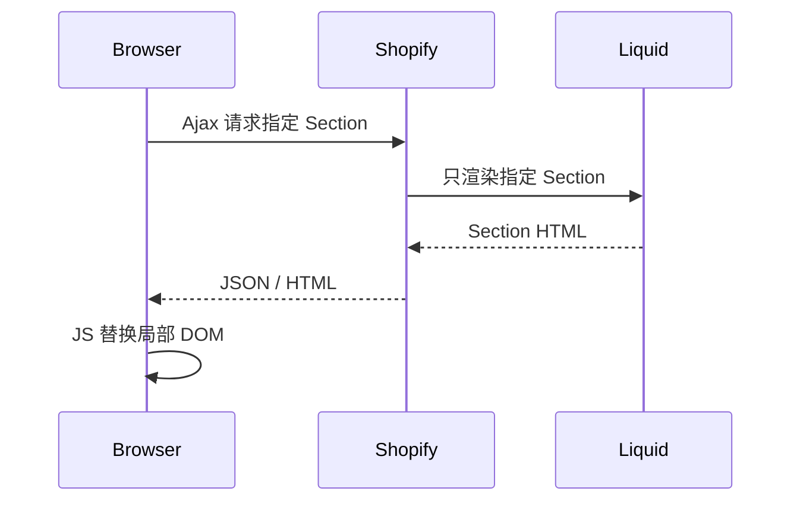

它 **不会强制整个页面 reload**。

官方： [Section Rendering API](https://shopify.dev/docs/api/ajax/section-rendering)

例如：

```text
Header          不动
Product Page    不动
Cart Drawer     更新
Cart Bubble     更新
Footer          不动
```

Cart API 还可以配合 **Bundled Section Rendering**，让加购/修改 Cart 与重新渲染 Sections 在同一请求中完成。

---

## 4.7 Cart Drawer 的标准交互链

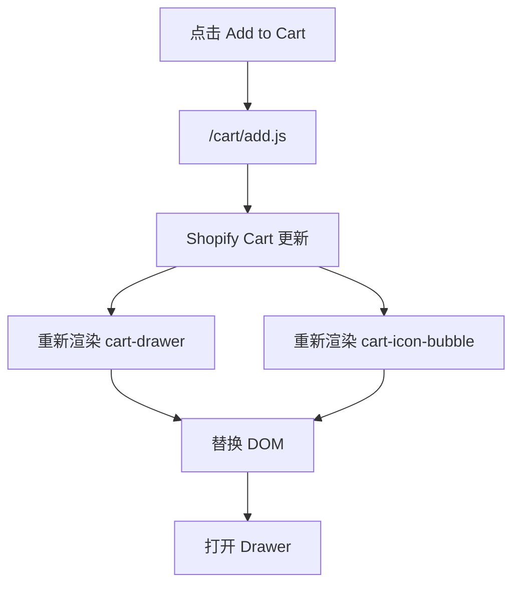

数量 `+/-`：

```text
点击 +
→ /cart/change.js
→ Cart 更新
→ Section Rendering
→ Drawer 更新
```

删除：

```text
quantity = 0
```

真实项目还要处理：

- Loading
- 连续点击防抖/禁用
- Error
- Sold out / inventory changes
- Empty cart state
- Focus management / Accessibility

---

## 4.8 Add to Cart 与 Buy It Now

### Add to Cart

```text
Product
→ Variant
→ Cart
→ Cart Drawer / Cart Page
→ Checkout
```

### Buy It Now / Accelerated Checkout

更接近：

```text
当前购买意图
→ 快速进入 Checkout
```

Product Form 中可以使用：

```liquid
{{ form | payment_button }}
```

官方： [Product template - Accelerated checkout buttons](https://shopify.dev/docs/storefronts/themes/architecture/templates/product/overview)

具体按钮可能依据商店和买家环境显示 Buy it now / Shop Pay 等。

---

## 4.9 Checkout 一般不需要 Theme 自己写

这是 Shopify 与“自己搭电商后端”最大的区别之一。

Theme 一般负责：

```text
Product UI
Variant Selector
Cart
Cart Drawer
Checkout Entry
```

Shopify Checkout 负责：

```text
地址
配送
税
折扣
支付
最终订单
```

如果是 Headless Storefront，当前模型也是：

```text
Storefront Cart
→ checkoutUrl
→ Shopify Web Checkout
```

Storefront API Cart： [Cart](https://shopify.dev/docs/api/storefront/latest/objects/Cart)

不要按照旧教程去构建已淘汰的老 Checkout API 流程。

---

# Part 5：活动价、Discount、Function 与 App 的边界

## 5.0 先建立“价格权威”模型

前端可以展示价格、选择 Variant、提交 Cart mutation，但**浏览器不是价格的最终权威**。

```text
浏览器
  ├── 可以说：我要 Variant 123，数量 2
  ├── 可以说：这次购买附带 campaign=summer
  └── 不应该能说：请把价格改成 $1
                ↓
Shopify / Function / Discount
                ↓
可信的价格与折扣计算
```

因此当业务问“能不能前端传个 price？”时，正确思路不是找一个隐藏参数，而是选择正确的 Shopify 定价机制。


## 5.1 为什么不能加购时传 `price`？

假设 Shopify Variant 原价：

```text
$29.99
```

活动页显示：

```text
$19.99
```

错误思路：

```js
{
  id: variantId,
  quantity: 1,
  price: 1999
}
```

为什么不允许浏览器决定最终价格？

因为用户可以打开 DevTools：

```js
price: 1
```

客户端永远不能成为可信的最终交易价格来源。

正确思维：

```text
Browser
→ 提出购买意图

Shopify 后端
→ 根据可信规则决定最终价格
```

---

## 5.2 常见特殊价格方案

### 方案选择表

| 需求 | 更适合的机制 | 说明 |
|---|---|---|
| 公开促销码 | Discount code | 商家熟悉、配置简单 |
| 自动满减/折扣 | Automatic discount / Function | 规则由 Shopify 执行 |
| 订阅价、周期购买 | Selling Plan | 购买计划是独立商业概念 |
| 同一商品长期存在不同可购买 SKU | Variant | 前提是它真的是不同规格/库存/sku |
| 复杂企业规则、会员层级、组合规则 | Shopify Functions + App 配置 | App 管配置，Function 执行交易规则 |
| 只是记录活动来源 | Line Item Property / Cart attribute | 只能记录上下文，不能作为价格授权 |

> 不要为了“做活动价”随便复制一堆 Variant。Variant 是商品模型，不应该被当成所有营销规则的万能开关。


### Discount

适合：

```text
原价 $29.99
优惠 -$10
最终 $19.99
```

### Selling Plan

适合：

```text
一次性购买 $29.99
订阅购买 $19.99
```

### 活动专用 Variant / Product

业务简单且 SKU 模型允许时，可以使用独立 SKU / Variant。

### Shopify Functions

复杂促销逻辑可以通过 Function 在 Shopify 后端实时计算。

官方：

- [About discounts](https://shopify.dev/docs/apps/build/discounts)
- [Build a Discount Function](https://shopify.dev/docs/apps/build/discounts/build-discount-function?extension=javascript)
- [About Shopify Functions](https://shopify.dev/docs/apps/build/functions)

---

## 5.3 Line Item Property 可以传活动上下文，但不是安全凭证

例如：

```js
properties: {
  _campaign: 'summer_sale'
}
```

它可以告诉系统：

```text
这条 Cart Line 来自 Summer Sale 业务上下文
```

但用户也可以自己伪造这个字段。

所以后端 Function/App 还应该验证：

- 活动是否存在
- 当前时间是否有效
- Variant 是否属于活动
- Buyer 是否符合条件
- 数量是否满足
- 真正活动价是多少

结论：

> **客户端上下文可以参与判断，但不能单独作为优惠授权。**

---

## 5.4 Shopify App 与 Function 的区别

### 把 App 和 Function 想成“系统”和“规则插件”

| 维度 | App | Shopify Function |
|---|---|---|
| 形态 | 完整应用 | Shopify 后端特定扩展点上的逻辑 |
| UI | 可以有 Admin UI | 本身通常不是一个完整 UI 应用 |
| 数据库 | 可以有自己的 DB | 通常读取输入并返回规则结果 |
| OAuth / 权限 | 常见 | 通常随 App 部署和配置 |
| Webhook / API | 可以 | 不是其核心职责 |
| 典型例子 | ERP 集成、评价 App、营销平台 | Discount、Cart transform、Delivery/Payment customization |

典型架构：

```text
Merchant
  ↓
App Admin UI
  ↓ 保存“会员 9 折”等配置
App / Metafield / DB
  ↓
Shopify Function
  ↓ 在结账相关扩展点执行
Discount result
```

官方：[About Shopify Functions](https://shopify.dev/docs/apps/build/functions)


一句话：

> **App 是完整应用/业务系统；Function 是 Shopify 在特定业务节点执行的后端扩展逻辑。**

```text
Shopify App
│
├── Admin UI
├── React / Web App
├── Database
├── Admin GraphQL API
├── OAuth
├── Webhooks
└── Shopify Function
      └── Discount / Delivery / Cart / Payment 等规则
```

| 项目 | App | Function |
|---|---|---|
| 定位 | 完整业务应用 | 业务规则扩展 |
| UI | 可以有 | 通常没有 |
| 数据库 | 可以有 | Function 自身不是数据库 |
| OAuth | App 负责 | 不负责 |
| Webhook | App 可使用 | 不是主要职责 |
| 执行 | App 服务自身运行 | Shopify 在对应运行点调用 |
| 典型场景 | ERP / 营销后台 / Product 管理 | 折扣、配送、购物车规则 |

官方： [About Shopify Functions](https://shopify.dev/docs/apps/build/functions)

---

# Part 6：Theme 深入：Collection

## 6.0 Collection 在 Admin 的位置与创建

### 旧 Admin 模型下的经典创建过程

如果你的后台仍显示 Manual / Smart：

**Manual：**

```text
Products → Collections → Add collection
→ Title / Description
→ Manual
→ 保存
→ 手工添加 Products
→ 设置 Sort
```

**Smart：**

```text
Products → Collections → Add collection
→ Smart
→ 定义 conditions
→ 选择 ALL / ANY 规则逻辑
→ Shopify 自动维护成员
```

新 Collections model 的 UI 可能把这些能力重新组织为 sources + conditions，但“集合成员来自哪里、是否由条件自动维护”的建模问题仍然相同。


**Admin：** `Products → Collections`。

当前 Shopify 正在逐步推出新的 Collections model，因此你可能看到两种后台体验：

- 旧模型：**Manual collection / Smart collection**；
- 新模型：Collection 可以从不同 sources 添加 Product / Variant / existing collections / app sources，并支持条件。

如果你的 Admin 已经看到新 Collections UI，优先按当前界面操作；理解旧的 Manual / Smart 思维仍然很有价值，因为大量现有店铺和教程仍使用这个术语。

官方 Help Center：

- [Creating collections and adding products](https://help.shopify.com/en/manual/products/collections/create-collection)
- [Creating and modifying smart collections](https://help.shopify.com/en/manual/products/collections/smart-collections/create)

开发文档：

- [Liquid `collection` object](https://shopify.dev/docs/api/liquid/objects/collection)
- [Collection template](https://shopify.dev/docs/storefronts/themes/architecture/templates/collection)


## 6.1 Collection 不是 Product 的父目录

### Collection 更像“集合/查询结果”，不是目录树

Product A 可以同时属于：

```text
Running Shoes
Nike
Men's Shoes
Best Sellers
New Arrivals
```

所以不要设计成：

```text
Product.parentCollection
```

更接近：

```text
Product ↔ many Collections
```

### Manual 与 Smart 的经典区别

| | Manual | Smart / Automated |
|---|---|---|
| 谁决定商品成员 | 商家手动选择 | Shopify 根据 conditions 自动匹配 |
| 适合 | 精选、首页运营位 | Vendor、Tag、Type、Price 等规则集合 |
| 商品数据变化后 | 成员不会自动因条件变化更新 | 条件重新匹配 |
| 人工排序 | 常见 | 也可配置 sort order，但成员由条件决定 |

> 新 Collections model 正在变化中，创建能力可能比上表更丰富；上表用于帮助理解经典数据模型，而不是限制最新 Admin UI。


Collection 是一个 Product 集合。

一个 Product 可以属于多个 Collections：

```text
Nike Air Max
├── Running Shoes
├── Nike
├── Best Sellers
└── Men's Shoes
```

所以关系更接近多对多。

Liquid 官方： [collection](https://shopify.dev/docs/api/liquid/objects/collection)

---

## 6.2 Collection 页面运行链路

### Collection 常用 Liquid 属性

| 属性 | 含义 | 常见使用 |
|---|---|---|
| `collection.id` | Collection ID | data 属性、调试 |
| `collection.title` | 标题 | H1 |
| `collection.handle` | URL handle | URL / 逻辑判断 |
| `collection.url` | Collection URL | 链接 |
| `collection.description` | 描述 | SEO / 页面内容 |
| `collection.image` | Collection 图片 | Hero |
| `collection.products` | 当前 Collection 商品 | Product grid |
| `collection.products_count` | 当前视图商品数 | 过滤后结果数语义 |
| `collection.all_products_count` | Collection 全部商品数 | 未过滤总量语义 |
| `collection.filters` | Storefront filters | 筛选 UI |
| `collection.sort_options` | 可用排序项 | Sort select |
| `collection.sort_by` | 当前 URL 排序值 | UI 状态 |
| `collection.default_sort_by` | 默认排序 | 初始化 |
| `collection.metafields` | Collection 自定义字段 | Hero、副标题、SEO 扩展 |

完整列表：[Liquid `collection` object](https://shopify.dev/docs/api/liquid/objects/collection)


```text
/collections/shoes
      ↓
Shopify 找到 Collection
      ↓
collection.json
      ↓
Collection Sections
      ↓
collection.products
      ↓
Product Card
```

例如：

```liquid
<h1>{{ collection.title }}</h1>


  

```

React 类比：

```jsx
products.map(product => (
  <ProductCard product={product} />
))
```

---

## 6.3 Product Card 为什么要拆成 Snippet？

### 一个 Product Card 最好接受明确参数

教学版：

```liquid

```

Snippet 内只依赖传入的 `product`，而不是偷偷依赖外层某个 `collection`。这样它可以复用于：

- Collection grid；
- Search results；
- Related products；
- Featured collection；
- Landing page 推荐商品。

这和 React 中让组件 props 明确、降低隐式上下文依赖是同一个工程思想。


不要在 Collection、Search、Recommendation 每个地方重复写一整份 Card。

推荐：

```text
sections/
└── main-collection-product-grid.liquid

snippets/
└── product-card.liquid
```

Collection：

```liquid

```

好处：

- 复用
- 样式统一
- 易维护
- Collection / Search 共用

---

## 6.4 Pagination

### Collection products 为什么要 paginate？

官方 Collection template 文档说明 Collection Product 分页每页最多 50 个。典型实现：

```liquid

  <div class="product-grid">
    
      
    
  </div>

  {{ paginate | default_pagination }}

```

`paginate` 不只是“画页码”；它还决定 Liquid 当前能访问哪一段资源集合。


```liquid


  
    
  

  {{ paginate | default_pagination }}


```

URL：

```text
/collections/shoes?page=2
```

它体现了 Shopify Theme 的重要模式：

> **URL 是页面状态的一部分。**

---

# Part 7：Theme 深入：Product Media

## 7.0 Media 在 Admin 的位置

进入：`Products → 打开 Product → Media`。商家可以给 Product 添加图片、视频、3D model 等媒体。

Theme 不应该把 `product.media` 当成“图片数组”。一个媒体项可能是：

```text
image
video
external_video
model
```

官方：

- [Support product media](https://shopify.dev/docs/storefronts/themes/product-merchandising/media/support-media)
- [Product media – Help Center](https://help.shopify.com/en/manual/products/product-media)


## 7.1 Image 是 Media 的一种

Product 不只有 Images。

```text
Product Media
├── Image
├── Video
├── External Video
└── 3D Model
```

官方： [Product media](https://shopify.dev/docs/storefronts/themes/product-merchandising/media)

Theme 应优先围绕 `product.media` 建立 Gallery，而不是把 Product Media 简化成“图片数组”。

---

## 7.2 基础 Media 渲染

### 按 `media_type` 分发渲染

```liquid

  
    {{ media | image_url: width: 1600 | image_tag: loading: 'lazy' }}

  
    {{ media | video_tag: controls: true }}

  
    {{ media | external_video_tag }}

  
    {{ media | model_viewer_tag }}

```

这比：

```liquid

```

更符合 Shopify Media 数据模型，也能让 Theme 支持未来商品内容扩展。


```liquid

  

    
      {{
        media
        | image_url: width: 1000
        | image_tag: alt: media.alt
      }}

    
      ...

    
      ...

    
      ...

  

```

官方实现指南： [Support product media](https://shopify.dev/docs/storefronts/themes/product-merchandising/media/support-media)

---

## 7.3 Variant 与 Media

### Variant 切换通常为什么需要 JS？

Liquid 初始渲染只能根据当前请求知道“页面打开时”的 Variant 状态。用户在浏览器里点另一个 Color 后：

```text
Option click
 ↓
JS 找到新 Variant
 ↓
更新 variant URL / hidden input
 ↓
读取 Variant 关联 media
 ↓
切换 Gallery active media
```

这正是典型的“Liquid 初始 SSR + JavaScript progressive enhancement”。


一个 Color Variant 可以关联对应 Media。

```text
Black Variant
→ Black Image

White Variant
→ White Image
```

用户切换 Variant 后：

```text
JS 匹配 Variant
→ 找对应 Media
→ Gallery 切换
```

这是典型的：

```text
Liquid 提供初始数据和 DOM
+
JavaScript 提供运行时交互
```

---

# Part 8：Theme 深入：Search 与 Predictive Search

## 8.0 Search 的 Admin 与平台位置

Storefront 的完整搜索页面通常是 `/search?q=...`；搜索行为还可以受 Shopify **Search & Discovery** App 配置影响。

相关入口：

- `Apps → Search & Discovery`：过滤、搜索和推荐相关配置；
- Theme 的 `search` template：控制结果页 UI；
- Predictive Search API：实现输入即建议。

官方：

- [Storefront search](https://shopify.dev/docs/storefronts/themes/navigation-search/search)
- [Liquid `search` object](https://shopify.dev/docs/api/liquid/objects/search)
- [Predictive Search API](https://shopify.dev/docs/api/ajax/reference/predictive-search)


## 8.1 Full Search

### `search.results` 不等于 Product[]

搜索结果可能包含多种资源，所以渲染时需要考虑 `object_type` / 资源类型语义，而不是默认每一条都有 `price`。

简化思路：

```liquid

  <p>{{ search.results_count }} results</p>

  
    
      
        
      
        <a href="{{ result.url }}">{{ result.title }}</a>
      
        <a href="{{ result.url }}">{{ result.title }}</a>
    
  

```

完整结果类型和字段以当前 [`search` object](https://shopify.dev/docs/api/liquid/objects/search) 为准。


URL：

```text
/search?q=shirt
```

Liquid：

```liquid
search.terms
search.results
search.results_count
search.performed
```

官方：

- [Storefront search](https://shopify.dev/docs/storefronts/themes/navigation-search/search)
- [Liquid search object](https://shopify.dev/docs/api/liquid/objects/search)

### 一个重要修正

完整 Search 的 `search.results` 当前主要是：

```text
article
page
product
```

不要把完整 Search 的结果集合与 Predictive Search 混为一谈。

---

## 8.2 Predictive Search

### Theme 中最小请求结构

使用 locale-aware URL：

```js
const params = new URLSearchParams({
  q: query,
  'resources[type]': 'product,collection,page,article'
});

const url = `${window.Shopify.routes.root}search/suggest.json?${params}`;

const response = await fetch(url);
const data = await response.json();
```

Predictive Search 的目的不是替代完整 Search，而是降低输入成本：

```text
输入 “run”
 ↓
快速建议 Products / Collections / Queries ...
 ↓
用户点击建议
或 Enter 进入完整 Search
```

官方 UX 还强调键盘、关闭行为、mobile focus、empty state 等可访问性细节：
[Predictive search UX guidelines](https://shopify.dev/docs/storefronts/themes/navigation-search/search/predictive-search-ux)


Predictive Search 可以在用户输入时即时建议：

- Products
- Collections
- Queries
- Pages
- Articles

官方： [Add predictive search to your theme](https://shopify.dev/docs/storefronts/themes/navigation-search/search/predictive-search)

基本模型：

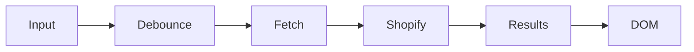

真实实现应考虑：

- Debounce
- AbortController
- Race Condition
- Loading
- Empty State
- Keyboard Navigation
- ARIA / Accessibility

---

## 8.3 Race Condition

### 为什么要 AbortController？

用户连续输入：

```text
s
sh
sho
shoe
```

网络响应不保证按请求顺序回来。旧请求可能最后返回，反而覆盖新查询结果。

```js
let controller;

async function predictiveSearch(query) {
  controller?.abort();
  controller = new AbortController();

  const url = `${window.Shopify.routes.root}search/suggest.json?q=${encodeURIComponent(query)}`;

  const response = await fetch(url, {
    signal: controller.signal
  });

  return response.json();
}
```

Debounce 解决“请求太频繁”，AbortController 解决“旧请求还在飞”。它们解决的是两个不同问题。


例如用户快速输入：

```text
shirt
shoes
```

`shirt` 请求可能后返回，覆盖掉 `shoes` 的结果。

可以使用 `AbortController`：

```js
let controller;

async function search(query) {
  controller?.abort();
  controller = new AbortController();

  const response = await fetch(url, {
    signal: controller.signal
  });

  return response.json();
}
```

这不是 Shopify 特有问题，而是标准前端异步竞态问题。

---

# Part 9：Theme 深入：Filtering、Sort、Pagination 与 URL State


## 9.0 Filter 的 Admin 配置位置

常见流程：

```text
Shopify Admin
  → Apps
  → Search & Discovery
  → Filters
  → Add filter
  → 选择 Source
```

官方 Help Center：[Adding filters with Shopify Search & Discovery](https://help.shopify.com/en/manual/online-store/storefront-search/search-and-discovery-filters)

Theme 负责读取 `collection.filters` / `search.filters` 并渲染；**Theme 不负责凭空定义商家有哪些 filter source**。


## 9.1 Filter 从哪里来？

### 三层模型再展开一次

```text
第 1 层：商品数据
Price / Availability / Vendor / Product type / Option / Metafield
       ↓
第 2 层：Search & Discovery 配置
商家选择哪些 source 暴露成 storefront filter
       ↓
第 3 层：Theme
collection.filters → HTML controls → URL params
```

因此“我创建了 `custom.material`，为什么页面没出现 Material Filter？”的排查顺序是：

1. Product 是否真的填写了 metafield value？
2. Metafield type 是否适合过滤？
3. Search & Discovery 是否添加为 Filter？
4. Theme 是否支持/渲染 Storefront filtering？
5. 当前 Collection 的商品里是否存在相关值？


这是你追问后我们重点补全的一层。

`collection.filters` **不是 Theme 自己凭空定义的字段**。

完整链路：

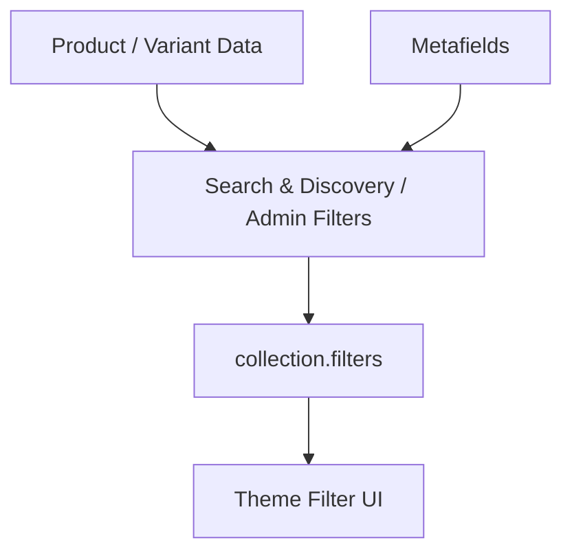

官方：

- [Storefront filtering](https://shopify.dev/docs/storefronts/themes/navigation-search/filtering/storefront-filtering)
- [Support storefront filtering](https://shopify.dev/docs/storefronts/themes/navigation-search/filtering/storefront-filtering/support-storefront-filtering)

Shopify 当前支持基于：

- Availability
- Category
- Price
- Product Tags
- Product Type
- Vendor
- Variant Options
- Metafields

创建 Storefront Filters。

---

## 9.2 实例：Price / Color / Material / Origin

### 数据建模建议

| 筛选维度 | 优先数据源 | 原因 |
|---|---|---|
| Price | Shopify 原生 price | 天然是交易数据 |
| Availability | Shopify 原生 availability | 与 Variant 可售状态相关 |
| Color | Product Option / category metafield / metaobject based visual attribute | 如果 Color 决定 SKU，则应该是 Option；视觉色板可结合标准属性 |
| Size | Product Option | 通常决定 Variant |
| Material | Product/category Metafield | 通常是描述属性，不一定生成 SKU |
| Origin | Product Metafield | 通常是 Product 级属性 |

不要为了“想要一个 Filter”就反过来扭曲商品数据模型。**先建模，再决定是否把这个字段暴露为 Filter。**


推荐建模：

| Filter | 数据来源 |
|---|---|
| Price | Shopify 原生价格 |
| Color | Product Option / Category Metafield |
| Material | Product Metafield `custom.material` |
| Origin | Product Metafield `custom.origin` |

例如 Material：

```text
Settings
→ Custom data
→ Products
→ Add definition

custom.material
Type: Single line text
```

商品数据：

```text
Product A → Leather
Product B → Mesh
Product C → Cotton
```

再把它配置为 Storefront Filter。

Theme 最终通过：

```liquid

  {{ filter.label }}

```

读取。

结论：

> **Metafield 是数据；Storefront Filter 是基于这些数据创建出来的用户筛选能力。**

---

## 9.3 Filter 的逻辑

### 官方默认逻辑与可配置 operator

Shopify Storefront filtering 的基础规则是：

```text
不同 filters：AND
同一 filter 的多个 values：通常 OR
```

例如：

```text
Color = Black OR White
AND
Size = M OR L
```

表示商品需要同时满足“颜色组”和“尺码组”。

但部分 filter 类型（例如 Product tags、某些 list metafields / metaobject reference lists）可以通过 Search & Discovery 配置 AND 行为。Liquid `filter.operator` 能反映相关逻辑。

所以不要把“同组永远 OR”写死成自己的前端业务规则；以 Shopify 返回的 Filter 数据和当前 Search & Discovery 配置为准。

### `filter` / `filter_value` 常用字段

| 对象 | 字段 | 含义 |
|---|---|---|
| `filter` | `label` | 展示名称 |
| `filter` | `type` | `list` / `price_range` / boolean 等语义 |
| `filter` | `values` | 可选 values |
| `filter` | `active_values` | 当前已选 values |
| `filter` | `param_name` | URL 参数名称（适用时） |
| `filter` | `url_to_remove` | 移除该 filter 的 URL |
| `filter_value` | `label` | value 展示文案 |
| `filter_value` | `value` | value 值 |
| `filter_value` | `count` | 该 value 对应结果数量 |
| `filter_value` | `active` | 是否已激活 |
| `filter_value` | `param_name` | 表单 input name |
| `filter_value` | `url_to_remove` | 移除该 value 的 URL |

官方：[Liquid `filter` object](https://shopify.dev/docs/api/liquid/objects/filter)

### 一个最小 List Filter 表单

```liquid
<form method="get">
  
    
      <fieldset>
        <legend>{{ filter.label | escape }}</legend>

        
          <label>
            <input
              type="checkbox"
              name="{{ value.param_name }}"
              value="{{ value.value }}"
              checked
              disabled
            >
            {{ value.label | escape }} ({{ value.count }})
          </label>
        
      </fieldset>
    
  

  <button type="submit">Apply</button>
</form>
```

生产实现还需要处理 `price_range`、保留 sort/query 参数、可访问性、移动端 drawer 等。

官方完整实现参考：
[Support storefront filtering](https://shopify.dev/docs/storefronts/themes/navigation-search/filtering/storefront-filtering/support-storefront-filtering)


当前 Storefront filtering 官方文档说明最多可以配置 **25 个 filters**。同时，不同 filter source 之间与同一 filter 内多个 values 的逻辑需要按具体 filter type / Search & Discovery 配置理解，不能把所有情况死记成一个固定 AND/OR 规则。

官方：[Storefront filtering](https://shopify.dev/docs/storefronts/themes/navigation-search/filtering/storefront-filtering)


通常：

```text
不同 Filter 之间 → AND
同一个 Filter 多值 → OR
```

例如：

```text
Color = Black
AND
Size = M
```

而：

```text
Color = Black OR White
```

官方： [Storefront filtering](https://shopify.dev/docs/storefronts/themes/navigation-search/filtering/storefront-filtering)

---

## 9.4 Filter 会进入 URL

### 为什么 URL State 很重要？

URL 同时服务：

- 刷新后恢复状态；
- 浏览器前进/后退；
- 分享链接；
- 无 JS fallback；
- Shopify 服务器理解筛选条件；
- SEO/analytics 能看到页面状态。

因此不要只维护：

```js
const state = { color: 'black' };
```

却让地址栏永远停留在 `/collections/shoes`。对于 Shopify Theme，**URL 是筛选/排序/分页的重要公共状态容器**。


例如：

```text
/collections/shoes
?filter.v.option.color=black
&filter.v.option.size=M
```

为什么 URL 化很重要？

- 刷新后状态存在
- 可分享
- 浏览器 Back / Forward 正常
- Progressive Enhancement
- 服务端可理解当前查询状态

---

## 9.5 Sort 与 Filter 完全不同

```text
Filter
= 哪些商品应该留下？

Sort
= 留下的这些商品按什么顺序排列？
```

例如：

```text
1000 products
→ Color=Black
→ 300
→ Material=Leather
→ 80
→ Price Low to High
→ 仍然 80，只是顺序改变
```

---

## 9.6 Shopify 原生 Collection Sort

### 为什么用 `collection.sort_options` 比硬编码更稳？

Theme 最好根据 Shopify 给出的可用排序项渲染：

```liquid


<select data-sort-by>
  
    <option
      value="{{ option.value }}"
      selected
    >
      {{ option.name }}
    </option>
  
</select>
```

然后 JS 只操作 URL：

```js
document.querySelector('[data-sort-by]').addEventListener('change', (event) => {
  const url = new URL(window.location.href);
  url.searchParams.set('sort_by', event.target.value);
  url.searchParams.delete('page');
  window.location.href = url;
});
```

这样 Theme 不需要自己维护 Shopify 当前支持的完整排序文案列表。


常见原生排序包括：

- Manual / Featured
- Best Selling
- Title A-Z / Z-A
- Price Low-High / High-Low
- Created Old-New / New-Old

所以“最新上架”不需要自己创建字段，对应 `created-descending`。

Liquid 使用：

```liquid
collection.sort_options
collection.sort_by
collection.default_sort_by
```

官方对象： [collection](https://shopify.dev/docs/api/liquid/objects/collection)

---

## 9.7 为什么不能原生按 Rating 排序？

即使你有：

```text
custom.rating = 4.9
```

也不能直接：

```text
?sort_by=rating-descending
```

原因：

> Shopify 原生 Collection Sort 是固定排序键，不是“任意 Metafield Sort”。

因此：

```text
Metafield → Filter ✅
Metafield → 任意原生 Collection Sort ❌
```

想做 Rating / Recommendation Score / Margin 等排序，通常需要：

- App / 后端计算
- 预计算后维护 Collection `manual` 排序
- 自定义 Storefront / Headless 查询架构

---

## 9.8 普通 Page 中的一组商品能否使用 Shopify 原生 Sort？

核心边界：

> `sort_by` 是 Collection 查询/排序能力，不是对任意 Liquid Product 数组调用的通用排序函数。

例如 Landing Page 有 20 个活动商品，并且要支持：

```text
Newest
Best Selling
Price Low-High
```

推荐做法：

```text
Landing Page
→ 绑定一个 Collection
→ 使用 Collection 的原生排序能力
```

页面 URL 可以仍然是：

```text
/pages/summer-sale
```

数据来源使用一个 Collection。

如果是简单属性排序，Liquid 有 `sort` 一类能力，但它不等价于 Shopify 后端的 `best-selling` 等 Collection Sort。

---

## 9.9 Pagination + Sort + Filter 是同一个 URL State

### 三条状态规则

| 用户动作 | Filter | Sort | Page |
|---|---|---|---|
| 改 Filter | 保留/修改 | 保留 | **删除，回第 1 页** |
| 改 Sort | 保留 | 修改 | **删除，回第 1 页** |
| 点 Page 3 | 保留 | 保留 | 改成 3 |

原因很简单：筛选或排序后，原来的 Page 5 很可能已经没有相同含义；而分页本身不应该丢掉用户已经选好的 Filter / Sort。


例如：

```text
/collections/shoes
?filter.v.option.color=black
&sort_by=price-ascending
&page=2
```

三者组成：

```text
Collection Page State
├── Filter
├── Sort
└── Page
```

规则建议：

```text
改变 Filter → reset page
改变 Sort   → reset page
改变 Page   → 保留 Filter 和 Sort
```

原因：改变筛选/排序后，原来的第 5 页已经不再代表同一个结果空间。

---

## 9.10 AJAX 增强但保留 URL

### Progressive enhancement 版本流程

```text
用户改 Filter
 ↓
更新 URLSearchParams，删除 page
 ↓
请求当前 URL + sections=product-grid
 ↓
Shopify 根据新 URL 重新执行 Liquid
 ↓
返回 product grid + pagination HTML
 ↓
replace DOM
 ↓
history.pushState(newUrl)
```

这样同时获得：

- 无整页刷新体验；
- URL 可复制；
- Back/Forward 有意义；
- 服务器仍是 Product Grid 的渲染权威。


可以通过 Section Rendering：

```text
点击 Page 2
→ Fetch Shopify Section
→ 返回新的 Product Grid HTML
→ 替换局部 DOM
→ history.pushState 更新 URL
```

这样同时拥有：

- 无整页刷新体验
- 正确 URL
- Back/Forward
- Progressive Enhancement

官方： [Section Rendering API](https://shopify.dev/docs/api/ajax/section-rendering)

---

# Part 10：Theme SEO


SEO 这一章不要只理解成 `<meta>` 标签大全。对电商 Theme 更关键的是：**页面语义、URL 规范化、可抓取的服务端 HTML、结构化商品数据、性能**一起工作。


## 10.1 SEO 三件套

### 三者分别回答什么？

| 元信息 | 回答的问题 | 常见 Liquid |
|---|---|---|
| `<title>` | “这个文档叫什么？” | `page_title` |
| meta description | “页面主要讲什么？” | `page_description` |
| canonical | “多个 URL 版本里哪个是规范版本？” | `canonical_url` |

典型：

```liquid
<title>
  {{ page_title }}
   – {{ shop.name }}
</title>


  <meta name="description" content="{{ page_description | escape }}">


<link rel="canonical" href="{{ canonical_url }}">
```


Shopify 官方 Theme SEO Metadata 重点：

```text
Title
Meta Description
Canonical URL
```

官方： [Add SEO metadata to your theme](https://shopify.dev/docs/storefronts/themes/seo/metadata)

典型代码：

```liquid
<title>
  {{ page_title }}

  
    – Page {{ current_page }}
  

  
    – {{ shop.name }}
  
</title>


  <meta
    name="description"
    content="{{ page_description | escape }}"
  >


<link
  rel="canonical"
  href="{{ canonical_url }}"
>
```

---

## 10.2 `{{ canonical_url }}` 在哪里配置？

`canonical_url` 不是 Admin 里一个“Canonical 输入框”，而是 Shopify 根据当前页面上下文提供的 Liquid 全局对象。

完整定义：[Liquid `canonical_url`](https://shopify.dev/docs/api/liquid/objects/canonical_url)

如果你需要编辑 Product 自己的搜索结果标题、描述和 handle，Admin 中可以进入 Product 的 **Search engine listing** 区域；这和 `canonical_url` 的平台计算不是一回事。

官方 Product SEO 编辑步骤：[Adding and updating products](https://help.shopify.com/en/manual/products/add-update-products)


答案：**不需要你在后台单独配置这个变量。**

它是 Shopify 的全局 Liquid 对象：

```liquid
{{ canonical_url }}
```

Shopify 根据当前页面计算 canonical URL。

你需要做的是在 `theme.liquid` 的 `<head>` 输出：

```liquid
<link rel="canonical" href="{{ canonical_url }}">
```

官方： [canonical_url](https://shopify.dev/docs/api/liquid/objects/canonical_url)

先检查现有 Theme 是否已经输出，避免重复 canonical。

---

## 10.3 Filter / Sort / Pagination 为什么和 SEO 有关？

### Canonical ≠ robots ≠ noindex

这三个概念不要混：

| 机制 | 主要目的 |
|---|---|
| Canonical | 告诉搜索引擎内容的首选规范 URL |
| robots.txt | 给 crawler 抓取路径规则 |
| robots meta / noindex | 控制某页面是否应进入索引 |

因此 `canonical` 不是一个“禁止搜索引擎访问此 URL”的开关。


一个 Collection 可能出现：

```text
/collections/shoes
/collections/shoes?page=2
/collections/shoes?sort_by=price-ascending
/collections/shoes?filter.v.option.color=black
```

这会产生大量 URL 变体。

SEO 需要正确处理：

- Title
- Canonical
- Pagination 内容
- 页面主体语义
- 爬虫策略

不要把 SEO 理解成“只加 meta description”。

---

## 10.4 H1 与 `<title>` 不是一回事

```html
<title>Nike Air Max Running Shoes | Store</title>
```

属于 Document Metadata。

```html
<h1>Nike Air Max</h1>
```

属于页面主体语义结构。

两者可以相关，但职责不同。

---

## 10.5 JSON-LD Structured Data

### HTML 给人看，Structured Data 给机器理解

Product 页面视觉上写：

```html
<h1>Classic T-Shirt</h1>
<p>$29.00</p>
```

人能看懂，但搜索引擎还需要更明确的 Product / Offer 语义。JSON-LD 可以表达：

```json
{
  "@context": "https://schema.org",
  "@type": "Product",
  "name": "Classic T-Shirt",
  "offers": {
    "@type": "Offer",
    "price": "29.00",
    "priceCurrency": "USD"
  }
}
```

真实生产环境还要正确处理 Variant、availability、image、brand 等，并避免 Theme 与 SEO App 重复输出冲突的 schema。不要复制一份静态 JSON-LD 就认为“SEO 做完了”。


Product 页面常见：

```html
<script type="application/ld+json">
{
  "@context": "https://schema.org",
  "@type": "Product",
  "name": "Nike Air Max"
}
</script>
```

它帮助机器理解：

- Product
- Offer
- Price
- Availability
- SKU
- Image

Liquid 可以服务端生成 JSON-LD。

---

## 10.6 robots.txt 与 hreflang

Shopify 默认管理 robots.txt，可在特殊场景定制，但不要无目的修改爬虫规则。

SEO 官方入口： [Shopify Theme SEO](https://shopify.dev/docs/storefronts/themes/seo)

多市场 / 多语言还涉及 hreflang；Shopify Markets 和平台输出会参与其中，所以要避免重复生成冲突标签。

---

## 10.7 SEO 排查 Checklist

遇到“为什么这个 Product SEO 不对”，建议按顺序检查：

1. HTML `<title>` 是否正确且页面间有区分；
2. meta description 是否存在且不是全站同一段；
3. canonical 是否只有一个、目标是否合理；
4. H1 / 页面主体是否真的由服务端 HTML 输出；
5. Product structured data 是否有效、是否被 App 重复输出；
6. 商品图片是否有有意义的 alt；
7. Filter / sort / pagination URL 是否产生大量无意义索引页；
8. robots / noindex 是否意外阻止关键页面；
9. Markets / hreflang 是否由 Shopify 正确输出且没有重复手写；
10. Core Web Vitals 是否严重影响用户体验。

---

# Part 11：Theme Performance


性能优化的目标不是“把每个资源都延迟”，而是：**关键内容尽快出现，非关键内容晚一点，主线程保持可响应。**


## 11.1 三个核心 Web Vitals

| 指标 | 用人话解释 | Shopify Theme 常见罪魁祸首 |
|---|---|---|
| LCP | 首屏最大主要内容多久出现 | Hero/Product image 太晚、资源优先级错误、服务器/第三方拖延 |
| CLS | 页面加载时会不会乱跳 | 图片没尺寸、异步 Banner、字体/组件尺寸不稳定 |
| INP | 点击/输入后多久看到响应 | 大 JS、长任务、复杂 DOM、第三方脚本 |

性能不是单一 Lighthouse 分数，而是用户真实加载与交互体验。


```text
LCP → 首屏主要内容什么时候出现
CLS → 页面加载时是否乱跳
INP → 用户交互到下一次可见更新是否足够快
```

官方： [Performance best practices for Shopify themes](https://shopify.dev/docs/storefronts/themes/best-practices/performance)

---

## 11.2 LCP：首屏主图不要 lazy load

官方当前明确建议不要 lazy-load LCP image，并可以对明确的 LCP 图使用 `fetchpriority="high"`。

```liquid
{{ product.featured_image
  | image_url: width: 1200
  | image_tag:
    loading: 'eager',
    fetchpriority: 'high',
    widths: '400, 600, 800, 1000, 1200',
    sizes: '(min-width: 990px) 50vw, 100vw'
}}
```

但不要机械地让页面所有图片都 `eager + high`，否则“高优先级”就失去意义。

官方：

- [Never lazy-load the LCP image](https://shopify.dev/docs/storefronts/themes/best-practices/performance/never-lazy-load-lcp-image)
- [Mark the LCP image with fetchpriority="high"](https://shopify.dev/docs/storefronts/themes/best-practices/performance/set-fetchpriority-high-on-lcp-image)


错误：

```html

```

如果这张图正好是 Product Page 首屏 LCP Image，它会延迟主要内容显示。

常见策略：

```text
首屏 LCP Image
→ eager
→ fetchpriority="high"

下方 Gallery Images
→ lazy
```

---

## 11.3 图片优化

### `srcset / sizes` 的核心不是语法，而是避免下载过大的源图

```liquid
{{ image
  | image_url: width: 1200
  | image_tag:
    widths: '320, 480, 640, 800, 1200',
    sizes: '(min-width: 990px) 50vw, 100vw',
    loading: 'lazy'
}}
```

如果桌面卡片实际只占 300px，却始终下载 3000px 原图，CSS 把图片“缩小显示”并不会把网络成本缩小。


Shopify Image CDN 可以按宽度输出资源：

```liquid
{{
  product.featured_image
  | image_url: width: 800
  | image_tag
}}
```

不要显示 400px 的图，却让用户下载 5000px 原图。

关注：

- `srcset`
- `sizes`
- `width` / `height`
- `aspect-ratio`
- lazy loading
- fetch priority

---

## 11.4 CLS

### Shopify Image 对象为什么比裸字符串 URL 更有价值？

因为 Image 对象知道 width / height / aspect ratio 等元数据。使用 `image_url` + `image_tag` 能让 Theme 更容易生成尺寸信息和 responsive image markup，从而提前给浏览器布局空间。

对于固定 Product Card，还可以配合：

```css
.product-card__media {
  aspect-ratio: 1 / 1;
  overflow: hidden;
}

.product-card__media img {
  width: 100%;
  height: 100%;
  object-fit: cover;
}
```


图片没有固定宽高时：

```text
页面先布局
→ 图片加载
→ 高度突然出现
→ 内容向下跳
```

避免方式：

- 给图片 width / height
- 保留 aspect ratio
- Product Card 图片容器预留尺寸

---

## 11.5 JavaScript 不应接管一切

### Shopify 官方现在明确强调“essential content server-side”

一个商品页不应是：

```html
<div id="product-app"></div>
```

然后等 JS 请求商品数据才显示 Title / Price。

更合理：

```text
Liquid 先渲染
Product title / price / image / form
        ↓
浏览器已有可读可操作基础 HTML
        ↓
JS 再增强
Variant picker / drawer / animation / async update
```

官方：[Render essential content in Liquid and HTML, not JavaScript](https://shopify.dev/docs/storefronts/themes/best-practices/performance/render-essential-content-server-side)


Shopify Theme 的推荐思路：

```text
Shopify
→ Liquid SSR
→ HTML
→ Browser
→ JS Enhancement
```

而不是：

```text
<div id="app"></div>
→ 下载巨大 JS
→ API
→ JS Render Everything
```

Theme 本身适合 Progressive Enhancement。

Shopify 官方也强调减少不必要 JavaScript、优先使用浏览器原生能力。

---

## 11.6 `defer` 与按需加载

```html
<script
  src="{{ 'product.js' | asset_url }}"
  defer
></script>
```

可以减少 parser-blocking。

更大的原则：

> **当前页面不需要的 JS，就不要让用户下载和执行。**

例如：

```text
product.js
collection.js
cart.js
predictive-search.js
```

按功能组织，而不是所有逻辑都堆进一个超大的 `theme.js`。

---

## 11.7 Liquid 也会慢

### “服务端渲染”不代表 Liquid 可以随便写

常见问题：

- 深层嵌套循环；
- 对高 Variant Product 遍历/输出大量数据；
- 一个页面反复做相同昂贵计算；
- 输出巨大 JSON 再让 JS 二次解析；
- 为了一个小组件读取远超需要的数据结构。

优化的基本原则仍然是：**减少工作量、减少 payload、减少重复。**


性能不是只有浏览器端。

Shopify 服务端执行 Liquid，复杂 Liquid 会增加 TTFB。

官方重点建议：

- 避免深层嵌套 loops
- 避免循环中大量 metafield access
- 不要无意义遍历大量 variants
- 减少重复复杂 render 嵌套
- 控制 pagination 深度

官方： [Performance best practices](https://shopify.dev/docs/storefronts/themes/best-practices/performance)

---

## 11.8 App / Third-party Scripts

### 排查性能时建立“责任清单”

DevTools Network / Performance 里至少区分：

```text
Theme 自己的 JS / CSS
Shopify 平台资源
App embed / App block 资源
Analytics
Ads / marketing pixels
Chat / reviews / personalization
```

一个 `theme.js` 优化了 20KB，并不能抵消 8 个第三方 App 在主线程执行数百毫秒的成本。性能优化要针对最终页面，而不是只针对你自己的仓库代码。


线上性能：

```text
Theme
+
Shopify runtime
+
App Embeds
+
Analytics
+
Chat
+
Review
+
Marketing / Tracking
```

所以 Lighthouse 变慢时，不要只盯自己的 `theme.js`。

要检查：

- Network
- Third-party JS
- App Embed
- Main-thread time
- Coverage
- Long tasks

---

# Part 12：Shopify Commerce 数据模型深入

这一 Part 建议把它当成“电商数据库建模课”。Theme 只是这些对象的一种消费端；App、Admin API、ERP、WMS、OMS 也都围绕同一批 Commerce resources 工作。


# 12.1 Product / Variant 深入

### 从 Admin、Theme、API 三个视角看同一个 Product

| 视角 | 你看到什么 | 关注重点 |
|---|---|---|
| Shopify Admin | Products 页面 | 商家编辑商品、Variant、Media、Metafields |
| Liquid Theme | `product` / `variant` objects | Storefront 渲染和购买 UI |
| Admin GraphQL API | Product / ProductVariant resources | App 管理商品、同步外部系统 |

重要原则：**同一个业务概念在不同 API surface 上字段名和能力不一定一一相同。** 不要拿 Liquid object 的属性表去猜 Admin GraphQL 字段，反之亦然。

官方：

- [Liquid product](https://shopify.dev/docs/api/liquid/objects/product)
- [Liquid variant](https://shopify.dev/docs/api/liquid/objects/variant)
- [Admin GraphQL Product](https://shopify.dev/docs/api/admin-graphql/latest/objects/Product)
- [Admin GraphQL ProductVariant](https://shopify.dev/docs/api/admin-graphql/latest/objects/ProductVariant)


最核心的关系：

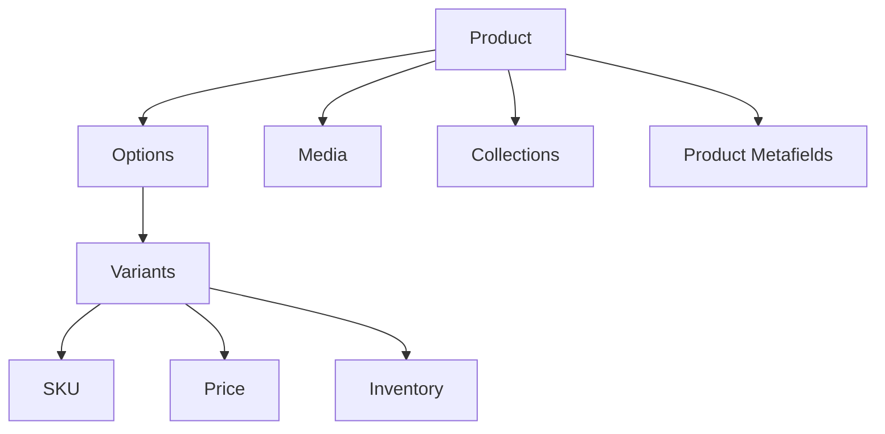

Product 是商品主体。

Variant 是真正交易单位。

最终加购：

```text
Variant ID + Quantity
```

而不是：

```text
Product ID + Quantity
```

官方：

- [Liquid product](https://shopify.dev/docs/api/liquid/objects/product)
- [Liquid variant](https://shopify.dev/docs/api/liquid/objects/variant)
- [Admin GraphQL Product](https://shopify.dev/docs/api/admin-graphql/latest/objects/product)

---

# 12.2 Collection 数据模型

### Collection 自己也可以有 Metafields

例如营销团队希望每个 Collection Hero 都有：

```text
subtitle
hero_background
campaign_badge
seo_intro
```

这些不一定适合写死在 Theme settings，因为它们是“Collection 自己的数据”。可以定义 Collection owner 的 metafields：

```liquid
{{ collection.metafields.custom.subtitle.value }}
```

这个例子很好地说明了：**Theme setting 是主题配置；Metafield 是资源数据。**


Collection 是一个 Product 集合。

从业务思维可以区分：

```text
Manual Collection
→ 人工挑选商品

Automated / Smart Collection
→ 根据条件自动匹配商品
```

它解决的是：

> 哪些商品属于这一组？

Filter 则是在 Collection 结果里继续缩小。

```text
Store Catalog
→ Collection
→ Filters
→ Sort
→ Pagination
```

Liquid： [collection](https://shopify.dev/docs/api/liquid/objects/collection)

---

# 12.3 Inventory / Location：库存不是简单挂在 Variant 上


## 12.3.1 Inventory 在 Admin 哪里？

主要入口：

- `Products → Inventory`：查看/编辑各 Variant 的库存状态；
- `Products → 某 Product / Variant → Inventory`：查看单个商品库存；
- `Settings → Locations`：管理仓库、零售店、3PL / fulfillment location 等 Location。

官方 Help Center：

- [Viewing inventory](https://help.shopify.com/en/manual/products/inventory/adjusting-inventory/viewing-inventory)
- [Setting up inventory for the first time](https://help.shopify.com/en/manual/products/inventory/setup/initial-inventory-setup)
- [Setting up and managing locations](https://help.shopify.com/en/manual/fulfillment/setup/locations/setup)

开发文档：

- [Manage inventory quantities and states](https://shopify.dev/docs/apps/build/orders-fulfillment/inventory-management-apps/manage-quantities-states)


这是 Shopify 数据模型中非常重要的一条链：

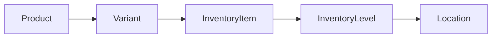

### 库存链路中的 Variant

表示：

```text
Nike Air Max / Black / 9
```

### InventoryItem

InventoryItem 是 Variant 对应的库存管理对象。你可以把它理解成“这个 SKU 的库存身份”。

常见关注：

- 是否 tracking inventory；
- SKU / inventory-related metadata；
- 它在多个 Location 下对应的 InventoryLevel。

开发时，如果你要做 ERP/WMS 库存同步，脑内链路应该是：

```text
ProductVariant
   ↓ inventoryItem
InventoryItem
   ↓ inventoryLevels
InventoryLevel[]
```


是这个 Variant 对应的库存管理对象。

官方： [InventoryItem](https://shopify.dev/docs/api/admin-graphql/latest/objects/inventoryitem)

### InventoryLevel

InventoryLevel 连接：

```text
InventoryItem + Location
```

因此同一个 SKU 可以得到多条库存记录：

```text
TS-BLK-M @ LA Warehouse
TS-BLK-M @ NY Store
TS-BLK-M @ 3PL
```

它不是“一个商品有几个库存”的简单字段，而是**地点维度上的库存状态**。


把：

```text
InventoryItem + Location
```

连接起来，记录某地点的库存状态。

### Location

Location 可以代表：

- Warehouse；
- Retail store；
- Popup / physical location；
- 某些 fulfillment service / app 管理位置。

而且“这个 Location 有库存”不必然意味着“这个库存参与 Online Store 履约”。后台还存在 location fulfillment / routing 配置。

官方：[Setting up order fulfillment for locations](https://help.shopify.com/en/manual/fulfillment/setup/locations/fulfillment)


可以是：

- Warehouse
- Retail Store
- Fulfillment Center
- Popup
- Dropshipper

官方： [Location](https://shopify.dev/docs/api/admin-graphql/latest/queries/location)

---

## 12.4 多仓库存为什么需要 InventoryLevel？

### `available`、`on_hand`、`committed` 不应混成一个 stock

在现代 Shopify Inventory 中，你会看到多个 quantity state。常用理解：

| 状态 | 直觉解释 |
|---|---|
| `on_hand` | 物理上/系统账面现有库存 |
| `available` | 当前可继续分配给新销售的库存 |
| `committed` | 已经被订单等需求占用 |
| `incoming` | 正在到货/转移途中 |
| 其他 unavailable states | 可能包括 damaged、reserved、quality control、safety stock 等 |

真实数量关系和可售策略要以当前 Inventory API 规则为准，不建议自己写一个 `on_hand - committed = available` 就当成 Shopify 的完整算法。


例如同一 Variant：

```text
Black / 9
```

库存：

```text
San Jose      → 20
Los Angeles   → 15
New York      → 8
```

所以库存不是一个简单：

```text
inventory = 43
```

因为履约时必须知道库存在哪里。

---

## 12.5 `available` ≠ 具体库存数量

### Theme 为什么通常只关心“可不可以卖”？

Storefront 的核心问题通常是：

```text
这个 Variant 现在能不能 Add to Cart？
```

所以 Theme 经常使用：

```liquid

  In stock

  Sold out

```

而 ERP/WMS 的问题是：

```text
LA warehouse on_hand 多少？
NY committed 多少？
3PL available 多少？
```

后者属于 Admin API / inventory integration 的职责。**不要强迫 Theme Liquid 承担后台库存系统的职责。**


Theme 中：

```liquid
variant.available
```

是可购买状态。

它不等于：

```text
库存数量 = 5
```

现代 Shopify Inventory 还存在多种状态，例如 available、on_hand、committed 等。

库存 App 官方概览： [Apps in inventory management](https://shopify.dev/docs/apps/build/orders-fulfillment/inventory-management-apps)

---

# 12.6 Cart / Checkout / Order 数据生命周期

### Cart

**Admin 里通常没有一个等价于 Orders 的“Cart 列表让商家管理所有在线购物车”页面。** Cart 更像 Storefront 购物上下文；对于 Headless，Storefront API 也有独立 Cart 模型。

Theme 场景主要通过：

- Liquid `cart` object；
- Ajax Cart API；
- Product Form；
- Section Rendering API；

进行交互。
 在 Liquid 中常用什么？

官方：[Liquid `cart` object](https://shopify.dev/docs/api/liquid/objects/cart)

| 属性 | 含义 | 常见场景 |
|---|---|---|
| `cart.items` | Cart line items | Cart page / drawer |
| `cart.item_count` | 商品数量总计语义 | Cart badge |
| `cart.total_price` | 当前 Cart 总价 | Cart summary |
| `cart.original_total_price` | 折扣前等原始总价语义 | Discount UI |
| `cart.cart_level_discount_applications` | Cart-level discounts | 折扣说明 |
| `cart.note` | Cart note | 买家留言 |
| `cart.attributes` | Cart attributes | Cart-level 自定义上下文 |

> Cart 的 cost 仍然不是“永远等于最终 Order total”的保证；Checkout 还可能受到 shipping、tax、discount、market context 等影响。


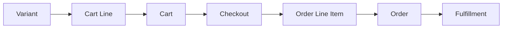

### 生命周期中的 Cart

用户准备购买的商品集合。

Liquid： [cart](https://shopify.dev/docs/api/liquid/objects/cart)

Storefront API： [Cart](https://shopify.dev/docs/api/storefront/latest/objects/Cart)

### Checkout

Checkout 负责把购物意图变成交易，涉及：

```text
buyer / contact
shipping address
shipping / delivery options
discounts
税费
total
payment
```

对于标准 Shopify Theme，通常不是让你“自己写一个信用卡页面”，而是把买家导向 Shopify Checkout，并在 Shopify 允许的 extensibility surface 上扩展。


负责最终交易确认：

```text
Shipping
Tax
Discount
Payment
Buyer details
```

### Order

**Admin：** `Orders`。

订单形成后，商家可以在 Orders 页面管理付款、编辑订单、退款/退货以及 Fulfillment。

官方 Help Center：

- [Managing orders](https://help.shopify.com/en/manual/fulfillment/managing-orders)
- [Order management and fulfillment](https://help.shopify.com/en/manual/fulfillment)

开发文档：[Admin GraphQL Order](https://shopify.dev/docs/api/admin-graphql/latest/objects/Order)


用户完成 Checkout 后形成的正式购买结果。

官方： [Order - GraphQL Admin](https://shopify.dev/docs/api/admin-graphql/2026-01/objects/Order)

---

## 12.7 Cart Line ≠ Order Line Item

### 为什么 Order Line Item 不能永远“回头读 Product 当前值”代替？

订单是一笔历史交易。假设下单后商家把 Product title 从：

```text
Classic T-Shirt
```

改成：

```text
Classic Cotton Tee 2027
```

历史订单仍需要保留成交时的商品上下文、价格、数量等订单数据。Order line item 是订单生命周期里的记录，不等于“实时 Product Card”。


生命周期不同：

```text
购物阶段
→ Cart Line

购买完成
→ Order Line Item
```

不要把 Cart 数据直接当成 Order 数据。

---

## 12.8 Customer：顾客资料 ≠ Customer Account ≠ 当前 Cart

### Admin 位置

`Shopify Admin → Customers`。

Customer profile 可能因为下单、注册账户、订阅营销等行为形成。Customer Account 则是顾客登录和自助查看订单等体验；不要把“存在 Customer record”简单等同于“这个人一定创建过账户并已登录”。

官方：

- [Customers – Help Center](https://help.shopify.com/en/manual/customers)
- [Managing customers](https://help.shopify.com/en/manual/customers/manage-customers)
- [Liquid `customer` object](https://shopify.dev/docs/api/liquid/objects/customer)

### Theme 中常见 Liquid 属性

| 属性 | 用途 |
|---|---|
| `customer.id` | Customer ID |
| `customer.first_name` / `last_name` | 个性化问候 |
| `customer.name` | 显示名称 |
| `customer.email` | 账户相关 UI（注意隐私与暴露范围） |
| `customer.addresses` | 顾客地址集合 |
| `customer.default_address` | 默认地址 |
| `customer.orders` | 账户上下文中的订单列表 |
| `customer.tags` | 商家标签 / 分群辅助 |
| `customer.metafields` | 自定义 Customer 数据 |
| `customer.has_account` | 账户状态相关语义 |

典型 Theme 判断：

```liquid

  <p>Welcome, {{ customer.first_name | default: customer.name | escape }}</p>

  <a href="{{ routes.account_login_url }}">Log in</a>

```

> 现代 Customer Accounts 与 classic account 体验、Customer Account API 是另一条能力线。做新项目时不要只根据多年以前的 `/account/login` 教程推断所有账户架构。

### 四个概念对比

| 概念 | 核心问题 |
|---|---|
| Customer | Shopify 认识的顾客资料是谁？ |
| Customer Account | 顾客如何认证并访问自己的账户体验？ |
| Cart | 此刻准备买什么？ |
| Order | 已经完成的历史交易是什么？ |

---

## 12.9 Order / Transaction / Fulfillment / Return / Refund

这组对象非常容易被“订单”两个字全部覆盖掉。

| 对象/概念 | 它回答的问题 | 典型状态/信息 |
|---|---|---|
| Order | 买了什么？总交易是什么？ | line items、totals、customer、addresses |
| Transaction | 钱发生了什么？ | authorization、capture、sale 等支付交易语义 |
| Fulfillment | 哪些商品如何发出？ | location、tracking、fulfilled items |
| Return | 哪些商品要退回来？ | return lines、return workflow |
| Refund | 多少钱退回去了？ | refund amounts、refund transactions |

### 为什么一个 Order 可以有多个 Fulfillment？

例如：

```text
Order #1001
├── T-Shirt × 1 → LA Warehouse
└── Shoes × 1   → NY Warehouse
```

或者部分商品先发、部分预售后发，都可能让一个 Order 对应多个履约单元。

Admin 中：`Orders → 打开订单`，可以看到 payment / fulfillment / return / refund 等操作。

官方：

- [Fulfilling orders](https://help.shopify.com/en/manual/fulfillment/fulfilling-orders)
- [Fulfilling your own orders individually](https://help.shopify.com/en/manual/fulfillment/fulfilling-orders/single-fulfillment)
- [Admin GraphQL Fulfillment](https://shopify.dev/docs/api/admin-graphql/latest/objects/Fulfillment)
- [Admin GraphQL OrderTransaction](https://shopify.dev/docs/api/admin-graphql/latest/objects/OrderTransaction)

### 数据链路

```text
Order
├── Line items
├── Payment / Transactions
├── Fulfillment Orders / Fulfillments
├── Returns
└── Refunds
```

做 OMS / WMS 集成时必须按 Shopify 当前 Fulfillment Orders 模型和 API 文档设计，不要只依据 Theme 里的订单展示对象推断后台履约 API。

# Part 13：Metafield 与 Metaobject 数据模型深入


这一 Part 不再把 Metaobject 只作为“下一课预告”，而是把它完整展开。


## 13.1 从数据库角度理解 Metafield

### Standard / Custom / Unstructured / App-owned

| 类型 | 谁定义 | 是否有 Definition | 使用建议 |
|---|---|---:|---|
| Standard metafield | Shopify 标准模型 | 是 | 有合适标准定义时优先 |
| Custom metafield | 商家/开发者 | 是 | 店铺特有业务字段 |
| Unstructured metafield | 历史/自由写入 | 否 | 兼容旧数据；新项目一般不优先 |
| App-owned metafield | App | 是/由 App 管理 | App 私有/业务扩展数据 |

官方 Help Center 对这几类 Custom Data 有完整解释：
[Overview of custom data](https://help.shopify.com/en/manual/custom-data/overview)


关系数据库：

```text
products table
+ 新增 material column
```

Shopify：

```text
Product Resource
+ Product Metafield Definition
```

官方的数据建模文档甚至直接用数据库类比说明：

- Resource ≈ Built-in Table
- Metafield Definition ≈ 新增 Column
- Metaobject Definition ≈ 自定义 Table

官方： [Data modeling with metafields and metaobjects](https://shopify.dev/docs/apps/build/metaobjects/data-modeling-with-metafields-and-metaobjects)

---

## 13.2 Metafield 可以挂在不同 Owner 上

### Owner type 影响“字段属于谁”

例如都叫 `custom.internal_note`：

```text
Product metafield
→ 描述商品内部备注

Customer metafield
→ 描述顾客内部备注

Order metafield
→ 描述订单业务备注
```

即使 namespace/key 看起来相同，它们的 owner type 不同，语义也不同。设计前先问：**这个信息的生命周期跟谁走？**


不只 Product：

```text
Product
Variant
Collection
Customer
Order
Shop
Location
...
```

所以：

```text
Product Metafield
```

与：

```text
Variant Metafield
```

不是同一个字段实例。

例如：

```text
Product
custom.material = Mesh

Variant Black / 9
custom.package_weight = 0.8kg
```

---

## 13.3 Metafield、Tag、Option 的区别

### 再补一个 Category Metafield

现代 Shopify 还有 **Category metafield**：它来自 Shopify Standard Product Taxonomy，与特定 Product Category 关联。例如某类服装可能获得 Color、Fabric、Size 等标准属性。

它与随意创建一个 `custom.color` 的意义不同：标准分类属性更有利于跨 Shopify / sales channels 的结构一致性。

官方：[Shopify's Standard Product Taxonomy](https://help.shopify.com/en/manual/products/details/product-category)


### Option

```text
Color / Size
```

通常参与生成 Variant。

### Metafield

```text
Material / Origin / Warranty
```

通常描述业务属性。

### Tag

```text
sale / summer / vip
```

更接近轻量标签或分组标识。

不要用 Tags 代替所有结构化业务数据。

---

## 13.4 Metaobject 为什么存在？

## 13.5 Metaobject 在 Admin 的位置与创建流程

Metaobject 有两个层次：

```text
Definition = 结构
Entry      = 一条具体内容
```

**Definition：**通常在 `Settings → Custom data / Metafields and metaobjects` 管理。

**Entries：**`Content → Metaobjects`。

当前 Help Center 也允许从 `Content → Metaobjects` 进入并创建 definition，具体 UI 会随着 rollout 调整。

### 示例：创建 `Size Guide`

1. 进入 `Content → Metaobjects` 或 `Settings → Custom data`。
2. 点击 **Add definition**。
3. Name：`Size Guide`。
4. Shopify 生成 type，例如 `size_guide`。
5. 添加 Fields：
   - `title`：single-line text；
   - `unit`：single-line text；
   - `chest`：text / number（按业务模型）；
   - `waist`；
   - `image`：file；
   - `notes`：rich/multi-line text。
6. 保存 Definition。
7. 进入 `Content → Metaobjects → Size Guide` 添加 Entries，例如 `Men Tops – US`。
8. 创建 Product Metafield `custom.size_guide`，类型选择 **Metaobject reference**，指向 `Size Guide`。
9. 在具体 Product 上选择对应 Size Guide entry。

官方：

- [Metaobjects – Help Center](https://help.shopify.com/en/manual/custom-data/metaobjects)
- [Building a metaobject](https://help.shopify.com/en/manual/custom-data/metaobjects/building-a-metaobject)
- [Liquid `metaobject` object](https://shopify.dev/docs/api/liquid/objects/metaobject)
- [Liquid `metaobjects` global object](https://shopify.dev/docs/api/liquid/objects/metaobjects)
- [Metaobject theme templates](https://shopify.dev/docs/storefronts/themes/architecture/templates/metaobject)

### Liquid：通过 Product metafield reference 读取

```liquid



  <section class="size-guide">
    <h2>{{ guide.title.value | escape }}</h2>
    <p>Unit: {{ guide.unit.value | escape }}</p>
    <p>Chest: {{ guide.chest.value }}</p>
    <p>Waist: {{ guide.waist.value }}</p>
  </section>

```

这里两次 `.value` 的含义不同层次：

```text
product.metafields.custom.size_guide.value
                         ↓
                    Metaobject entry
                         ↓
guide.title.value
        ↓
Metaobject field 的实际值
```

### Liquid：直接按 type + handle 找 Metaobject

```liquid



  {{ guide.title.value }}

```

官方已经把 `metaobjects.type.handle` / bracket notation 作为现代访问方式；旧的 `shop.metaobjects...` 语法属于兼容旧写法，不应该继续作为新教程主写法。

### Metafield vs Metaobject 选择表

| 数据 | 用 Metafield | 用 Metaobject |
|---|---:|---:|
| `Material = Cotton` | ✅ | 不必要 |
| `Warranty months = 12` | ✅ | 不必要 |
| 一个产品引用一个 Brand story | reference metafield | ✅ Story 本身适合 Metaobject |
| Size guide 含 title、rows、image、notes | 作为 reference | ✅ |
| 多个 Product 共用同一 Author / Designer | 作为 reference | ✅ |
| 一组结构化 Product highlights | list of references | ✅ |

一句话：**Metafield 更像“字段”；Metaobject 更像“你自己定义的新对象类型”。**

---

## 13.6 Dynamic Source：不写 Liquid 也能把 Metafield 接到 Theme

支持 dynamic source 的 Theme Editor setting 可以连接 Product metafield、Metaobject 等资源。

例如 Section 有一个 text setting，商家在 Theme Editor 点击 “Connect dynamic source”，把它连接到 `Product → custom.subtitle`。

这形成：

```text
Product metafield value
       ↓
Dynamic source
       ↓
Section setting
       ↓
Theme UI
```

这种方式很适合让商家自行配置，不必每一个自定义字段都写死：

```liquid
{{ product.metafields.custom.xxx.value }}
```

官方：[Metafields – Help Center](https://help.shopify.com/en/manual/custom-data/metafields)

---

## 13.7 一个完整建模案例：服装 Product

假设业务要管理：

```text
Classic T-Shirt
颜色 / 尺寸
材质
产地
洗护说明
尺码表
设计师信息
顾客刺绣文字
```

正确拆分可以是：

| 数据 | Shopify 模型 | 原因 |
|---|---|---|
| Color / Size | Product Options → Variants | 决定具体可购买 SKU |
| Material | Product/category Metafield | Product 属性 |
| Origin | Product Metafield | Product 属性 |
| Care instructions | Product Metafield | 各商品不同的结构化文本 |
| Size Guide | Metaobject + Product reference Metafield | 多字段、可复用 |
| Designer | Metaobject + reference | 设计师自身是独立实体，可被多个 Product 引用 |
| Engraving text | Line Item Property | 属于“这一次购买”的用户输入 |

这张表比记任何 API 都重要：**先根据生命周期建模，代码只是把模型实现出来。**


Metafield 很适合：

```text
material = Cotton
```

但如果你需要：

```text
Size Guide
├── title
├── unit
├── chest
├── waist
├── hip
├── image
└── description
```

把它塞进一个字符串/JSON 并不理想。

这时候更适合：

```text
Metaobject Definition: Size Guide
↓
Metaobject Entry
↓
Product Metafield Reference
```

官方： [About metaobjects](https://shopify.dev/docs/apps/build/metaobjects)

可以这样记：

```text
Metafield
= 给现有 Shopify Resource 增加字段

Metaobject
= 创建一种新的结构化业务对象
```

---

# Part 14：核心对象“在哪里、怎么建、代码怎么拿”速查

这一 Part 不是替代前面的解释，而是开发时快速翻阅。

## 14.1 Product

**Admin：** `Products → Add product`

**创建最小信息：** Title + Price 即可起步，然后再补 Media / Inventory / Variant / Metafield / Publishing。

**Theme：** Product template 中的 `product`。

**常用：** `title`、`url`、`handle`、`description`、`vendor`、`available`、`price_*`、`options_with_values`、`variants`、`media`、`metafields`。

**官方：** [Liquid Product](https://shopify.dev/docs/api/liquid/objects/product) · [Admin Product](https://shopify.dev/docs/api/admin-graphql/latest/objects/Product)

---

## 14.2 Variant

**Admin：** `Products → Product → Variants`

**创建：** 添加 Option + values 自动产生组合，或按后台提供的 Add variant / bulk 工具管理。

**Theme：** `product.variants` / `selected_or_first_available_variant`。

**最关键：** `variant.id` 是 Product Form / Ajax Cart 加购时提交的 purchasable Variant ID。

**官方：** [Liquid Variant](https://shopify.dev/docs/api/liquid/objects/variant) · [Adding variants](https://help.shopify.com/en/manual/products/variants/add-variants)

---

## 14.3 Collection

**Admin：** `Products → Collections`

**创建：** 视你当前 Admin rollout，可以手工/条件/来源的方式添加 Product / Variant。

**Theme：** `collection`。

**常用：** `title`、`description`、`image`、`products`、`filters`、`sort_options`、`sort_by`、`default_sort_by`。

**官方：** [Liquid Collection](https://shopify.dev/docs/api/liquid/objects/collection) · [Create collections](https://help.shopify.com/en/manual/products/collections/create-collection)

---

## 14.4 Cart

**Admin：** 没有一个与 Product/Orders 相同的普通资源编辑页面；主要存在于 Storefront 购物生命周期。

**Theme：** `cart` Liquid object + `/cart` template + Ajax Cart API。

**常用：** `items`、`item_count`、`total_price`、`note`、`attributes`、discount applications。

**官方：** [Liquid Cart](https://shopify.dev/docs/api/liquid/objects/cart) · [Ajax Cart API](https://shopify.dev/docs/api/ajax/reference/cart)

---

## 14.5 Metafield

**Admin：** `Settings → Metafields and metaobjects`；值也可在对应 Product/Customer/Order 等资源页面填写。

**创建：** Owner → Name → namespace/key → type → validations → value。

**Theme：** `resource.metafields.namespace.key.value`。

**官方：** [Liquid Metafield](https://shopify.dev/docs/api/liquid/objects/metafield) · [About metafields](https://shopify.dev/docs/apps/build/metafields)

---

## 14.6 Metaobject

**Admin：** Definition 在 Custom data 设置；Entries 在 `Content → Metaobjects`。

**创建：** Definition → fields → entries → 可选用 reference metafield 关联到 Product 等资源。

**Theme：** `metaobjects.type.handle` 或通过 reference Metafield 得到 entry。

**官方：** [Liquid Metaobject](https://shopify.dev/docs/api/liquid/objects/metaobject) · [Building a metaobject](https://help.shopify.com/en/manual/custom-data/metaobjects/building-a-metaobject)

---

## 14.7 Inventory / Location

**Admin：** `Products → Inventory`；Location 在 `Settings → Locations`。

**数据模型：** Variant → InventoryItem → InventoryLevel ↔ Location。

**主要开发面：** 后台集成通常走 Admin GraphQL，而不是 Theme Liquid。

**官方：** [Manage inventory states](https://shopify.dev/docs/apps/build/orders-fulfillment/inventory-management-apps/manage-quantities-states) · [Locations](https://help.shopify.com/en/manual/fulfillment/setup/locations/setup)

---

## 14.8 Customer

**Admin：** `Customers`。

**Theme：** 登录上下文可使用 `customer` Liquid object。

**常用：** `name`、`email`、`addresses`、`orders`、`tags`、`metafields`、`has_account`。

**官方：** [Liquid Customer](https://shopify.dev/docs/api/liquid/objects/customer) · [Customers Help](https://help.shopify.com/en/manual/customers)

---

## 14.9 Order / Fulfillment

**Admin：** `Orders`。

**Order：** 成交后的商业记录；**Fulfillment：** 哪些 line items 从哪里、如何被履约。

**App：** OMS/WMS/3PL 通常使用 Admin GraphQL 的 Order / Fulfillment Orders / Fulfillment 模型。

**官方：** [Managing orders](https://help.shopify.com/en/manual/fulfillment/managing-orders) · [Build fulfillment solutions](https://shopify.dev/docs/apps/build/orders-fulfillment/order-management-apps/build-fulfillment-solutions)

---

# Part 15：常见“到底该用哪个？”决策表

## 15.1 Option vs Variant vs Metafield vs Metaobject vs Line Item Property

| 需求 | 应优先考虑 | 理由 |
|---|---|---|
| 黑色/M 有独立库存和 SKU | Variant | 它是独立可购买规格 |
| 商品材质 Cotton | Metafield | Product 的简单自定义字段 |
| 多字段尺码表且多个商品复用 | Metaobject + reference | 独立、结构化、可复用对象 |
| 顾客这一次输入刻字 Alice | Line Item Property | 属于购买实例，不应生成 SKU |
| Color 是用户必须选择的规格 | Product Option | Option values 用来解析 Variant |

## 15.2 Theme setting vs Metafield

| 场景 | Theme setting | Metafield |
|---|---:|---:|
| 全站按钮圆角 | ✅ | ❌ |
| 首页 Hero 标题 | ✅ | 可选，看内容模型 |
| 每个 Product 都有自己的“材质” | ❌ | ✅ |
| Collection 自己的营销副标题 | 不建议逐 Collection 写 Theme setting | ✅ Collection metafield |
| 商家想在编辑器里选择展示风格 | ✅ | ❌ |

## 15.3 Filter vs Sort vs Collection

| 概念 | 问题 |
|---|---|
| Collection | 这一页的初始商品集合是什么？ |
| Filter | 从集合里留下哪些商品？ |
| Sort | 已留下的商品怎么排序？ |
| Pagination | 结果的哪一页？ |

## 15.4 Theme vs App vs Function vs Headless

| 如果需求是… | 首选 |
|---|---|
| 商品详情页 UI | Theme |
| Admin 中复杂业务系统 | App |
| Checkout commerce rule | Function（通常由 App 交付） |
| 自己用 React 完全控制 Storefront | Headless / Storefront API |
| 仅给 Product 增加结构化字段 | Metafield，不要为了字段做整个 App |

# Part 16：综合实战：一个商品详情页如何把知识串起来

假设需求是：

> 做一个服装 Product page，支持 Color / Size 选规格、切图、显示 Material、打开 Size Guide、Ajax 加购并打开 Cart Drawer。

不要直接开写 JS。先拆数据模型。

## 16.1 数据建模

```text
Product
├── title / description / media
├── Options
│   ├── Color
│   └── Size
├── Variants
│   ├── Black / S
│   ├── Black / M
│   └── ...
├── Product Metafield
│   └── custom.material = Cotton
└── Product Metafield
    └── custom.size_guide
          ↓ reference
       Size Guide Metaobject
```

这样：

- SKU / price / stock → Variant；
- Material → Metafield；
- 多字段可复用 Size Guide → Metaobject；
- Cart Drawer → Theme UI。

## 16.2 Liquid 首屏应该输出什么？

```liquid




<article data-product-section data-product-id="{{ product.id }}">
  <h1>{{ product.title | escape }}</h1>

  <div data-price>
    {{ current_variant.price | money }}
  </div>

  
    <p>Material: {{ material }}</p>
  

  
    <details>
      <summary>{{ size_guide.title.value | escape }}</summary>
      <p>Chest: {{ size_guide.chest.value }}</p>
      <p>Waist: {{ size_guide.waist.value }}</p>
    </details>
  

  
    <input type="hidden" name="id" value="{{ current_variant.id }}" data-variant-id>
    <input type="number" name="quantity" value="1" min="1">
    <button type="submit" disabled>
      Add to cart
    </button>
  
</article>
```

首屏即使 JS 还没执行，Title、Price、Material、Form 等核心内容已经存在。

## 16.3 Variant Picker 的 JS 负责什么？

```text
读取用户选择的 Color / Size
       ↓
解析目标 Variant
       ↓
更新 hidden input 的 variant ID
       ↓
更新价格 / 可售状态
       ↓
切换 Media
       ↓
可选：同步 ?variant=...
```

它不负责：

- 决定可信价格；
- 修改 Shopify 库存；
- 自己造一个 Order。

## 16.4 Ajax 加购

```js
const form = document.querySelector('#ProductForm');

form.addEventListener('submit', async (event) => {
  event.preventDefault();

  const formData = new FormData(form);
  const variantId = Number(formData.get('id'));
  const quantity = Number(formData.get('quantity') || 1);

  const response = await fetch(window.Shopify.routes.root + 'cart/add.js', {
    method: 'POST',
    headers: {
      'Content-Type': 'application/json',
      Accept: 'application/json'
    },
    body: JSON.stringify({
      items: [{ id: variantId, quantity }],
      sections: ['cart-drawer', 'cart-icon-bubble']
    })
  });

  if (!response.ok) {
    // 生产代码：显示 Shopify 返回的库存/加购错误
    return;
  }

  const result = await response.json();

  // 生产 Theme 应按自己的 section wrapper 结构安全替换。
  document.querySelector('#cart-drawer').innerHTML = result.sections['cart-drawer'];
});
```

这里把前面课程完整连起来：

```text
Product / Variant 数据模型
        ↓
Liquid SSR
        ↓
Metafield / Metaobject 内容
        ↓
JS Variant interaction
        ↓
Ajax Cart API
        ↓
Section Rendering
        ↓
Cart Drawer UI
        ↓
Shopify Checkout
```

## 16.5 最后的工程检查

| 检查项 | 为什么 |
|---|---|
| 首屏主图是否被 lazy load | 影响 LCP |
| Product form 是否提交 Variant ID | Product ID 不能直接替代 |
| 无 JS 时页面是否仍有核心内容 | Progressive enhancement |
| Size Guide 是否被重复存进每个 Product | 可复用数据应考虑 Metaobject |
| Cart Drawer 更新是否使用 Shopify 返回的新 HTML/数据 | 避免前端状态漂移 |
| URL 是否同步 Variant / filter 等重要状态 | 刷新/分享/后退 |
| 活动价是否只靠浏览器参数 | 价格安全边界错误 |

---

# Part 17：课程式精讲——保留原对话的“逐步推导”

> 前面的 Part 0–16 更适合查阅；这一 Part 更接近真正上课。它刻意保留“先写最小版本 → 发现它为什么不够 → 增加状态/边界 → 再工程化”的过程。你不需要背代码，重点是理解代码为什么一步步演化成现在这样。

---

# 第 8 课：Add to Cart 实战——从 Variant ID 到真实 Cart


官方参考：

- [Product template overview](https://shopify.dev/docs/storefronts/themes/architecture/templates/product/overview)
- [Ajax Cart API](https://shopify.dev/docs/api/ajax/reference/cart)
- [Cart Liquid object](https://shopify.dev/docs/api/liquid/objects/cart)

## 8.1 最小版本看起来非常简单

我们已经知道：真正加入购物车的是 Variant，不是 Product。

所以最小 Product Form：

```liquid

  <input
    type="hidden"
    name="id"
    value="{{ product.selected_or_first_available_variant.id }}"
  >

  <button type="submit">Add to cart</button>

```

你现在应该能读懂：

```text
name="id"
    ↓
Variant ID
    ↓
Shopify Cart
```

注意：虽然字段名叫 `id`，它不是 `product.id`。

---

## 8.2 但是 Variant Selector 一旦存在，隐藏 ID 也必须跟着变化

例如首屏：

```text
Black / S → Variant 101
```

Liquid 输出：

```html
<input name="id" value="101">
```

用户后来选择：

```text
Black / M → Variant 102
```

如果 JS 只更新了价格，但没有更新 input：

```html
<input name="id" value="101">
```

那么用户视觉上选的是：

```text
Black / M
```

真正加入购物车的却是：

```text
Black / S
```

这类 Bug 非常隐蔽。

所以 Variant change 时：

```js
variantInput.value = selectedVariant.id;
```

必须和其它 UI 同步。

---

## 8.3 Ajax Add to Cart 只是换了“提交方式”，没有改变数据模型

普通 Form：

```text
Browser Form
→ Shopify
→ Cart
→ 页面跳转/刷新
```

Ajax：

```text
Browser JS
→ /cart/add.js
→ Shopify Cart
→ JSON
→ JS 更新 UI
```

核心仍然是：

```text
Variant ID + Quantity
```

最小 Ajax：

```js
async function addToCart(variantId, quantity) {
  const response = await fetch(
    window.Shopify.routes.root + 'cart/add.js',
    {
      method: 'POST',
      headers: {
        'Content-Type': 'application/json',
        Accept: 'application/json'
      },
      body: JSON.stringify({
        items: [
          {
            id: variantId,
            quantity
          }
        ]
      })
    }
  );

  return response.json();
}
```

为什么推荐 `window.Shopify.routes.root`？

因为跨语言 / Markets 店铺可能有 locale-aware 路径。硬编码：

```js
'/cart/add.js'
```

在简单商店里可能工作，但不是最稳妥的 Theme 习惯。

---

## 8.4 但是实际项目不能直接 `await addToCart(...)`

真实商品页首先要判断：

```js
variant
```

是否存在。

比如：

```text
Color = Black
Size = null
```

那么 `selectedVariant` 可能是：

```js
null
```

所以：

```js
if (!variant) {
  showError('Please select all options');
  return;
}
```

然后判断：

```js
variant.available
```

```js
if (!variant.available) {
  showError('This variant is sold out');
  return;
}
```

完整一点：

```js
async function handleAddToCart() {
  const variant = productState.selectedVariant;

  if (!variant) {
    showError('Please select an option');
    return;
  }

  if (!variant.available) {
    showError('This variant is sold out');
    return;
  }

  await addToCart(variant.id, productState.quantity);
}
```

这段就是你在原对话里特别关注的点：

> “按钮看起来能不能点”和“加购函数实际允许不允许执行”是两层保护。

---

## 8.5 Quantity 也是商品页状态

除了：

```text
selectedOptions
selectedVariant
```

还有：

```text
quantity
```

所以状态更完整：

```js
const state = {
  selectedOptions: {
    Color: 'Black',
    Size: 'M'
  },
  selectedVariant: {
    id: 102,
    available: true
  },
  quantity: 2
};
```

加购：

```js
await addToCart(
  state.selectedVariant.id,
  state.quantity
);
```

不要把数量输入框里的任意字符串直接信任为数量。至少要：

```js
const quantity = Math.max(
  1,
  Number.parseInt(quantityInput.value, 10) || 1
);
```

---

## 8.6 真实项目需要 loading 状态

用户可能连续点：

```text
Add to Cart
Add to Cart
Add to Cart
```

如果每次都发请求，可能出现重复加购。

所以：

```js
if (state.loading) return;

state.loading = true;
button.disabled = true;
```

请求结束：

```js
finally {
  state.loading = false;
  updateAddButton(state.selectedVariant);
}
```

这里你会发现 Product 页面状态又多了一项：

```text
loading
```

---

## 8.7 HTTP 成功不等于业务一定成功

你不能只写：

```js
const data = await response.json();
```

还应该检查：

```js
if (!response.ok) {
  const error = await response.json();
  throw new Error(error.description || 'Unable to add item');
}
```

因为在用户看到页面和真正点击加购之间，库存可能变化：

```text
页面渲染时：available = true
        ↓
别的用户买走最后一件
        ↓
当前用户点击 Add
        ↓
Shopify 拒绝 / 调整
```

因此：

> 前端 `variant.available` 是提前改善体验；最终结果仍然以 Shopify 服务端响应为准。

---

## 8.8 一个更完整的加购 Handler

```js
async function handleAddToCart() {
  const variant = state.selectedVariant;

  if (!variant) {
    showError('Please select all options');
    return;
  }

  if (!variant.available) {
    showError('This variant is sold out');
    return;
  }

  if (state.loading) {
    return;
  }

  state.loading = true;
  clearError();
  renderAddButton();

  try {
    const response = await fetch(
      window.Shopify.routes.root + 'cart/add.js',
      {
        method: 'POST',
        headers: {
          'Content-Type': 'application/json',
          Accept: 'application/json'
        },
        body: JSON.stringify({
          items: [
            {
              id: variant.id,
              quantity: state.quantity
            }
          ]
        })
      }
    );

    const data = await response.json();

    if (!response.ok) {
      throw new Error(
        data.description || 'Unable to add item to cart'
      );
    }

    await refreshCartUI();
  } catch (error) {
    showError(error.message);
  } finally {
    state.loading = false;
    renderAddButton();
  }
}
```

这里已经出现完整前端交互状态：

```text
idle
↓
validating
↓
loading
├── success
└── error
```

---

## 8.9 Add to Cart 后为什么不应该自己“猜 Cart UI”？

例如你可以前端直接写：

```js
cartCount.textContent = Number(cartCount.textContent) + 1;
```

但真实 Cart 可能涉及：

```text
quantity
discount
bundle
selling plan
cart transform
inventory adjustments
line merging
```

所以更稳的做法是：

```text
请求 Shopify
↓
拿 Shopify 真实 Cart / Section HTML
↓
用真实结果更新 UI
```

下一课 Cart Drawer 就解决这个问题。

---

# 第 9 课：Cart Drawer——为什么它是 Theme UI，而不是 Shopify 固定组件


官方参考：

- [Ajax Cart API](https://shopify.dev/docs/api/ajax/reference/cart)
- [Section Rendering API](https://shopify.dev/docs/api/ajax/section-rendering)
- [Use Section Rendering API for dynamic updates](https://shopify.dev/docs/storefronts/themes/best-practices/performance/use-section-rendering-api)

## 9.1 先分清两个东西

```text
Cart
```

是 Shopify 的商业对象。

```text
Cart Drawer
```

是 Theme 的 UI。

可以换一个 Theme，把侧滑抽屉改成右侧、底部甚至 Modal；Cart 本身仍然是同一个 Shopify Cart。

对比：

| 概念 | 谁负责 | 是否 Shopify 核心数据 |
|---|---|---:|
| Cart | Shopify | 是 |
| Cart Lines | Shopify | 是 |
| Cart Drawer HTML | Theme | 否 |
| Drawer 动画 | Theme CSS / JS | 否 |
| Drawer 打开/关闭 | Theme JS | 否 |
| Checkout | Shopify | 平台流程 |

---

## 9.2 一个 Cart Drawer 至少需要哪些 UI 状态？

不是只有：

```text
open / close
```

实际至少可能有：

```js
const cartDrawerState = {
  open: false,
  loading: false,
  error: null,
  updatingLineKey: null
};
```

为什么需要 `updatingLineKey`？

因为用户可能正在改：

```text
Line A quantity +
```

同时 Cart 中还有 Line B/C。你不一定想让整个 Drawer 都变成不可操作。

---

## 9.3 最小 Drawer HTML

教学版：

```liquid
<aside
  id="cart-drawer"
  data-cart-drawer
  hidden
  aria-labelledby="cart-drawer-title"
>
  <header>
    <h2 id="cart-drawer-title">Your cart</h2>
    <button type="button" data-cart-close>
      Close
    </button>
  </header>

  <div data-cart-content>
    
      <p>Your cart is empty.</p>
    
      
        <article data-line-key="{{ item.key }}">
          <a href="{{ item.url }}">
            {{ item.product.title | escape }}
          </a>

          <p>{{ item.final_line_price | money }}</p>
          <p>Qty: {{ item.quantity }}</p>
        </article>
      
    
  </div>
</aside>
```

这里重点是：

```text
Liquid 负责根据真实 cart 渲染 HTML
JS 负责让它像 Drawer 一样交互
```

---

## 9.4 打开/关闭为什么还涉及 Accessibility？

最小版本：

```js
drawer.hidden = false;
```

还不够。

真实 Drawer 需要考虑：

- 打开后焦点去哪？
- `Esc` 能否关闭？
- 关闭后焦点是否回到触发按钮？
- 背景内容是否仍可键盘聚焦？
- Screen reader 能否理解这是一个独立区域？

所以：

```text
视觉上的 Drawer
≠
完整可访问的 Drawer
```

如果使用 `<dialog>`，浏览器可以帮你解决一部分模态交互；如果使用 `<aside>` + custom overlay，就要自己完整处理。

---

## 9.5 为什么 Add to Cart 后不重新请求 `/cart.js` 再手写所有 HTML？

当然可以：

```text
/cart.js
↓
JSON
↓
JS createElement
↓
Cart Drawer
```

但这意味着：

```text
一套 Cart 展示逻辑写在 Liquid
另一套 Cart 展示逻辑写在 JavaScript
```

很容易产生两个版本：

```text
Cart page 显示折扣 A
Cart drawer 显示折扣 B
```

Section Rendering 的价值就是：

> 仍然让 Shopify + Liquid 成为 HTML 真相来源，JS 只负责取回并替换局部 DOM。

---

## 9.6 Add to Cart + Bundled Section Rendering

例如：

```js
const response = await fetch(
  window.Shopify.routes.root + 'cart/add.js',
  {
    method: 'POST',
    headers: {
      'Content-Type': 'application/json',
      Accept: 'application/json'
    },
    body: JSON.stringify({
      items: [
        {
          id: variant.id,
          quantity: 1
        }
      ],
      sections: [
        'cart-drawer',
        'cart-icon-bubble'
      ]
    })
  }
);

const result = await response.json();
```

返回结果里除了加购数据，还可能有：

```js
result.sections['cart-drawer']
result.sections['cart-icon-bubble']
```

它们是 Shopify 服务端重新跑 Liquid 后生成的 HTML。

---

## 9.7 Section Rendering 到底“刷新”了什么？

不是：

```text
Browser reload
```

而是：

```text
当前页面仍然存在
↓
AJAX 请求 Shopify
↓
服务器重新 render 某个 Section
↓
返回 HTML 字符串
↓
JS 替换指定 DOM
```

所以页面可以表现成：

```text
Header            不刷新
Product Gallery   不刷新
Product Form      不刷新
Cart Drawer       更新
Cart Bubble       更新
Footer            不刷新
```

---

## 9.8 为什么不能假设 Section ID 就是文件名？

Theme 中：

```text
sections/cart-drawer.liquid
```

是 Section **类型/文件**。

但 JSON Template 中实例化后可能有运行时 Section ID。

所以动态渲染/替换时要区分：

```text
section type
section.id
DOM wrapper id
```

不要把：

```text
cart-drawer
```

当成所有场景下唯一且固定的实例 ID。

---

## 9.9 数量 `+/-` 发生什么？

假设用户把某条 Line 从：

```text
1 → 2
```

流程：

```text
点击 +
↓
读取 line key
↓
POST /cart/change.js
↓
quantity = 2
↓
Shopify 更新 Cart
↓
重新渲染 cart-drawer / bubble
↓
替换 DOM
```

这里为什么强调 line key，下一课讲。

---

# 第 10 课：Cart API——Add / Change / Update / Clear 到底怎么选？

官方参考：[Ajax Cart API](https://shopify.dev/docs/api/ajax/reference/cart)

## 10.1 先画一张职责表

| API | 主要动作 | 最典型场景 |
|---|---|---|
| `GET /cart.js` | 获取 Cart | 读取当前状态 |
| `POST /cart/add.js` | 新增 Line / 增加商品 | Add to Cart |
| `POST /cart/change.js` | 修改一条已有 Line | Qty +/-、删除单行 |
| `POST /cart/update.js` | 批量/Cart 级更新 | 多行更新、note、attributes |
| `POST /cart/clear.js` | 清空 Lines | Empty cart |

不要只记 Endpoint 名字，要记它操作的数据层级。

---

## 10.2 `add.js` 操作的是 Variant

```js
body: JSON.stringify({
  items: [
    {
      id: variantId,
      quantity: 2
    }
  ]
})
```

这里：

```text
id = Variant ID
```

原因：你正在告诉 Shopify：

> “把这个 SKU 放进 Cart。”

---

## 10.3 `change.js` 操作的是“已经存在的 Cart Line”

当商品进入 Cart 后，数据层级已经从：

```text
Variant
```

变成：

```text
Cart Line
```

所以修改数量时优先思考：

```text
我要修改哪一条 Line？
```

而不是：

```text
我要修改哪个 Product？
```

---

## 10.4 为什么 line key 比 Variant ID 更安全？

同一个 Variant 可能因为不同 properties 形成不同 Line：

```text
Variant 102
├── Line A
│   properties: Engraving = Alice
└── Line B
    properties: Engraving = Bob
```

如果你只说：

```text
variant = 102
```

到底改哪一条？

Line key 更能标识具体购物车记录。

---

## 10.5 删除一行其实可以理解成 Quantity 变成 0

```js
await changeCartLine({
  id: lineKey,
  quantity: 0
});
```

这体现 Shopify Cart 的一个很自然的数据模型：

```text
Line quantity > 0
→ Line 存在

Line quantity = 0
→ 移除 Line
```

---

## 10.6 `update.js` 为什么不能简单理解成“change 的批量版”？

它更偏 Cart 级更新，除了 Lines，还可能涉及：

```text
note
attributes
```

所以选择 API 时问：

```text
我是操作一个具体 Line？
还是操作 Cart 整体？
```

---

## 10.7 Cart Attributes 和 Line Item Properties 不一样

| 概念 | 挂在哪 | 示例 |
|---|---|---|
| Line Item Property | 某条 Cart Line | `Engraving=Alice` |
| Cart Attribute | 整个 Cart | `delivery_note=...` |
| Cart Note | 整个 Cart | 用户订单备注 |

这类“名字都像自定义字段”的概念很容易混。

---

# 第 11–12 课：活动价、Campaign Context、Function 与 App 边界

官方参考：

- [Shopify Functions](https://shopify.dev/docs/apps/build/functions)
- [Discount APIs / Functions](https://shopify.dev/docs/apps/build/discounts)

## 11.1 为什么浏览器不能决定价格？

你可能想：

```js
fetch('/cart/add.js', {
  body: JSON.stringify({
    id: variantId,
    quantity: 1,
    price: 1999
  })
});
```

然后让 `$29.99` 变 `$19.99`。

问题是：

```text
浏览器完全由用户控制
```

用户可以打开 DevTools：

```js
price = 1
```

如果 Shopify 接受浏览器传入价格，那价格体系就没有安全边界。

因此：

> **Theme 可以展示价格、传上下文，但不能成为价格权威。**

---

## 11.2 Line Item Property 可以传活动来源，但不能当授权

例如：

```js
properties: {
  _campaign: 'summer-2026'
}
```

它可以帮助：

```text
分析来源
标识活动上下文
给后端规则读取辅助信息
```

但是不能理解成：

```text
有 _campaign 就必须给 50% off
```

因为浏览器自己也可以伪造：

```js
_campaign = 'vip-90-off'
```

所以后端规则仍要验证真实条件。

---

## 11.3 App 和 Function 为什么总一起出现？

可以这样类比：

```text
App
= 一个完整系统

Function
= 系统安装到 Shopify 交易流程里的一个“小规则模块”
```

App 可能负责：

```text
Admin UI
OAuth
数据库
Metafield 配置
Webhooks
Function 部署/配置
```

Function 负责：

```text
在 Shopify 指定业务节点
输入确定数据
执行规则
返回结果
```

所以：

> App 是业务产品，Function 是 Shopify 后端执行点里的规则扩展。

---

# 第 13 课：Collection——为什么它不是 Product 的“文件夹”

官方参考：

- [Liquid `collection`](https://shopify.dev/docs/api/liquid/objects/collection)
- [Collection template](https://shopify.dev/docs/storefronts/themes/architecture/templates/collection)

## 13.1 最容易产生的错误心智模型

很多人第一次会想：

```text
Collection
└── Product
```

像：

```text
目录
└── 文件
```

但一个 Product 可以同时属于：

```text
Running Shoes
Nike
Men
Best Sellers
Summer Sale
```

所以更准确：

```text
Product ↔ Collection
```

是多对多关系。

---

## 13.2 Theme 为什么从 `collection.products` 开始？

访问：

```text
/collections/running-shoes
```

Shopify 先解析 Collection，再把它作为当前模板上下文：

```text
URL
↓
Collection resource
↓
collection template
↓
collection Liquid object
↓
collection.products
↓
Product Cards
```

Theme 并不“创建” Collection，它只是读取 Shopify 数据并展示。

---

## 13.3 为什么 Product Card 应该拆出来？

Collection 页可能重复渲染几十个商品：

```liquid

  ...

```

如果所有 HTML 都写在 Collection Section：

```text
collection.liquid
→ 300 行 Product Card
→ Quick add
→ Badge
→ Rating
→ Swatches
```

很快难维护。

更自然：

```liquid

```

这样：

```text
Collection 负责“有哪些 Product”
Product Card 负责“一个 Product 怎么显示”
```

---

## 13.4 为什么 `collection.products` 需要 Pagination？

因为你不应该假设一个 Collection 只有 12 个 Product。

```text
Collection = 2,000 Products
```

如果一次性生成所有 Card：

```text
Liquid 工作多
HTML 巨大
图片多
JS 多
浏览器 DOM 多
```

因此：

```liquid

  
    
  

  {{ paginate | default_pagination }}

```

---

# 第 14 课：Product Media——为什么不能把商品媒体理解成“图片数组”

官方参考：[Support product media](https://shopify.dev/docs/storefronts/themes/product-merchandising/media/support-media)

## 14.1 `product.featured_image` 和 `product.media` 不一样

前者适合：

```text
给我一张主要 Product Image
```

后者表示：

```text
这个 Product 的完整媒体集合
```

可能包含：

```text
image
video
external_video
model
```

所以 Gallery 最好围绕：

```liquid
product.media
```

设计，而不是假设所有内容都是 ``。

---

## 14.2 渲染时按 `media_type` 分发

```liquid

  
    
      {{ media | image_url: width: 1400 | image_tag }}

    
      {{ media | video_tag: controls: true }}

    
      {{ media | external_video_tag }}

    
      {{ media | model_viewer_tag }}
  

```

这里的关键不是 case 语法，而是：

> Media 是一个多态数据模型。

---

## 14.3 Variant 为什么会影响 Gallery？

假设：

```text
Black Variant → 黑色主图
White Variant → 白色主图
```

用户切 Color：

```text
Variant change
↓
variant.featured_media
↓
Gallery active media
```

所以 Product 页面并不是：

```text
Variant Selector
Gallery
```

两个完全孤立组件。

它们共享：

```text
selectedVariant
```

---

## 14.4 为什么不应该把所有 Product 数据都 JSON 化？

为了做 Gallery，你可能只需要：

```text
variant.id
variant.featured_media.id
```

却输出：

```liquid
{{ product | json }}
```

这会把很多根本不用的数据送到浏览器。

原则：

> **Server already knows the data，不等于 Browser should receive all the data。**

---

# 第 15 课：Search——完整搜索页面到底是什么？

官方参考：

- [Storefront search](https://shopify.dev/docs/storefronts/themes/navigation-search/search)
- [Liquid `search`](https://shopify.dev/docs/api/liquid/objects/search)

## 15.1 搜索 URL 本身就是状态

用户搜索：

```text
shirt
```

典型 URL：

```text
/search?q=shirt
```

所以你不需要在浏览器自己维护：

```js
state.searchQuery = 'shirt'
```

才能让页面可恢复。

URL 已经是：

```text
可分享
可刷新
可返回
可被服务器解析
```

的状态容器。

---

## 15.2 `search.results` 不一定都是 Product

这一点很容易被电商直觉误导。

Search 可能返回：

```text
Product
Page
Article
```

所以：

```liquid

  
    
      ...
    
      ...
    
      ...
  

```

不要：

```liquid
{{ item.price }}
```

默认所有结果都有价格。

---

## 15.3 Search Page 的最小结构

```liquid
<form action="{{ routes.search_url }}" method="get" role="search">
  <input
    type="search"
    name="q"
    value="{{ search.terms | escape }}"
  >
  <button type="submit">Search</button>
</form>


  <p>{{ search.results_count }} results</p>

  
    
      ...
    
  

```

这里：

```text
GET form
↓
URL q=...
↓
Shopify Search
↓
Liquid search object
```

---

# 第 16 课：Predictive Search——为什么输入框会出现 Race Condition？

官方参考：

- [Predictive Search API](https://shopify.dev/docs/api/ajax/reference/predictive-search)
- [Predictive search UX](https://shopify.dev/docs/storefronts/themes/navigation-search/search/predictive-search-ux)

## 16.1 Predictive Search 和 Search Page 不一样

```text
Full Search
→ 用户正式提交
→ /search?q=shirt
→ 完整结果页
```

```text
Predictive Search
→ 用户还在输入
→ sh
→ shi
→ shirt
→ 下拉建议
```

Predictive Search 是：

> 搜索前的实时辅助体验。

---

## 16.2 最小请求

```js
async function predictiveSearch(query) {
  const url = new URL(
    window.Shopify.routes.root + 'search/suggest.json',
    window.location.origin
  );

  url.searchParams.set('q', query);

  const response = await fetch(url);
  return response.json();
}
```

---

## 16.3 为什么要 debounce？

如果用户输入：

```text
s
sh
shi
shir
shirt
```

每敲一个字符都请求：

```text
5 次请求
```

实际用户可能在 200ms 内就继续输入。

所以可以等待：

```text
停止输入 200–300ms
```

再请求。

---

## 16.4 但是 debounce 不能解决 Race Condition

假设：

```text
请求 A: sh
请求 B: shirt
```

网络时序可能：

```text
B 先返回
→ UI 显示 shirt

A 后返回
→ UI 又被旧的 sh 覆盖
```

这就是 Race Condition。

---

## 16.5 AbortController 解决的是“旧请求已经没有价值”

```js
let controller;

async function search(query) {
  controller?.abort();
  controller = new AbortController();

  const url = new URL(
    window.Shopify.routes.root + 'search/suggest.json',
    window.location.origin
  );

  url.searchParams.set('q', query);

  const response = await fetch(url, {
    signal: controller.signal
  });

  return response.json();
}
```

状态：

```text
输入 sh
→ Request A

输入 shirt
→ abort A
→ Request B
```

---

## 16.6 Predictive Search 还要考虑键盘体验

真实功能不是：

```text
fetch + innerHTML
```

还包括：

```text
↑ / ↓ 切换建议
Enter 打开
Esc 关闭
输入框和 popup ARIA 关系
没有结果时怎么办
移动端如何表现
```

这就是为什么 Shopify 官方有专门的 Predictive Search UX 指南。

---

# 第 17 课：Collection Filtering——Filter 到底从哪里来？

官方参考：[Storefront filtering](https://shopify.dev/docs/storefronts/themes/navigation-search/filtering/storefront-filtering)

## 17.1 `collection.filters` 不是“自动猜出来的”

真正链路有三层：

```text
第一层：Product / Variant 数据
        ↓
第二层：Search & Discovery 中配置 Filter Source
        ↓
第三层：Theme 读取 collection.filters
```

Theme 只负责：

```text
“这些过滤器怎么显示？”
```

而不是负责定义商家有哪些过滤维度。

---

## 17.2 Price 为什么不需要 Metafield？

因为 Shopify 已经有原生：

```text
price
```

所以 Search & Discovery 可以基于它建立价格过滤。

同理：

```text
Availability
Vendor
Product Type
Variant Option
```

都有对应结构化数据源。

---

## 17.3 Material 为什么通常需要 Metafield？

假设 Product 没有原生：

```text
material
```

你创建：

```text
custom.material
```

Product A：

```text
Cotton
```

Product B：

```text
Wool
```

然后：

```text
Search & Discovery
→ Add filter
→ Product metafield
→ Material
```

Theme 才可能在：

```liquid
collection.filters
```

看到它。

---

## 17.4 “有 Metafield”不等于“自动有 Filter”

这是非常重要的一条：

```text
Metafield = 数据
Filter configuration = 搜索筛选配置
Theme = UI
```

三层缺一不可。

---

## 17.5 Filter 和 Sort 不要混

例如：

```text
Material = Cotton
```

回答：

> 哪些 Product 留下来？

这是 Filter。

```text
Price Low → High
```

回答：

> 留下来的 Product 按什么顺序？

这是 Sort。

对比：

| | Filter | Sort |
|---|---|---|
| 改变结果集合 | 是 | 否 |
| 改变顺序 | 否 | 是 |
| Material | 常见 | 通常不是 |
| Price | 可过滤范围 | 可升降序 |

---

## 17.6 多 Filter 的逻辑怎么理解？

最常见：

```text
Color = Black
AND
Size = M
```

而同一 Filter 多个值：

```text
Color = Black OR White
```

不过某些支持 AND operator 的 Filter 类型可以有不同语义，所以真实 Theme 应读取 Shopify 的 Filter 对象，而不是把所有过滤逻辑硬编码成自己假设的 AND/OR。

---

# 第 18 课：Pagination / Sort / URL State——为什么 URL 是 Theme 的状态容器？

官方参考：[Collection template](https://shopify.dev/docs/storefronts/themes/architecture/templates/collection)

## 18.1 先看最终 URL

```text
/collections/shoes
?filter.v.option.color=Black
&sort_by=price-ascending
&page=2
```

这一个 URL 同时表示：

```text
Collection = shoes
Filter = Black
Sort = Price ↑
Page = 2
```

这就是为什么我说：

> **URL 是 Shopify Theme 很重要的外部状态。**

---

## 18.2 Filter 改变时为什么要回 Page 1？

假设：

```text
当前 Page 8
```

然后用户增加一个 Filter，结果只剩 2 页。

如果继续：

```text
page=8
```

就进入无效状态。

所以：

```text
Filter change
→ delete page
```

---

## 18.3 Sort 改变时也建议回 Page 1

原因不是技术上绝对不允许保留 Page 8，而是用户语义：

```text
“我换了一套排序”
```

通常希望从新顺序第一屏开始看。

所以：

```js
const url = new URL(window.location.href);
url.searchParams.set('sort_by', value);
url.searchParams.delete('page');
window.location.assign(url);
```

---

## 18.4 为什么不要手工拼 query string？

不推荐：

```js
location.href = '?sort_by=' + value + '&page=1';
```

因为你可能把：

```text
filter
search query
utm
其它 URL state
```

全部丢掉。

使用：

```js
new URL(window.location.href)
```

的核心价值是：

> 在现有 URL 状态上做局部修改。

---

## 18.5 Shopify 原生 Sort 有边界

你能通过：

```liquid
collection.sort_options
```

拿到当前可用排序。

不要想当然地：

```text
我有 custom.rating
→ sort_by=rating-descending
```

Shopify 原生 Collection Sort 不会因为你创建一个 Metafield 就自动增加任意排序。

---

## 18.6 为什么 Rating 排序比较难？

因为：

```text
Filter
```

只需要判断是否匹配某个值。

而：

```text
全 Collection 自定义排序
```

需要 Shopify 在所有候选 Product 上执行统一排序，然后再 Pagination。

如果你只在当前 Liquid 页面拿 24 个 Product：

```liquid
| sort: ...
```

得到的只是：

```text
当前 24 个内排序
```

并不是：

```text
全 2,000 Products 先按 rating 排完
再取第 2 页
```

这就是为什么“自定义排序”通常需要 App/Backend/Headless 或先预计算 Collection manual order。

---

## 18.7 Section Rendering 如何让 Filter 看起来不刷新页面？

```text
Filter change
↓
修改 URL params
↓
请求当前 Collection 的 Product Grid Section
↓
Shopify 按新 URL Server Render
↓
返回 Product Grid HTML
↓
replace DOM
↓
history.pushState
```

重要的是：

```text
URL 仍然更新
```

不要做成：

```text
DOM 已经 Black Filter
URL 还是原始 Collection
```

否则刷新/分享/Back 都会错。

---

# 第 19 课：Theme SEO——不是几个 Meta Tags，而是 URL 语义

官方参考：

- [Liquid `canonical_url`](https://shopify.dev/docs/api/liquid/objects/canonical_url)
- [Shopify Theme SEO requirements](https://shopify.dev/docs/storefronts/themes/store/requirements)

## 19.1 SEO 三件套

```text
page_title
page_description
canonical_url
```

分别回答：

```text
这个页面叫什么？
这个页面大致是什么？
这个内容的标准 URL 是哪个？
```

---

## 19.2 `canonical_url` 不是后台手工配置的变量

Theme：

```liquid
<link rel="canonical" href="{{ canonical_url }}">
```

Shopify 根据当前页面上下文计算值。

因此它和：

```text
Product SEO title / description
```

不是同一种配置项。

---

## 19.3 为什么 Collection Filter 会引出 Canonical 问题？

同一个 Collection 可能有：

```text
/collections/shoes
/collections/shoes?sort_by=price-ascending
/collections/shoes?filter.v.option.color=Black
/collections/shoes?page=2
```

URL 变体非常多。

SEO 要解决的不是：

```text
“所有 query parameter 都删掉”
```

而是明确：

```text
哪些 URL 是有独立搜索价值的页面？
哪些只是同一内容的排序/交互变体？
```

Canonical 是其中一个信号，但不是 robots/noindex 的同义词。

---

## 19.4 `<title>` 和 `<h1>` 为什么不能混？

```html
<title>Nike Air Max Running Shoes | My Store</title>
```

是 document metadata。

```html
<h1>Nike Air Max</h1>
```

是页面内容结构。

它们可以相关，但没有要求必须完全相同。

---

## 19.5 JSON-LD 为什么有用？

普通 HTML：

```html
<h1>Nike Air Max</h1>
<p>$129</p>
```

人能理解。

JSON-LD：

```json
{
  "@type": "Product",
  "name": "Nike Air Max",
  "offers": {
    "@type": "Offer",
    "price": "129"
  }
}
```

是在更明确告诉机器：

```text
这个是 Product
这个是 Offer
这个是 Price
```

---

# 第 20 课：Theme Performance——性能优化不是“全都 lazy”

官方参考：

- [Never lazy-load the LCP image](https://shopify.dev/docs/storefronts/themes/best-practices/performance/never-lazy-load-lcp-image)
- [Mark LCP image with fetchpriority high](https://shopify.dev/docs/storefronts/themes/best-practices/performance/set-fetchpriority-high-on-lcp-image)
- [Render essential content server-side](https://shopify.dev/docs/storefronts/themes/best-practices/performance/render-essential-content-server-side)

## 20.1 三个指标先翻译成人话

```text
LCP
→ 首屏最重要的大内容什么时候出现？

CLS
→ 页面加载时会不会乱跳？

INP
→ 用户点一下以后，页面多久有响应？
```

---

## 20.2 为什么 LCP 主图不能 lazy？

`loading="lazy"` 的语义是：

> “这张图片不是现在立刻需要。”

而 Product 首屏大图往往正是：

> “页面现在最需要的主要内容。”

于是：

```text
LCP Image + lazy loading
```

语义互相冲突。

---

## 20.3 真实 Gallery 不能简单按“第一张 eager，其它全 lazy”

如果 Gallery 布局首屏同时可见：

```text
2 张 / 4 张
```

那么真正首屏图片不一定只有数组第一个。

所以更成熟的判断可能结合：

```text
section.index
forloop.index
layout
viewport
```

Shopify 官方性能文档也强调“按页面位置决定资源优先级”，而不是机械给所有图片同一种 loading。

---

## 20.4 `image_url` + `image_tag` 的价值不只是语法更短

它让 Theme 可以明确：

```text
目标尺寸
width candidates
sizes
loading
fetchpriority
alt
```

例如：

```liquid
{{
  product.featured_image
  | image_url: width: 1200
  | image_tag:
    loading: 'eager',
    fetchpriority: 'high',
    widths: '400, 600, 800, 1000, 1200',
    sizes: '(min-width: 990px) 50vw, 100vw'
}}
```

---

## 20.5 JavaScript 为什么会拖慢 Shopify Theme？

典型商店：

```text
Theme JS
Review App
Chat App
Analytics
Ads pixels
Upsell
Subscription
A/B testing
```

性能问题经常不是一个 `for` 循环，而是：

```text
很多第三方脚本一起抢 Main Thread
```

所以排查时不要只看自己的 `theme.js`。

---

## 20.6 为什么 Shopify Theme 不鼓励所有核心内容都靠 JS 请求后再 render？

不理想：

```html
<div id="product"></div>
<script>
  fetch(...)
  // render whole product
</script>
```

更符合 Theme 的架构：

```text
Shopify Liquid
↓
首屏 HTML
↓
Browser immediately has content
↓
JS enhance interaction
```

也就是：

```text
SSR + Progressive Enhancement
```

的思维。

---

# 第 21 课：Product / Variant 数据模型深入

官方参考：

- [Liquid `product`](https://shopify.dev/docs/api/liquid/objects/product)
- [Liquid `variant`](https://shopify.dev/docs/api/liquid/objects/variant)

## 21.1 Product 回答“卖的是什么”

例如：

```text
Classic T-Shirt
```

它承载：

```text
title
handle
description
vendor
product type
options
variants
media
collections
metafields
```

---

## 21.2 Variant 回答“实际买的是哪个规格”

```text
Classic T-Shirt
+ Black
+ M
= Black / M Variant
```

这个 Variant 才有独立：

```text
ID
SKU
price
barcode
availability
```

所以购买链路：

```text
Product
↓
Option Values
↓
Variant
↓
Variant ID
↓
Cart
```

---

## 21.3 Product ID、Variant ID、SKU 为什么都不能混？

| 标识 | 谁生成/维护 | 主要用途 |
|---|---|---|
| Product ID | Shopify | API / 资源关系 |
| Variant ID | Shopify | SKU 级 API / Cart |
| SKU | 商家业务字段 | ERP / WMS / PIM 对接 |
| Handle | Shopify/商家可调整 | URL |

所以：

```text
SKU ≠ Variant ID
Handle ≠ Product ID
```

---

# 第 22 课：Collection 数据模型深入

## 22.1 为什么 Product 可以属于多个 Collection？

因为 Collection 更接近：

```text
产品集合 / merchandising view
```

而不是：

```text
唯一目录归属
```

例如同一个 Product：

```text
Nike Air Max
```

同时可以是：

```text
Nike
Running
Men
New Arrivals
Sale
```

这对电商 merchandising 非常重要。

---

## 22.2 Manual Order 为什么是个很有用的“接口”？

虽然 Shopify 原生 Sort 不支持任意 `custom.rating`，但你可以让 App / 后台系统提前计算排序结果，然后把 Collection 的 manual order 排好。

于是 Storefront 使用：

```text
Featured / manual
```

看到的其实是：

```text
后台算法预计算后的顺序
```

这是一种很常见的架构折中：

```text
复杂排序在后台算
Theme 只读稳定顺序
```

---

# 第 23 课：Inventory / Location——库存为什么不是一个数字？

官方参考：

- [InventoryItem - Admin GraphQL](https://shopify.dev/docs/api/admin-graphql/latest/objects/InventoryItem)
- [InventoryLevel - Admin GraphQL](https://shopify.dev/docs/api/admin-graphql/latest/objects/InventoryLevel)
- [Location - Admin GraphQL](https://shopify.dev/docs/api/admin-graphql/latest/objects/Location)

## 23.1 最小心智模型

```text
Product
↓
Variant
↓
InventoryItem
↓
InventoryLevel
↓
Location
```

不要压缩成：

```text
Variant.stock = 43
```

---

## 23.2 为什么需要 InventoryItem？

Variant 主要回答：

```text
“卖哪个规格？”
```

InventoryItem 回答：

```text
“这个可库存商品如何被库存系统管理？”
```

这使 Shopify 可以把商业商品信息和库存管理信息分层。

---

## 23.3 InventoryLevel 是“库存商品 × 地点”的关系

例如：

```text
Black / M InventoryItem
```

在：

```text
Los Angeles Warehouse
```

有一条 InventoryLevel。

在：

```text
New York Store
```

又是另一条 InventoryLevel。

所以：

```text
InventoryLevel
= InventoryItem + Location + quantities
```

---

## 23.4 `available` 和 `on_hand` 为什么不是一回事？

你可以先粗略理解：

```text
on_hand
→ 物理库存相关数量

committed
→ 已被订单等占用

available
→ 当前可供后续销售/分配的数量状态
```

真实库存状态比一个数字复杂，所以 Theme 的：

```liquid
variant.available
```

只应该理解为：

```text
当前 Variant 能不能买？
```

而不是：

```text
所有仓库加起来还有多少个？
```

---

# 第 25 课：Cart / Checkout / Order——三个阶段不要混成“下单”

官方参考：

- [Storefront Cart](https://shopify.dev/docs/api/storefront/latest/objects/Cart)
- [Admin GraphQL Order](https://shopify.dev/docs/api/admin-graphql/latest/objects/Order)

## 25.1 Cart 是购买意图

```text
用户准备买：
Black / M × 2
Socks × 1
```

还不等于交易完成。

用户可以：

```text
关掉网页
```

Cart 曾经存在，但没有 Order。

---

## 25.2 Checkout 是交易确认过程

它进一步处理：

```text
shipping address
shipping rate
tax
discount
payment
final total
```

所以 Cart 中看到的金额，不能简单认为一定和最终 Order 完全相同。

---

## 25.3 Order 是购买结果

当购买流程完成后，才进入：

```text
Order
```

Order 后面再连接：

```text
Transaction
Fulfillment
Refund
Return
```

---

## 25.4 Cart Line 和 Order Line Item 为什么不能认为是同一个对象？

```text
Cart Line
→ 购买过程中
```

```text
Order Line Item
→ 成交记录中
```

Order 需要保存成交当时的快照语义。

如果 Product 第二天改名/改价：

```text
历史 Order
```

不能因此失去原成交信息。

---

# 第 27 课：Metafield——自定义字段不是“随便塞 JSON”

官方参考：

- [About metafields](https://shopify.dev/docs/apps/build/metafields)
- [Manage metafield definitions](https://shopify.dev/docs/apps/build/metafields/definitions)
- [Liquid `metafield`](https://shopify.dev/docs/api/liquid/objects/metafield)

## 27.1 为什么 Product 原生字段永远不可能满足所有商家？

服装可能需要：

```text
Material
Fit
Care Instructions
```

家具可能需要：

```text
Wood Species
Assembly Time
Room Type
```

B2B 可能需要：

```text
Supplier Code
MOQ
Internal Category
```

Shopify 不可能把所有行业字段都做进 Product 核心 Schema。

因此：

```text
Core resource
+
Metafield extension layer
```

是更通用的设计。

---

## 27.2 Definition 和 Value 为什么一定要分？

你先定义：

```text
Name: Material
Namespace/key: custom.material
Type: single_line_text_field
Owner: Product
```

这相当于：

```text
数据库 Schema
```

然后不同 Product 才填：

```text
A = Cotton
B = Wool
C = Polyester
```

这是 Value。

---

## 27.3 Namespace + Key 不是多余语法

```text
custom.material
```

拆成：

```text
namespace = custom
key = material
```

这样：

```text
custom.material
supplier.material
app_xyz.material
```

可以并存。

本质是：

```text
命名空间隔离
```

---

## 27.4 为什么要用正确 Type？

如果：

```text
rating = 4.8
```

却定义成普通字符串，你失去一部分：

```text
类型校验
编辑体验
可查询语义
过滤能力
```

所以 Metafield Type 不只是 Admin 输入框样式，而是数据模型的一部分。

---

## 27.5 Metafield 什么时候应该升级成 Metaobject？

如果只是：

```text
material = Cotton
```

Metafield 足够。

如果是：

```text
Size Guide
├── title
├── unit
├── chest
├── waist
├── hip
└── instructions
```

这已经不是一个字段，而是一个“对象”。

更自然：

```text
Metaobject Definition: Size Guide
        ↓
Metaobject Entry
        ↓
Product metafield reference
```

---

## 27.6 Metafield、Option、Tag、Line Item Property 最终判断法

问四个问题：

```text
1. 它是否决定 SKU / Price / Inventory？
   → Option / Variant

2. 它是否是 Product 自身的结构化属性？
   → Metafield

3. 它是否只是一个轻量标签/分类标记？
   → Tag

4. 它是否只属于这一次购买？
   → Line Item Property
```

这个判断比背 API 名字重要得多。

---

# Part 17 小结：为什么“课程式推导”值得保留？

如果只看速查，你会得到：

```text
variant.id 用于 Cart
collection.filters 用于 Filter
canonical_url 用于 canonical
```

这些都没错，但很难支撑真实开发。

真实项目需要的是：

```text
为什么这里需要状态？
为什么这个判断不能省？
为什么 URL 要同步？
为什么 Cart Line 不能用 Product ID？
为什么价格不能由浏览器传？
为什么 Metafield 不能替代 Variant？
为什么库存不是一个 stock 数字？
```

当你能回答这些“为什么”，Shopify 就不再是一堆 Liquid API，而会变成一个可以推理的电商系统。

---

# Part 18：从 Theme 开发者升级到 Shopify 应用与平台开发者

前面的课程解决的是：**如何在 Shopify 已有的 Commerce 能力之上，把 Storefront 做对。**

这一阶段开始，我们换一个视角：

```text
之前：
“Shopify 已经有数据和规则，我怎么把它展示出来？”

现在：
“我怎么通过 App / API / Webhook / Function 参与 Shopify 平台的数据、规则和系统集成？”
```

这两个阶段之间有一道非常重要的分界线：

> **Theme 主要工作在 Storefront 表现层；App / Admin API / Webhook / Function 开始进入 Shopify 的平台扩展与后台集成层。**

接下来八课会沿着一条真实项目路线推进：

```text
Market / Discount 数据模型
        ↓
App 架构与认证
        ↓
Admin GraphQL API
        ↓
Webhooks / 事件驱动同步
        ↓
Shopify Functions
        ↓
把原来的 Theme 重构成清晰的分层架构
        ↓
Headless / Storefront API / Hydrogen
        ↓
Plus / Enterprise 扩展表面
```

---

# 第 29 课：Market / Discount 数据模型——先把“价格”拆开

这一课一定不要急着写 API。

因为 Shopify 里的“价格”并不是一个 `price` 字段就结束了。

真实跨境电商里，一个商品最终显示给买家的金额，可能同时受到下面几层影响：

```text
Variant 基础价格
        ↓
Market / Catalog 上下文价格
        ↓
Discount
        ↓
Shipping / Tax / Duties
        ↓
Checkout 最终金额
```


如果这几层不区分清楚，后面做 App、促销、Markets、Headless 时非常容易出现这样的错误：

```text
“后台 Price 明明是 $100，为什么加拿大用户看到 CAD 139？”

“Product 页显示 $90，为什么 Checkout 又变成 $81？”

“Compare-at price 是不是 Discount？”

“我可不可以 /cart/add.js 时自己传 price？”
```

答案分别来自不同层。

---

## 29.1 先建立五个不同的“价格概念”

先看最重要的对比表。

| 概念 | 它是什么 | 谁配置 | 是否是真正的折扣规则 | 常见用途 |
|---|---|---|---:|---|
| `Variant.price` | 商品 Variant 的基础销售价 | Product / Variant | 否 | 正常商品定价 |
| `compareAtPrice` / `compare_at_price` | 用来表达“原价 / 对比价”的 merchandising 字段 | Product / Variant | **否** | 划线价、Sale badge |
| Market contextual price | 某个 Market / Catalog 上下文下解析后的价格 | Markets / Catalog / Price List | 否 | 国际定价、B2B 定价、市场差异化价格 |
| Discount | 满足条件后产生的价格优惠 | Discounts / App / Function | **是** | 优惠码、自动折扣、满减、买 X 送 Y |
| Checkout final total | 交易上下文最终金额 | Shopify Checkout | 结果，不是单一配置字段 | 商品 + 折扣 + 运费 + 税费 + duties 等 |

这张表里最容易犯的错误是：

> **Sale price 不等于 Discount。**

例如：

```text
Compare-at price = $120
Price            = $90
```

这是商品本身就被定成了 `$90`，Theme 可以展示：

```text
$120  →  $90
```

但 Shopify 并没有因为这两个字段自动创建一个“25% discount rule”。

官方帮助文档：[Setting sale prices for products](https://help.shopify.com/en/manual/products/details/product-pricing/sale-pricing)

---

## 29.2 基础价格在哪里配置？

### Admin 位置

```text
Shopify Admin
→ Products
→ 打开 Product
→ Variants
→ 打开某个 Variant
→ Price
```

常见字段：

```text
Price
Compare-at price
Cost per item（如果商店界面提供）
```

例如：

```text
Product: Classic Hoodie
Variant: Black / M

Price:            $80
Compare-at price: $100
```

你可以把它理解成：

```text
Product
└── Variant: Black / M
      ├── price = 80
      └── compareAtPrice = 100
```

### Theme 中

```liquid


<span class="price">
  {{ variant.price | money }}
</span>


  <s class="compare-price">
    {{ variant.compare_at_price | money }}
  </s>

```

这里要理解：Theme 负责的是**展示 Shopify 已经解析好的 storefront 价格上下文**，不是在浏览器里成为价格权威。

官方对象：

- [Liquid `variant`](https://shopify.dev/docs/api/liquid/objects/variant)
- [Admin GraphQL `ProductVariant`](https://shopify.dev/docs/api/admin-graphql/latest/objects/ProductVariant)

---

## 29.3 Market 到底是什么？

以前很多文章把 Market 讲成：

```text
Market = 国家 / 地区
```

现在这个理解已经不够完整。

当前 Shopify Markets 的概念更接近：

> **Market = 一组满足特定条件的买家，以及 Shopify 为这组买家提供的定制化商业体验。**

条件可以涉及：

```text
Region
Company location（B2B）
POS / retail location
Sales channel
...
```

而 Market 可以控制或参与：

```text
Currency
Pricing
Product availability
Domain / web presence
Language
Taxes / duties context
Theme / storefront contextual experience（按计划和能力）
...
```

官方文档：

- [About Shopify Markets](https://shopify.dev/docs/apps/build/markets)
- [Market GraphQL object](https://shopify.dev/docs/api/admin-graphql/latest/objects/Market)
- [Shopify Help Center: Markets](https://help.shopify.com/en/manual/markets)

---

## 29.4 Market 在 Admin 哪里？怎么创建？

当前 Shopify Admin 通常可以直接进入：

```text
Shopify Admin
→ Markets
```

> 不要死记旧教程里的 `Settings → Markets`。Shopify Admin 导航会迭代，当前官方 Help Center 直接描述为进入 **Markets** 页面。

### 创建一个 Canada Market

大致步骤：

```text
1. Admin → Markets
2. Create market
3. Name = Canada
4. 选择 Draft / Active
5. Add condition
6. Region → Canada
7. 查看继承的 customizations
8. 修改需要覆盖的 currency / pricing / domain 等配置
9. Save
10. 准备好物流等配置后 Activate
```

官方操作文档：[Creating and activating markets](https://help.shopify.com/en/manual/markets/getting-started/set-up-markets)

注意一个很有用的概念：

```text
Market 设置可能是：

Inherited
    ↓
继承父级 / 商店默认

Customized
    ↓
只在当前 Market 覆盖
```

这和前端里的配置继承非常像。

---

## 29.5 `Market` 对象身上有哪些常用属性？

从 Admin GraphQL 的角度，最值得先认识这些字段：

| 属性 | 含义 | 常见使用场景 |
|---|---|---|
| `id` | Market GID | API 关联、更新 |
| `name` | 商家可读名称 | 管理 UI |
| `handle` | 稳定 handle | 标识 / 集成 |
| `status` | Market 状态 | 判断是否可用 |
| `type` | Market 类型 | Region / B2B / retail / channel 等场景判断 |
| `conditions` | 哪些买家进入该 Market | 理解 Market 匹配逻辑 |
| `currencySettings` | 货币相关设置 | 国际化价格 |
| `catalogs` | 关联的 Catalog | 商品可见性和价格上下文 |
| `webPresences` | 域名 / Web presence | 国际域名 / 子目录等 |
| `priceInclusions` | 价格包含项相关上下文 | 税费 / duties 展示与定价模型 |

完整字段请看：[Market object](https://shopify.dev/docs/api/admin-graphql/latest/objects/Market)

---

## 29.6 Catalog / Publication / PriceList：Market 定价真正要理解的三个对象

这里开始进入一个抽象但非常重要的数据模型。

很多开发者第一次看 Markets API，会产生疑问：

> “为什么 Market 不直接有一个 `productPrices` 数组？”

因为 Shopify 把不同职责拆开了。

```text
Market
  ↓
Catalog
  ├── Publication
  │      ↓
  │   哪些商品可见
  │
  └── PriceList
         ↓
      这些商品怎么定价
```

可以类比：

```text
Catalog
≈ 某种买家上下文下的“商品目录合同”

Publication
≈ 这份目录里允许卖哪些商品

PriceList
≈ 这份目录里价格怎么覆盖默认价格
```

官方文档：

- [About catalogs in Markets](https://shopify.dev/docs/apps/build/markets/catalogs)
- [Build a catalog](https://shopify.dev/docs/apps/build/markets/build-catalog)
- [Catalog object](https://shopify.dev/docs/api/admin-graphql/latest/interfaces/Catalog)
- [PriceList object](https://shopify.dev/docs/api/admin-graphql/latest/objects/PriceList)

### `Catalog` 常用属性

| 属性 | 作用 |
|---|---|
| `id` | Catalog ID |
| `title` | 名称 |
| `status` | 状态 |
| `publication` | 控制商品 publication / availability |
| `priceList` | 控制定价覆盖 |

### `PriceList` 常用属性

| 属性 | 作用 |
|---|---|
| `id` | Price List ID |
| `name` | 名称 |
| `currency` | 使用货币 |
| `parent` | 基于哪个基础价格 / adjustment 关系 |
| `prices` | Variant 级价格列表 |
| `fixedPricesCount` | 固定价格数量 |
| `catalog` | 关联的 Catalog |

Price List 可以表达：

```text
默认价格 + percentage adjustment
```

或者：

```text
特定 Variant 的 fixed price
```

所以你不能把 Market pricing 简化成：

```text
USD * 汇率
```

因为真实业务中可能是：

```text
美国：$100
加拿大：CAD 139（固定心理定价）
英国：£89（固定市场价）
B2B Company A：$72（Catalog contract price）
```

---

## 29.7 什么叫 Contextual Pricing？

我们以前查询：

```text
variant.price
```

问的是：

> 这个 Variant 的基础价格是什么？

但进入 Markets / B2B 以后，更有意义的问题是：

> **“这个 Variant 在某个买家上下文里到底是多少钱？”**

Shopify Admin GraphQL 的 `ProductVariant.contextualPricing` 就是这个思想。

例如查询加拿大上下文：

```graphql
query VariantContextualPrice($id: ID!, $country: CountryCode!) {
  productVariant(id: $id) {
    id
    price
    compareAtPrice
    contextualPricing(context: { country: $country }) {
      price {
        amount
        currencyCode
      }
      compareAtPrice {
        amount
        currencyCode
      }
    }
  }
}
```

Variables：

```json
{
  "id": "gid://shopify/ProductVariant/123456789",
  "country": "CA"
}
```

你可能得到概念上类似：

```text
Default shop price:
$100 USD

Canada contextual price:
$139 CAD
```

官方字段：[ProductVariant.contextualPricing](https://shopify.dev/docs/api/admin-graphql/latest/objects/ProductVariant#field-ProductVariant.fields.contextualPricing)

这一点以后做 ERP / PIM / 价格同步 App 特别重要：

```text
基础价格 ≠ 买家实际上下文价格
```

---

## 29.8 Headless 中也必须带 Context

Theme 由 Shopify 帮你承担了大量 storefront context。

但 Headless 时，你自己发 Storefront API 查询，就必须主动理解 context。

例如：

```graphql
query ProductForCountry($handle: String!, $country: CountryCode!)
@inContext(country: $country) {
  product(handle: $handle) {
    id
    title
    priceRange {
      minVariantPrice {
        amount
        currencyCode
      }
    }
    variants(first: 20) {
      nodes {
        id
        title
        price {
          amount
          currencyCode
        }
        compareAtPrice {
          amount
          currencyCode
        }
      }
    }
  }
}
```

这里：

```text
@inContext(country: CA)
```

不是“把美元手动换算成加币”。

而是：

> **让 Shopify 按该买家上下文解析产品、价格、市场规则。**

官方文档：[Contextual queries with `@inContext`](https://shopify.dev/docs/storefronts/headless/building-with-the-storefront-api/in-context)

---

## 29.9 Discount 又是什么？

Market pricing 解决的是：

```text
这个买家上下文里的“正常价格”是什么？
```

Discount 解决的是：

```text
基于当前购买行为 / 买家资格 / 活动规则，应该再优惠多少？
```

例如：

```text
Canada contextual price = CAD 139
```

然后：

```text
Automatic Discount = 10% off
```

购物车可能变成：

```text
CAD 139
- CAD 13.90
= CAD 125.10
```

这就是为什么：

```text
Market Price ≠ Discounted Price
```

---

## 29.10 Discount 在 Admin 哪里？

```text
Shopify Admin
→ Discounts
→ Create discount
```

你通常会选择：

```text
Amount off products
Amount off order
Buy X get Y
Free shipping
App-based discount（安装了提供该类型的 App 时）
```

然后再选择：

```text
Method:
Code
or
Automatic
```

官方帮助中心：[Discounts](https://help.shopify.com/en/manual/discounts)

官方开发文档：[About discounts](https://shopify.dev/docs/apps/build/discounts)

---

## 29.11 Discount 里最容易混的三个维度

很多人会把下面三个东西叫成“discount type”，导致讨论非常混乱。

我们分开：

| 维度 | 例子 | 它回答的问题 |
|---|---|---|
| **Method** | Code / Automatic | “客户怎么触发它？” |
| **Class** | PRODUCT / ORDER / SHIPPING | “优惠作用在哪个金额层级？” |
| **Implementation / Type** | amount off / BXGY / free shipping / app-based Function | “优惠逻辑具体是什么？” |

例如：

```text
SUMMER10
```

可能是：

```text
Method = Code
Class = PRODUCT
Implementation = 10% percentage off
```

而：

```text
订单满 $100 自动免运费
```

可能是：

```text
Method = Automatic
Class = SHIPPING
Implementation = Free shipping rule
```

新版 Discount Function API 甚至可以让一个 Function 同时参与多种 discount classes。

官方：[Discount classes](https://shopify.dev/docs/apps/build/discounts#discount-classes)

---

## 29.12 `DiscountNode` 数据模型

在 Admin GraphQL 中，你会经常遇到：

```text
DiscountNode
```

先不要把它理解成“某一种 discount”。

它更像 Shopify 给多种 Discount 实现提供的统一节点包装：

```text
DiscountNode
├── id
├── discount → union/interface 下的具体 discount 实现
├── metafields
└── events
```

常用属性：

| 属性 | 含义 |
|---|---|
| `id` | Discount node GID |
| `discount` | 具体 discount 对象 |
| `metafields` | 自定义配置 |
| `events` | 相关事件记录 |

完整官方对象：[DiscountNode](https://shopify.dev/docs/api/admin-graphql/latest/objects/DiscountNode)

以后你的 App 查询 discount 时，经常需要根据具体类型做 GraphQL fragment：

```text
DiscountNode
       ↓
discount
       ↓
... on DiscountCodeBasic
... on DiscountAutomaticBasic
... on DiscountCodeApp
... on DiscountAutomaticApp
...
```

这就是 GraphQL union/interface 思维。

---

## 29.13 Automatic Discount 和 Code Discount 对比

| | Automatic | Code |
|---|---|---|
| 用户输入 code | 不需要 | 需要 |
| 满足条件自动生效 | 是 | Code + 条件满足后生效 |
| 常见场景 | 全场活动、特定 Collection 活动 | 邮件营销、Affiliate、客服补偿 |
| Admin | Discounts | Discounts |
| App API | automatic discount mutations | code discount mutations |
| Function | 可以做 app-based automatic | 可以做 app-based code discount |

当前帮助中心说明，自动折扣会在 cart / checkout 满足资格条件时应用。官方文档：[Automatic discounts](https://help.shopify.com/en/manual/discounts/discount-methods/automatic-discounts)

---

## 29.14 一个完整价格案例

假设：

```text
Classic Hoodie / Black / M
```

后台 Product：

```text
Price = $100 USD
Compare-at = $120 USD
```

### 美国买家

```text
Base / contextual price = $100
Discount = none
Shipping = $5
Tax = $8

Checkout total = $113
```

### 加拿大买家

Market / Catalog 配了：

```text
Fixed price = CAD 139
```

活动：

```text
Automatic discount = 10%
```

那么概念上：

```text
CAD 139.00     Market contextual product price
- CAD 13.90    Discount
+ shipping     Checkout context
+ tax/duties   Checkout context
---------------------------
Final total    Shopify resolves
```

所以一个前端页面上出现：

```text
$100
CAD 139
CAD 125.10
```

并不一定是谁算错了。

它们可能只是**不同层的价格**。

---

## 29.15 为什么前端不能自己传活动价？

回到我们前面的 Cart API：

```js
await fetch('/cart/add.js', {
  method: 'POST',
  headers: {
    'Content-Type': 'application/json'
  },
  body: JSON.stringify({
    items: [
      {
        id: variantId,
        quantity: 1
      }
    ]
  })
});
```

你不能设计成：

```js
{
  id: variantId,
  quantity: 1,
  price: 1.99
}
```

然后期待 Shopify 信任浏览器传进来的 `$1.99`。

为什么？

因为：

```text
Browser
= 不可信客户端
= 用户可以 DevTools 修改
= 请求可以自己构造
```

所以价格权威必须在：

```text
Product / Catalog / PriceList
Discount
Shopify Function
Checkout
```

这些可信边界里。

Theme 可以携带：

```text
_campaign = "summer-2026"
```

这样的上下文信息，但：

> **上下文不是授权，更不是价格权威。**

后端规则仍然必须验证。

---

## 29.16 Market / Discount / Function 到底怎么选？

| 需求 | 应该优先考虑 |
|---|---|
| 加拿大长期卖 CAD 139 | Market / Catalog / PriceList |
| B2B Company A 长期合同价 | Catalog / PriceList / B2B pricing |
| 本周全场 10% off | Discount |
| 输入 `SUMMER10` 减 10% | Code Discount |
| 满 3 件才能打折 | Discount / Function（复杂度决定） |
| 根据 product metafield + customer 条件动态算 | Shopify Function |
| 仅仅显示“原价 $120，现价 $100” | `price + compareAtPrice` |

口诀：

```text
长期上下文定价 → Market / Catalog
促销优惠       → Discount
复杂可信规则   → Function
视觉划线价     → Compare-at price
```

---

## 29.17 本课最终心智模型

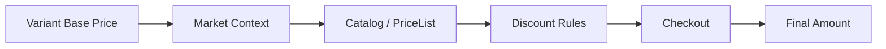

你以后看到“价格不一致”问题，不要先问：

```text
price 字段是多少？
```

而应该问：

```text
1. 哪个 Variant？
2. 哪个 Market / buyer context？
3. 有没有 Catalog / PriceList？
4. 有没有 Discount / Function？
5. 现在看的是 Product price、Cart cost 还是 Checkout / Order total？
```

这才是平台开发者的排查方式。

---

# 第 30 课：Shopify App 架构与认证——从“页面代码”进入“平台应用”

前面学 Theme 时，我们的运行环境是：

```text
Shopify Server
→ Liquid
→ Browser
```

App 完全不同。

一个典型 Shopify App 更像你熟悉的完整 Web Application：

```text
Frontend
Backend
Database
Authentication
API
Webhooks
Background jobs
Extensions
Functions
```


---

## 30.1 App 和 Theme 的根本区别

| | Theme | App |
|---|---|---|
| 主要用户 | Storefront 买家 | Merchant / 后台系统 / Storefront 扩展 |
| 核心技术 | Liquid + HTML/CSS/JS | React Router / Backend / DB / APIs / Extensions |
| 能不能持有数据库 | Theme 自身通常不能 | 可以 |
| 能不能访问 Admin API | 浏览器 Theme 不能拿 Admin token | App backend 可以 |
| 能不能做后台任务 | 不适合 | 可以 |
| 能不能收 Webhook | 不行 | 可以 |
| 适合 ERP / PIM / OMS | 不适合 | 非常适合 |
| 能不能提供 Function | 不能单独提供 | App 可携带 Function extension |

你可以把 App 理解成：

> **一个被 Shopify 安装、授权，并和 Shopify 平台能力深度集成的应用系统。**

---

## 30.2 App 不是一个 UI 页面，而是一组能力

一个真实 App 可能包含：

```text
my-shopify-app/
│
├── App Home UI
│     Merchant 在 Shopify Admin 里看到
│
├── Backend
│     API / auth / business logic
│
├── Database
│     app-specific data
│
├── Admin GraphQL API client
│
├── Webhook handlers
│
├── Background workers
│
└── extensions/
      ├── Admin UI Extension
      ├── Checkout UI Extension
      ├── Theme App Extension
      └── Shopify Function
```

所以以后听到：

```text
“我们做一个 Shopify App”
```

不要自动理解成：

```text
“写一个 React 页面”
```

React 页面只是 App 的一个表面。

---

## 30.3 开发者在哪里创建 App？

开发过程中有两个不同的“位置”，不要混：

### 开发者视角

```text
Shopify Dev Dashboard
→ Apps
```

或者通过 Shopify CLI 创建：

```bash
shopify app init
```

当前 Shopify 官方推荐大多数新 App 使用 React Router 模板开始。

官方教程：[Scaffold an app](https://shopify.dev/docs/apps/build/scaffold-app)

### 商家视角

安装后，Merchant 通常从 Shopify Admin 的 Apps 入口打开你的 App。

另外，安装和权限可以在 Admin 的 Apps / Apps and sales channels 管理界面中查看。

---

## 30.4 推荐的新 App 起步方式

当前典型流程：

```text
1. 安装 Shopify CLI
2. shopify app init
3. 选择 React Router app
4. CLI 创建项目
5. shopify app dev
6. 安装到 dev store
7. Shopify template 自动处理常规认证框架
```

项目大致会出现：

```text
app/
├── routes/
├── shopify.server.ts
├── db.server.ts
└── ...

extensions/

shopify.app.toml
package.json
```

其中：

```text
shopify.server.ts
```

通常负责 Shopify app package 的核心 server configuration。

而：

```text
shopify.app.toml
```

承载 App 配置，例如：

```text
access scopes
webhooks
app URL
embedded setting
...
```

---

## 30.5 OAuth 先不要死记“重定向 URL”

如果你看旧 Shopify 教程，可能会看到：

```text
merchant
 ↓
/admin/oauth/authorize
 ↓
callback?code=...
 ↓
exchange access token
```

这个流程仍然是理解 OAuth 的重要基础，也仍用于某些独立 / 自定义技术栈场景。

但是：

> **对当前使用 Shopify CLI 官方 App 模板的嵌入式 App，推荐模型是 managed installation + token exchange。**

也就是说，新手不应该第一天就自己手搓 OAuth callback。

官方：[Authentication for apps built with Shopify CLI](https://shopify.dev/docs/apps/build/authentication-authorization/cli-app-authentication)

---

## 30.6 现代 Embedded App 的认证流程

你真正应该理解的是：

```text
Merchant opens App in Shopify Admin
        ↓
Shopify / App Bridge
        ↓
short-lived ID token
        ↓
你的 Backend 验证请求
        ↓
Token exchange
        ↓
Access token
        ↓
Admin GraphQL API
```

这里有两个非常容易混的 Token。

---

## 30.7 ID Token vs Access Token

| | ID token | Access token |
|---|---|---|
| 核心用途 | 证明当前请求来自已认证 Shopify 用户 / Admin 上下文 | 调用 Shopify API |
| 生命周期 | 很短 | 取决于 token 类型 |
| 浏览器 / App Bridge | 会参与获取 | **不应该暴露 Admin access token 给浏览器** |
| Backend | 验证 / exchange | 持有并调用 Admin API |
| 类比 | “身份证明票据” | “API 门禁卡” |

官方：[About app authentication](https://shopify.dev/docs/apps/build/authentication-authorization)

---

## 30.8 Access Token 又分哪几种？

当前主要需要认识：

| Token | 用途 |
|---|---|
| Offline access token | 后台任务、Webhook、scheduled jobs；不依赖当前 merchant session |
| Online access token | 需要尊重某个 staff 用户权限 / 归因到具体用户时 |
| Delegate access token | 给子系统更窄的临时 / 限定权限场景 |

对普通 App 开发最先掌握的是：

```text
offline token
```

因为你的 App 经常需要：

```text
凌晨同步库存
接收 webhook 后查询 Product
后台 worker 处理订单
```

这些时候 Merchant 根本没有打开你的页面。

官方：[Access tokens](https://shopify.dev/docs/apps/build/authentication-authorization/access-tokens)

当前 Shopify 对新 public apps 的 offline token 生命周期/刷新机制也在持续强化，所以：

> 使用官方模板时，优先让 Shopify package 处理 token exchange / refresh，不要自己发明 token persistence 方案。

---

## 30.9 Scope 是什么？

Token 并不是：

```text
拿到以后能访问 Shopify 所有数据
```

它被 access scopes 限制。

例如：

```toml
[access_scopes]
scopes = "read_products,write_products,read_orders"
```

意思概念上是：

```text
可以读 Product
可以写 Product
可以读 Order
```

但没有：

```text
write_orders
```

就不能因为“我已经登录了”而随便修改订单。

所以：

```text
Authentication
= 你是谁 / App 是否被正确认证

Authorization
= 你被允许干什么
```

这是 Web 安全里的经典区别。

---

## 30.10 最小权限原则

不要为了省事：

```text
所有 scope 全申请
```

应该：

```text
功能需要什么
→ 只申请什么
```

例如产品同步 App：

```text
read_products
write_products
read_inventory
write_inventory
```

如果完全不碰 Customer，就不要无缘无故请求 Customer 相关数据权限。

原因包括：

```text
安全
商家信任
App Review
数据最小化
未来维护
```

---

## 30.11 一个 App Route 怎么拿到 Admin client？

使用官方 React Router App package 时，典型思路是：

```ts
import type {LoaderFunctionArgs} from 'react-router';
import {authenticate} from '../shopify.server';

export async function loader({request}: LoaderFunctionArgs) {
  const {admin, session} = await authenticate.admin(request);

  return {
    shop: session.shop,
    hasAdminClient: Boolean(admin),
  };
}
```

真正关键的不是这几行代码，而是它背后的流程：

```text
authenticate.admin(request)
        ↓
验证 Shopify 请求上下文
        ↓
必要时完成 token exchange / session 处理
        ↓
返回已认证 Admin GraphQL client
```

所以以后你不会在每一个 route 里自己拼：

```http
X-Shopify-Access-Token: ...
```

官方 Package 已经帮你封装了常规路径。

官方：[Interacting with Shopify Admin](https://shopify.dev/docs/api/shopify-app-react-router/latest/guide-admin)

---

## 30.12 `AppInstallation` 是什么？

当一个 App 安装到一个 Shop 后，平台会有安装关系。

GraphQL 中：

```text
AppInstallation
```

可以理解成：

```text
App
   +
Shop
   +
Granted Scopes
   +
Billing / app-specific metadata
   =
AppInstallation
```

常用属性：

| 属性 | 含义 |
|---|---|
| `id` | 当前安装实例 ID |
| `app` | 哪个 App |
| `accessScopes` | 获得的权限 |
| `activeSubscriptions` | 当前 App billing subscriptions |
| `launchUrl` | 打开 App 的 URL |
| `uninstallUrl` | 卸载 URL |
| `metafields` | 只属于该 App installation 的自定义数据 |

官方：[AppInstallation](https://shopify.dev/docs/api/admin-graphql/latest/objects/AppInstallation)

这也帮助你理解：

```text
App Definition
```

和：

```text
这个 App 在某一家店里的 Installation
```

不是一回事。

---

## 30.13 App / Extension / Function 再对比一次

| 概念 | 你可以理解成 |
|---|---|
| App | 整个产品 / 应用系统 |
| App Home | App 在 Shopify Admin 里的主要 UI |
| Admin UI Extension | 插进 Shopify Admin 特定位置的一块 UI |
| Theme App Extension | 插入 Theme Editor / storefront 的 App 能力 |
| Checkout UI Extension | 插进 Checkout 扩展点的 UI |
| Shopify Function | Shopify 后端业务执行点中的规则代码 |
| Webhook handler | Shopify 事件触发你的 Backend |

所以：

```text
Function 通常是 App 的一个 extension
```

不是和 App 平级的“另一种独立应用”。

---

## 30.14 本课你真正应该掌握的流程

```text
Merchant installs App
        ↓
Approves scopes
        ↓
Shopify manages installation
        ↓
Merchant opens embedded app
        ↓
ID token
        ↓
authenticate.admin(request)
        ↓
Access token stays on backend
        ↓
admin.graphql(...)
```

如果这条链懂了，下一课 Admin GraphQL API 就不会变成“我应该把 token 放在哪”的混乱问题。

---

# 第 31 课：Admin GraphQL API——真正进入 Shopify 后台数据层

如果 Theme 里的 Liquid 对象是：

```text
Shopify 给当前页面准备好的数据
```

那么 Admin GraphQL API 是：

> **让受授权的 App 主动查询和修改 Shopify 后台资源。**


官方入口：[GraphQL Admin API](https://shopify.dev/docs/api/admin-graphql/latest)

---

## 31.1 GraphQL 和 Liquid 对象最大的区别

Theme：

```liquid
{{ product.title }}
```

前提是：

```text
当前页面 Shopify 已经给了 product object
```

App：

```graphql
query {
  product(id: "gid://shopify/Product/...") {
    title
  }
}
```

你主动告诉 Shopify：

```text
我要哪个资源
我要哪些字段
```

这就是 GraphQL 最基本的思维。

---

## 31.2 Query 和 Mutation

先只记：

```text
Query
= read

Mutation
= write / action
```

例如：

```graphql
query {
  shop {
    name
  }
}
```

是读。

而：

```graphql
mutation ... {
  productUpdate(...) { ... }
}
```

是修改。

但 GraphQL 不应该简单等于 REST：

```text
Query ≠ GET URL
Mutation ≠ POST URL
```

因为 Shopify GraphQL 通常都发送到一个 GraphQL endpoint，operation 决定你要做什么。

---

## 31.3 GID 是什么？

你会大量看到：

```text
gid://shopify/Product/123456789
```

这叫 Global ID。

不要再默认 Shopify API ID 都是：

```text
123456789
```

GraphQL 世界里常见：

```text
gid://shopify/Product/123
gid://shopify/ProductVariant/456
gid://shopify/Order/789
```

优点之一是：

```text
ID 本身带资源类型语义
```

所以：

```text
Product ID
Variant ID
Order ID
```

不会只是几个看不出类型的整数。

---

## 31.4 Connection / Nodes / Cursor

Shopify 中很多列表不是直接：

```graphql
products
```

返回无限数组。

而是分页 connection。

例如：

```graphql
query ProductsPage($first: Int!, $after: String) {
  products(first: $first, after: $after) {
    nodes {
      id
      title
      status
    }
    pageInfo {
      hasNextPage
      endCursor
    }
  }
}
```

第一次：

```json
{
  "first": 20,
  "after": null
}
```

返回：

```text
20 products
hasNextPage = true
endCursor = "abc..."
```

下一次：

```json
{
  "first": 20,
  "after": "abc..."
}
```

所以 GraphQL 分页不是：

```text
?page=2
```

而是：

```text
cursor
```

---

## 31.5 `nodes` 和 `edges` 有什么区别？

你可能会看到两种写法。

### 简洁写法

```graphql
products(first: 10) {
  nodes {
    id
    title
  }
}
```

### Edge 写法

```graphql
products(first: 10) {
  edges {
    cursor
    node {
      id
      title
    }
  }
}
```

区别可以理解成：

```text
nodes
→ 我只关心资源

edges
→ 我还关心每条连接本身的信息，例如 cursor
```

大多数业务展示场景 `nodes` 更舒服。

需要逐项 cursor 时 `edges` 更合适。

---

## 31.6 在 React Router App 里发 Admin GraphQL

典型：

```ts
import type {LoaderFunctionArgs} from 'react-router';
import {authenticate} from '../shopify.server';

export async function loader({request}: LoaderFunctionArgs) {
  const {admin} = await authenticate.admin(request);

  const response = await admin.graphql(
    `#graphql
      query ProductsPage($first: Int!, $after: String) {
        products(first: $first, after: $after) {
          nodes {
            id
            title
            status
          }
          pageInfo {
            hasNextPage
            endCursor
          }
        }
      }
    `,
    {
      variables: {
        first: 20,
        after: null,
      },
    },
  );

  const result = await response.json();

  return result.data.products;
}
```

这里最重要的是职责：

```text
Browser
  ↓ request
Your App Backend
  ↓ authenticate
Admin GraphQL client
  ↓
Shopify Admin API
```

不要把 Admin access token 塞进 storefront JS。

---

## 31.7 Mutation 一定要看 `userErrors`

例如修改 Product title：

```graphql
mutation UpdateProductTitle($product: ProductUpdateInput!) {
  productUpdate(product: $product) {
    product {
      id
      title
    }
    userErrors {
      field
      message
    }
  }
}
```

Variables：

```json
{
  "product": {
    "id": "gid://shopify/Product/123456789",
    "title": "New title"
  }
}
```

很多初学者会写：

```text
HTTP 200
→ 成功
```

这是错的。

GraphQL 可能：

```text
HTTP = 200
```

但 mutation payload：

```json
{
  "userErrors": [
    {
      "field": ["product", "title"],
      "message": "..."
    }
  ]
}
```

所以业务代码通常要：

```js
if (userErrors.length > 0) {
  // 业务失败
}
```

---

## 31.8 GraphQL Error vs `userErrors`

| | GraphQL errors | `userErrors` |
|---|---|---|
| 常见原因 | query 字段错误、权限、执行级问题 | mutation 输入业务校验失败 |
| 出现位置 | 顶层 `errors` | mutation payload 内 |
| HTTP 200 可能出现 | 是 | 是 |
| 应该处理吗 | 必须 | 必须 |

所以一个健壮客户端至少要考虑：

```text
Network error
HTTP error
GraphQL errors
userErrors
```

不能只有：

```js
try {
  await fetch(...)
} catch {}
```

---

## 31.9 GraphQL Cost：为什么“只取需要的字段”不是口号

Shopify Admin GraphQL 不是简单：

```text
每秒最多 N 个 request
```

核心限制模型是：

```text
Calculated Query Cost
```

例如简单查询：

```graphql
products(first: 1) {
  nodes {
    id
    title
  }
}
```

成本很低。

如果：

```text
products 100
  variants 100
    inventoryLevels 100
      locations ...
```

查询可能非常昂贵。

响应 `extensions` 中会提供 cost / throttle 状态。

官方：[GraphQL Admin API rate limits](https://shopify.dev/docs/apps/build/apis/graphql-admin/rate-limits)

开发思维：

```text
只请求当前任务需要的字段
```

而不是：

```text
“反正 GraphQL，所有字段一次拿完”
```

---

## 31.10 N+1 思维仍然存在

GraphQL 不代表自动消灭所有性能问题。

例如：

```text
先 query 50 Product
```

然后 Node 后端：

```js
for (const product of products) {
  await queryVariants(product.id);
}
```

这就是 API 层 N+1。

更合理通常是：

```graphql
products(first: 50) {
  nodes {
    id
    title
    variants(first: 10) {
      nodes {
        id
        sku
      }
    }
  }
}
```

当然嵌套越多 cost 又会上升。

所以真实优化是在：

```text
请求数量
vs
单请求复杂度
vs
数据规模
```

之间平衡。

---

## 31.11 大数据量不要只想着 while pagination

例如：

```text
导出店铺 300,000 个 Product / Variant
```

最朴素方法：

```text
first: 100
→ cursor
→ first: 100
→ cursor
→ ...
```

可能很慢，也容易触发限流与恢复逻辑。

这种大量离线导入导出场景，要开始研究：

```text
Bulk Operations
```

官方：[Bulk operations with the GraphQL Admin API](https://shopify.dev/docs/api/usage/bulk-operations/queries)

可以先把它记成：

> **大规模离线数据任务，不要默认用前端式分页循环硬拉。**

---

## 31.12 API Versioning

Shopify API 有版本节奏。

不要在教程里看到：

```text
2023-07
```

就复制到 2026 项目。

真实项目应该：

```text
固定当前支持版本
定期看 release notes
升级前测试 breaking changes
```

官方：[Shopify API versioning](https://shopify.dev/docs/api/usage/versioning)

这也是为什么这份教程大量使用：

```text
/latest
```

官方链接，而代码示例则按当前可验证 schema 书写。

---

## 31.13 Admin 对象与后台 UI 对照

这张表以后会非常实用：

| API 对象 | Merchant Admin 常见位置 | 常见 App 场景 |
|---|---|---|
| Product / ProductVariant | Products | PIM、商品同步 |
| Collection | Products → Collections | merchandising |
| InventoryItem / InventoryLevel | Products / Inventory / Locations | ERP/WMS |
| Order | Orders | OMS、售后 |
| Customer | Customers | CRM |
| Market | Markets | 国际化 / B2B |
| DiscountNode | Discounts | 促销 App |
| MetafieldDefinition | Settings → Custom data | 自定义数据 Schema |
| Metaobject | Content | CMS / 结构化业务数据 |

API 对象和 Admin 页面不是一一对应的 UI 组件，但建立这个映射能帮助你快速定位业务。

---

## 31.14 本课最终模型

```text
Authenticated App Backend
        ↓
GraphQL Query / Mutation
        ↓
Access Scope check
        ↓
Query Cost / Throttle
        ↓
Shopify Resource Graph
        ↓
Data / userErrors
```

掌握 Admin GraphQL 后，你已经从“Theme 开发”真正迈进 Shopify 系统集成。

---

# 第 32 课：Webhooks 与事件驱动同步——让 Shopify 主动告诉你的 App“发生变化了”

假设你的 ERP 要知道 Shopify Product 有没有变化。

最差的设计之一：

```text
每 10 秒
→ query 所有产品
→ 比较 updatedAt
```

这叫：

```text
polling
```

更自然的设计是：

```text
Shopify product updated
        ↓
Webhook
        ↓
Your App
        ↓
Update ERP / DB
```


官方：[About webhooks](https://shopify.dev/docs/apps/build/webhooks)

---

## 32.1 Webhook 是什么？

一句话：

> **你的 App 订阅某个 Shopify 事件；事件发生后，Shopify 主动向你配置的 destination 发送消息。**

例如：

```text
products/create
products/update
orders/create
app/uninstalled
```

概念：

```text
Subscription
├── Topic
├── Destination URI
├── API version
└── Optional filter / fields
```

---

## 32.2 Webhook 和 API Query 是完全不同的方向

### Admin API

```text
Your App
   ↓
“Shopify，请给我 Product #123”
   ↓
Shopify
```

### Webhook

```text
Shopify
   ↓
“Product #123 更新了”
   ↓
Your App
```

所以：

| | Admin API | Webhook |
|---|---|---|
| 谁发起 | 你的 App | Shopify |
| 模式 | Pull | Push |
| 适合 | 主动查询 / 修改 | 感知变化 |
| 是否可替代对方 | 不能完全 | 不能完全 |

真实同步系统通常两个都要。

---

## 32.3 Webhook Subscription 在哪里配置？

它不像 Product 那样主要在 Merchant Admin 页面手工创建。

App 开发通常通过：

```text
shopify.app.toml
```

或者 Admin API / Dev tooling 配置订阅。

官方推荐入口：[Manage webhook subscriptions](https://shopify.dev/docs/apps/build/webhooks/subscribe)

例如 app-level subscription：

```toml
[webhooks]
api_version = "2026-07"

[[webhooks.subscriptions]]
topics = ["products/update"]
uri = "/webhooks/products/update"
```

使用 relative URI 的一个实际好处是：

```text
shopify app dev
```

开发 tunnel URL 改变时，不需要你把固定域名写死进配置。

---

## 32.4 `WebhookSubscription` 对象有哪些重要属性？

| 属性 | 含义 |
|---|---|
| `id` | Subscription GID |
| `topic` | 订阅主题 |
| `uri` | Shopify 投递到哪里 |
| `apiVersion` | Payload 使用的 API version |
| `format` | payload format |
| `filter` | delivery filter |
| `includeFields` | 限定字段（相关配置场景） |
| `createdAt` | 创建时间 |
| `updatedAt` | 更新时间 |

官方：[WebhookSubscription](https://shopify.dev/docs/api/admin-graphql/latest/objects/WebhookSubscription)

---

## 32.5 React Router App 怎么接 Webhook？

使用官方 App package，可以：

```ts
import type {ActionFunctionArgs} from 'react-router';
import {authenticate} from '../shopify.server';

export async function action({request}: ActionFunctionArgs) {
  const {
    topic,
    shop,
    payload,
    webhookId,
  } = await authenticate.webhook(request);

  console.log('webhook', {
    topic,
    shop,
    webhookId,
  });

  await enqueueWebhookJob({
    topic,
    shop,
    webhookId,
    payload,
  });

  return new Response(null, {status: 200});
}
```

这里最值得注意的不是 `console.log`。

是：

```text
authenticate.webhook(request)
```

官方 package 会处理 webhook 验证相关流程，而不是你每个 endpoint 都手搓 HMAC。

官方：[authenticate.webhook](https://shopify.dev/docs/api/shopify-app-react-router/latest/authenticate/webhook)

---

## 32.6 为什么收到 Webhook 后不要做 30 秒业务逻辑？

最合理的处理：

```text
Webhook request
    ↓
Verify
    ↓
Persist / enqueue
    ↓
快速返回 2xx
    ↓
Background worker 做慢任务
```

不要：

```text
Webhook
 ↓
查 ERP 5 秒
 ↓
查数据库 5 秒
 ↓
调用第三方 10 秒
 ↓
AI 分析 20 秒
 ↓
终于 response
```

原因：

```text
超时
重试
重复投递
吞吐下降
```

官方也明确建议尽快返回 2xx，并把长任务异步处理。

参考：[Verify webhook deliveries](https://shopify.dev/docs/apps/build/webhooks/verify-deliveries)

---

## 32.7 Webhook 会不会重复？

会。

必须设计成：

```text
可能重复
```

Shopify 提供：

```http
X-Shopify-Webhook-Id
```

你可以保存它：

```text
processed_webhooks
------------------
webhook_id
processed_at
```

处理前：

```js
if (await alreadyProcessed(webhookId)) {
  return new Response(null, {status: 200});
}
```

处理成功后：

```js
await markProcessed(webhookId);
```

这叫：

```text
idempotency
```

即：

> 同一个事件处理两次，不应该产生两次副作用。

官方：[Ignoring duplicate webhook deliveries](https://shopify.dev/docs/apps/build/webhooks/verify-deliveries#ignore-duplicate-webhooks)

---

## 32.8 `Webhook ID` 和 `Event ID`

这是更高级一点但很实用的区别。

同一个 merchant action 在不同 subscription 下可能对应多个 delivery。

因此：

```text
Webhook ID
→ 一次具体 delivery

Event ID
→ 关联同一个 merchant event
```

简单业务先使用 Webhook ID 去重即可。

复杂 observability / correlation 系统再考虑 Event ID。

---

## 32.9 能不能相信 Webhook 严格按顺序到达？

不要设计依赖：

```text
Webhook A 一定先于 Webhook B
```

事件驱动系统更稳健的模型是：

```text
Webhook = “有东西变化了”
```

然后必要时：

```text
用 Admin API 获取当前 canonical state
```

例如你的本地 DB 收到 Product update：

```text
不要只盲目 patch payload
```

复杂同步可以：

```text
Webhook
  ↓
拿 product ID
  ↓
Worker query Admin API
  ↓
获取当前完整需要字段
  ↓
upsert local projection
```

这样更抗乱序。

---

## 32.10 Webhook 不是“绝对实时数据库复制”

真实生产架构建议：

```text
Initial full sync
       +
Webhooks incremental sync
       +
Periodic reconciliation
```

为什么还要 reconciliation？

因为任何分布式系统都可能出现：

```text
endpoint outage
bug
subscription misconfiguration
permission changed
payload processing failed
```

所以例如每天：

```text
query updated_at > last_reconcile_time
```

或者跑一轮 bulk reconciliation。

这才是 ERP / OMS 级别可靠同步。

---

## 32.11 Webhook 适合什么，不适合什么？

### 适合

```text
Product change sync
Order created sync
Inventory-related integration trigger
App uninstall cleanup
Customer-related integration（注意权限/隐私要求）
```

### 不适合

```text
Checkout 同步阻塞式价格计算
“必须在 30ms 内决定付款方式”
“必须让 Shopify 等我的 ERP 回复后才能完成交易”
```

这种同步交易执行点应该研究：

```text
Shopify Functions
Checkout extension APIs
平台原生能力
```

而不是 Webhook。

---

## 32.12 Events 和 Webhooks

Shopify 也在推进新的 Events 能力。

当前开发者文档描述：

```text
Events
```

提供更细粒度 trigger / GraphQL shaped payload 等能力，但当前仍属于较新的演进路线，覆盖范围与稳定级别要按最新文档确认。

现阶段生产 App：

> **Webhooks 仍是你首先必须掌握的事件机制。**

官方：[Events and webhooks](https://shopify.dev/docs/apps/build/events-webhooks)

---

# 第 33 课：Shopify Functions 实战——把可信业务规则放进 Shopify 执行边界

前面我们一直说：

```text
浏览器不能决定价格
```

那么问题来了：

> “如果我的业务规则 Shopify 原生 Discount 配不出来，我自己的逻辑到底放哪？”

答案之一就是：

```text
Shopify Functions
```


官方：[Shopify Functions](https://shopify.dev/docs/apps/build/functions)

---

## 33.1 Function 和普通 App Backend 有什么区别？

非常重要。

### App Backend

```text
你的服务器
```

它可以：

```text
访问 DB
调用网络
跑 background job
调用第三方 API
```

但 Checkout 并不会在每一个关键计算节点：

```text
随便暂停下来
→ HTTP 请求你的服务器
→ 等你 2 秒
```

### Function

是：

> **由 Shopify 在特定 commerce 执行点调用的受约束代码。**

例如：

```text
Discount
Cart validation
Cart transform
Delivery customization
Payment customization
Fulfillment constraints
...
```

---

## 33.2 Theme JS / App Backend / Function 对比

| | Theme JS | App Backend | Shopify Function |
|---|---|---|---|
| 执行位置 | Browser | 你的 server | Shopify 执行环境 |
| 是否可信 | 否 | 你的系统可信 | Shopify commerce boundary |
| 可联网 | 是 | 是 | 默认 run target 强约束；不能当普通服务器使用 |
| 能直接改页面 | 是 | 间接 | 否 |
| 适合动态 UI | 是 | API 数据 | 否 |
| 适合价格/Checkout 规则 | **否** | 配置/管理可以，实时执行不一定 | **是** |
| 适合后台同步 | 否 | **是** | 否 |

口诀：

```text
UI → Theme JS
系统集成 → App backend
交易规则 → Function
```

---

## 33.3 Function 的运行模型

一个 Function target 通常包含：

```text
Input GraphQL Query
        ↓
Shopify 生成 Input
        ↓
Function code
        ↓
规定结构的 Result / Operations
        ↓
Shopify 应用结果
```

你不是在 Function 里写：

```js
fetch('https://your-api.example/check-price')
```

然后随便返回任意 JSON。

而是：

```text
Input 和 Output 都由 Function API schema 约束
```

这是理解 Functions 的核心。

---

## 33.4 常见 Function API

当前你应该先认识这些：

| Function API | 解决的问题 |
|---|---|
| Discount | Product / Order / Shipping 优惠 |
| Cart and Checkout Validation | 阻止不符合业务条件的 Cart / Checkout |
| Cart Transform | 调整 Cart line 呈现 / bundle 等 |
| Delivery Customization | 重命名、排序、隐藏配送选项 |
| Payment Customization | 定制支付方式呈现 / 规则 |
| Fulfillment Constraints | 影响履约分配规则 |
| Pickup generators | 自定义 pickup options |

最新列表参考：[Shopify Functions APIs](https://shopify.dev/docs/api/functions)

---

## 33.5 Function 是 App 的 Extension

真实目录大概：

```text
my-app/
├── app/
├── extensions/
│    └── discount-function/
│         ├── shopify.extension.toml
│         └── src/
│              ├── cart_lines_discounts_generate_run.graphql
│              └── ...function code
└── shopify.app.toml
```

所以：

```text
App
└── Function Extension
```

而不是：

```text
App
Function
```

两个毫无关系的独立系统。

---

## 33.6 创建一个 Discount Function

在 App 项目根目录：

```bash
shopify app generate extension --template discount --name discount-function-js
```

CLI 会让你选择语言 / 创建 starter files。

官方：[Build a Discount Function](https://shopify.dev/docs/apps/build/discounts/build-discount-function)

---

## 33.7 实战需求：所有“new_collection”商品组成的订单打 10% 折扣

假设我们想要：

```text
只有当购物车里的商品全部属于 new_collection
才给 Order subtotal 10% off
```

Theme JS 能不能做？

```text
不能作为价格权威
```

App Backend 每次 Checkout 去 HTTP 查吗？

```text
不应该用这种思路做同步 pricing rule
```

Discount Function 很适合。

---

## 33.8 第一步：Function Input Query

Function 不会自动把整个 Shopify Store 数据塞给你。

你必须声明：

```text
我的规则到底需要哪些数据？
```

这里需要：

```text
当前 discount classes
cart lines
每条 line 对应 Product 是否有 new_collection tag
```

所以 input query：

```graphql
query Input {
  discount {
    discountClasses
  }
  cart {
    lines {
      id
      merchandise {
        __typename
        ... on ProductVariant {
          id
          product {
            hasAnyTag(tags: ["new_collection"])
          }
        }
      }
    }
  }
}
```

这段查询已经体现 Function 设计哲学：

> **只把规则运行真正需要的输入提供给 Function。**

---

## 33.9 第二步：Function Logic

JavaScript 版本可以这样理解：

```js
import {
  DiscountClass,
  OrderDiscountSelectionStrategy,
} from '../generated/api';

export function cartLinesDiscountsGenerateRun(input) {
  const supportsOrderDiscount =
    input.discount.discountClasses.includes(DiscountClass.Order);

  if (!supportsOrderDiscount) {
    return {operations: []};
  }

  const allProductsAreNewCollection =
    input.cart.lines.length > 0 &&
    input.cart.lines.every((line) => {
      if (line.merchandise.__typename !== 'ProductVariant') {
        return false;
      }

      return Boolean(line.merchandise.product?.hasAnyTag);
    });

  if (!allProductsAreNewCollection) {
    return {operations: []};
  }

  return {
    operations: [
      {
        orderDiscountsAdd: {
          candidates: [
            {
              message: '10% off new collection order',
              targets: [
                {
                  orderSubtotal: {
                    excludedCartLineIds: [],
                  },
                },
              ],
              value: {
                percentage: {
                  value: '10.0',
                },
              },
            },
          ],
          selectionStrategy:
            OrderDiscountSelectionStrategy.Maximum,
        },
      },
    ],
  };
}
```

重点不是死记 `orderDiscountsAdd`。

重点是你已经理解整个过程：

```text
Input
↓
检查 discount class
↓
检查 cart lines
↓
判断 Product Tag
↓
返回 operation
↓
Shopify 执行价格优惠
```

官方 API：[Discount Function API](https://shopify.dev/docs/api/functions/2026-07/discount)

---

## 33.10 为什么 Function 需要检查 DiscountClass？

假设 Merchant 配置的 discount 只允许：

```text
PRODUCT
```

但你的 Function 无条件返回：

```text
ORDER discount operation
```

这就违反当前 discount instance 的配置意图。

所以 Function 应该根据：

```text
input.discount.discountClasses
```

只返回启用的 class 对应 operations。

这也是平台逻辑和配置 UI 必须配合的原因。

---

## 33.11 Function Configuration 放哪里？

不要把所有业务数字写死：

```js
const percentage = 10;
```

真实 Discount App 通常希望 Merchant 在 Admin 里配置：

```text
percentage = 10
collection IDs
customer condition
minimum quantity
...
```

常见架构：

```text
Merchant Config UI
        ↓
Discount / App-owned metafield
        ↓
Function input query
        ↓
Function reads configuration
        ↓
executes rule
```

也就是：

```text
App UI = 配规则
Function = 跑规则
```

这就是 App + Function 的经典组合。

---

## 33.12 Function 最常见的错误思维

### 错误 1：把 Function 当 serverless API

```text
Function = 可以 fetch 任意第三方？
```

不是普通 serverless function。

它是被严格 schema 和 runtime 约束的 Shopify commerce extension。

### 错误 2：把 Function 当 UI

```text
Function 返回 HTML？
```

不是。

### 错误 3：把 Merchant 配置硬编码进 Function

真实 App 应把：

```text
Configuration
```

和：

```text
Execution
```

分开。

### 错误 4：所有规则都用 Function

如果 Shopify 原生 Discount 已经能配置：

```text
全场 10%
```

通常没必要为了炫技再写 Function。

---

# 第 34 课：完整 Theme 项目重构——把 Storefront 变成“清晰边界的前端系统”

到了这里，我们反过来重新看之前的 Theme。

为什么现在适合重构？

因为以前你的脑内只有：

```text
Liquid + JS
```

现在你已经知道真正的平台边界：

```text
Theme
App
Admin API
Webhook
Function
Markets
Discounts
```

所以重构的目标不再是：

```text
把文件拆小一点
```

而是：

> **让每一类职责待在正确的层。**


---

## 34.1 一个容易腐化的 Theme 项目

刚开始可能：

```text
assets/theme.js
```

然后慢慢变成：

```text
theme.js
├── variant selector
├── gallery
├── cart drawer
├── predictive search
├── collection filter
├── modal
├── popup
├── analytics
├── campaign
├── recommendations
└── 8000 lines
```

Liquid 也可能：

```text
sections/main-product.liquid
```

变成：

```text
2000 行
```

这不是 Shopify 特有问题。

本质上和普通前端单体组件一样。

---

## 34.2 重构的第一原则：先按职责，不要先按技术

不要只想：

```text
JS 放 assets
Liquid 放 sections
```

而应该先问：

```text
它是什么职责？
```

例如 Product Page：

```text
Product page
│
├── server-rendered product info
├── variant state
├── gallery
├── product form
├── price UI
├── inventory / availability UI
├── add-to-cart
└── cart-drawer bridge
```

再映射到文件。

---

## 34.3 一个更合理的 Product Theme 结构

示例：

```text
sections/
└── main-product.liquid

snippets/
├── product-gallery.liquid
├── product-price.liquid
├── variant-picker.liquid
├── product-form.liquid
└── product-inventory.liquid

assets/
├── product-controller.js
├── variant-selector.js
├── product-gallery.js
└── cart-client.js
```

思路：

```text
main-product
    ↓ orchestration
snippets
    ↓ server rendered presentation
small JS controllers
    ↓ browser interaction
```

不是为了“每个文件越小越高级”。

而是让：

```text
Price UI
Variant selection
Cart mutation
Gallery
```

不再互相直接乱改 DOM。

---

## 34.4 Product State 应该有明确 owner

我们前面学 Variant Selector 时已经建立：

```js
const state = {
  selectedOptions: {
    Color: 'Black',
    Size: 'M',
  },
  selectedVariant: null,
  quantity: 1,
};
```

重构以后不要：

```text
variant-picker.js 自己有一个 selectedVariant
price.js 自己猜一个 selectedVariant
gallery.js 再从 URL 猜一次
cart.js 从 hidden input 再猜一次
```

应该：

```text
Product Controller
       ↓
owns state
       ↓
variant changed event / callback
       ↓
Price / Media / Product Form 更新
```

例如概念结构：

```js
class ProductController {
  constructor(root, variants) {
    this.root = root;
    this.variants = variants;
    this.state = {
      selectedOptions: {},
      selectedVariant: null,
      quantity: 1,
    };
  }

  selectOption(name, value) {
    this.state.selectedOptions[name] = value;
    this.state.selectedVariant = this.resolveVariant();
    this.render();
  }

  resolveVariant() {
    // 根据 selectedOptions 找 variant
  }

  render() {
    // 统一通知 price / media / form / availability
  }
}
```

这就是你熟悉的前端 state management 思维，只不过不是 React。

---

## 34.5 Liquid 和 JS 的边界

重构以后建议坚持：

### Liquid 负责

```text
初始 HTML
SEO-critical content
商品 Title / Price 初始态
可访问的 Form
Section settings
结构化数据
```

### JavaScript 负责

```text
Variant 动态切换
Gallery interaction
Cart Drawer
Predictive Search
AJAX Filter enhancement
dialog / tabs
```

### Shopify Platform / App 负责

```text
真实价格规则
库存
Discount
Checkout
Order
后台同步
```

这是整本教程最重要的架构分层之一。

---

## 34.6 Progressive Enhancement 检查

Product 页面可以问：

```text
如果 JS 挂了：

标题还在吗？
价格还在吗？
商品描述还在吗？
图片还在吗？
基础 Product Form 还能否工作？
```

Collection 页面：

```text
商品列表是不是 Liquid 初始渲染？
```

Search：

```text
没有 predictive JS 时还能正常 submit /search 吗？
```

这就是 Shopify Theme 性能和可靠性很重要的原则。

---

## 34.7 Section Rendering 应该变成统一基础设施

不要每个组件：

```js
fetch('?sections=...')
```

都自己实现解析。

可以抽象：

```js
export async function renderSections(sectionIds, url = window.location.href) {
  const requestUrl = new URL(url, window.location.origin);
  requestUrl.searchParams.set('sections', sectionIds.join(','));

  const response = await fetch(requestUrl);

  if (!response.ok) {
    throw new Error(`Section rendering failed: ${response.status}`);
  }

  return response.json();
}
```

然后：

```text
Cart
Collection Filters
Variant-dependent section content
```

可以共享基础设施。

---

## 34.8 Cart Client 也应该单独封装

例如：

```js
export async function addCartLines(items, sections = []) {
  const response = await fetch(
    window.Shopify.routes.root + 'cart/add.js',
    {
      method: 'POST',
      headers: {
        'Content-Type': 'application/json',
      },
      body: JSON.stringify({
        items,
        sections,
      }),
    },
  );

  if (!response.ok) {
    throw new Error(`Cart add failed: ${response.status}`);
  }

  return response.json();
}
```

Product Controller 不应该关心：

```text
fetch header
cart endpoint
locale path
```

它只应该：

```text
selectedVariant valid
        ↓
cartClient.add(...)
```

---

## 34.9 Theme 不应该保存业务真相

例如 Campaign：

```js
const campaignPrice = 19.99;
```

写在：

```text
campaign.js
```

这是坏边界。

Theme 可以保存：

```text
campaign UI copy
campaign badge
campaign id
```

但真实 price / eligibility 应来自：

```text
Shopify Pricing
Discount
Function
App configuration
```

---

## 34.10 重构后的完整边界

```text
Theme
├── SSR content
├── merchant-configurable UI
├── user interaction
└── cart/search/filter storefront client

App
├── merchant business UI
├── external integrations
├── DB
├── GraphQL Admin API
└── webhooks

Function
└── synchronous commerce rules

Shopify Platform
├── catalog
├── pricing
├── inventory
├── checkout
└── orders
```

做到这里，你的 Theme 就不再是“会工作的代码集合”，而是一个有平台边界意识的前端系统。

---

# 第 35 课：Headless / Storefront API / Hydrogen——如果不使用 Liquid Theme 会怎样？

Theme 开发已经很强大。

那么为什么还有 Headless？

因为有些项目希望：

```text
完全控制前端 runtime
自定义路由
自定义 SSR / cache
React 生态
复杂内容平台
多后端聚合
非常特殊的 UX
```

这时候 Shopify 可以只承担 Commerce Backend。


---

## 35.1 Theme vs Headless

| | Liquid Theme | Headless |
|---|---|---|
| HTML 谁生成 | Shopify Liquid | 你的应用 / Hydrogen |
| Hosting | Shopify | Oxygen / 你的平台 |
| Router | Shopify Theme routes | React Router / custom |
| Commerce data | Liquid objects / Ajax APIs | Storefront API |
| Cart | Ajax Cart API / Theme | Storefront Cart API |
| Checkout | Shopify Checkout | 仍然进入 Shopify Checkout |
| SEO | Theme / Liquid | 你负责 SSR / metadata |
| 性能责任 | Shopify + Theme | 大部分 Storefront runtime 由你承担 |
| 开发自由度 | 高，但在 Theme 架构内 | 非常高 |
| 运维复杂度 | 低 | 高 |

所以 Headless 不是：

```text
Shopify 不够高级，所以换 React
```

而是：

> 用更高的工程复杂度换更高的 storefront runtime 控制权。

---

## 35.2 Storefront API 是什么？

Storefront API 是面向 buyer-facing storefront 的 GraphQL API。

它和 Admin GraphQL API 的权限模型和用途完全不同。

### Storefront API

```text
Product browsing
Collection
Search
Cart
Localization
Markets context
Buyer-facing data
```

### Admin API

```text
Product management
Order management
Inventory
Customers
Markets configuration
Discount management
后台写操作
```

所以：

```text
Headless browser / server
→ Storefront API
```

而不是：

```text
把 Admin access token 给浏览器
```

官方：[Storefront API](https://shopify.dev/docs/api/storefront)

---

## 35.3 Hydrogen 是什么？

Hydrogen 是 Shopify 针对 Headless Commerce 提供的 opinionated stack。

当前 Hydrogen 建立在 React Router 上，提供：

```text
Storefront client
Cart utilities
Caching helpers
Analytics helpers
Variant selector utilities
SEO utilities
Customer Account integration
Oxygen integration
```

官方：[Hydrogen](https://shopify.dev/docs/api/hydrogen/latest)

创建项目：

```bash
npm create @shopify/hydrogen@latest
```

---

## 35.4 一个 Hydrogen Product Loader

概念上：

```js
export async function loader({context, params}) {
  const {handle} = params;

  const {product} = await context.storefront.query(
    PRODUCT_QUERY,
    {
      variables: {handle},
    },
  );

  if (!product) {
    throw new Response('Not found', {status: 404});
  }

  return {product};
}
```

GraphQL：

```graphql
query Product($handle: String!) {
  product(handle: $handle) {
    id
    title
    description
    variants(first: 20) {
      nodes {
        id
        title
        availableForSale
        price {
          amount
          currencyCode
        }
      }
    }
  }
}
```

然后 React Component：

```text
loader data
   ↓
Product Component
   ↓
Variant Selector
   ↓
Storefront Cart
```

是不是很像你熟悉的现代 SSR React？

是的。

但 Commerce Backend 仍然是 Shopify。

---

## 35.5 Theme 和 Hydrogen 的 SSR 思维很像

### Liquid Theme

```text
Request
 ↓
Shopify
 ↓
Liquid SSR
 ↓
HTML
 ↓
JS enhancement
```

### Hydrogen

```text
Request
 ↓
React Router / Hydrogen server
 ↓
Storefront API
 ↓
React SSR
 ↓
HTML
 ↓
client runtime
```

所以你之前学 Theme SSR 并没有浪费。

反而你会更容易理解：

```text
server data loading
initial HTML
client interaction
```

这三个层。

---

## 35.6 Headless 的 Market Context 更不能忽略

Theme 下 Shopify 帮你处理了很多：

```text
localization
market context
currency
```

Headless 下需要你明确管理。

例如：

```graphql
@inContext(country: CA, language: EN)
```

甚至 B2B buyer context：

```text
customer access token
company location
```

都会影响：

```text
pricing
availability
quantity rules
```

这就是第 29 课为什么必须放在 Headless 之前。

---

## 35.7 Headless Cart 和 Theme Cart 不是同一个 API 表面

### Theme

```text
Ajax Cart API
/cart/add.js
/cart/change.js
```

### Headless

```text
Storefront API Cart
cartCreate
cartLinesAdd
cartLinesUpdate
cartBuyerIdentityUpdate
checkoutUrl
```

最终：

```text
Cart
 ↓
checkoutUrl
 ↓
Shopify Checkout
```

所以之前的 Cart 数据模型仍然成立，但访问它的 API surface 不同。

---

## 35.8 Headless 最大的成本：你得到自由，也得到责任

Theme 自动帮你很多：

```text
routing
Liquid object context
canonical defaults
Markets integration
asset hosting
theme editor
section architecture
```

Headless 后：

```text
route design
cache
SSR
SEO
error handling
analytics
consent
localization
market routing
image strategy
deployment
observability
```

你都要真正理解。

所以技术选型不能因为：

```text
“团队只会 React”
```

就自动选择 Headless。

---

## 35.9 什么项目真的适合 Headless？

更可能适合：

```text
复杂多品牌内容门户 + Commerce
需要和多个后端实时组合
非常定制的交互和路由
团队具备 React SSR / infra 能力
需要统一 Web / App 的 commerce data layer
```

普通：

```text
商品页
Collection
Cart drawer
Search
Blog
营销落地页
```

很多时候 Online Store Theme 已经足够，而且成本更低。

---

# 第 36 课：Shopify Plus / Enterprise 扩展能力——学会判断“平台能力”和“Plan-gated 能力”

最后这一课不是要你背 Plus 功能列表。

因为 Shopify 的计划与功能会持续变化。

更重要的是建立：

> **“这个需求是不是受 Plan 限制？”**

的习惯。


---

## 36.1 Plus 不是另一套 API 世界

无论普通计划还是 Plus，你仍然会看到：

```text
Product
Variant
Order
Market
Discount
Theme
App
Admin API
Storefront API
```

Plus 更像：

```text
在同一个 Shopify 平台上
开放更多 enterprise / checkout / organization 能力
```

所以不要建立错误模型：

```text
Shopify
和
Shopify Plus
是两套完全不同产品
```

不是。

---

## 36.2 Checkout UI Extension 是最典型的 Plan-gated 例子

Checkout extensibility 不同 target 的计划要求不同。

当前官方文档说明：

```text
Information / Shipping / Payment
这些核心 Checkout 步骤的 Checkout UI Extensions
→ Shopify Plus
```

而例如 Thank you / Order status 等表面的可用范围可能更广。

因此不要说：

```text
“Checkout UI Extensions 全部只有 Plus 能用”
```

也不要说：

```text
“所有计划都能改 Checkout 任意步骤”
```

应该按：

```text
具体 extension target
+ 商店 plan
+ 当前 API 文档
```

确认。

官方：[Technologies for customizing Shopify checkout](https://shopify.dev/docs/apps/build/checkout/technologies)

---

## 36.3 Checkout Extensibility vs 老 `checkout.liquid`

旧 Shopify Plus 项目经常会提：

```text
checkout.liquid
```

但现代 Shopify Checkout customization 应该学习：

```text
Checkout UI Extensions
Shopify Functions
Checkout Branding API
Web Pixels
Customer Account Extensions
```

而不是从旧主题文件 hack checkout。

官方 Checkout 开发入口：[Apps in checkout](https://shopify.dev/docs/apps/build/checkout)

---

## 36.4 Shopify Functions 和 Plan 限制也不能一句话概括

例如当前帮助中心区分：

```text
Public apps built with Shopify Functions
```

和：

```text
Custom apps built with Shopify Functions
```

在不同计划上的可用性可能不同。

所以做需求评估时：

```text
“这个 Function API 存在”
```

不等于：

```text
“客户这家店一定能以我们想要的分发方式使用”
```

要检查：

```text
Plan
App distribution
Function API
Checkout surface
```

---

## 36.5 B2B 也不要再用“只有 Plus 才有”这个旧结论

这是一个很典型的 Shopify 平台变化。

当前 Shopify Help Center 已说明：

> B2B 已可在 Basic、Grow、Advanced、Plus 使用，但不同计划能力不同。

例如：

```text
Companies
Company locations
部分 Catalog / B2B capabilities
```

现在已经不是简单 Plus-only。

但 Plus 仍有更多：

```text
更多 / 无限 B2B market catalogs（以当前计划表为准）
Direct company catalogs
部分 advanced payment capabilities
更深的 contextual customization
```

所以你的认知应该从：

```text
功能 = Plus / 非 Plus
```

升级成：

```text
功能矩阵
= Feature × Plan × Surface × Distribution
```

官方最新计划表：[Shopify B2B features by plan](https://help.shopify.com/en/manual/b2b/getting-started/plan-features)

---

## 36.6 B2B 的核心对象

做 B2B App 时要开始认识：

```text
Company
CompanyLocation
CompanyContact
Catalog
PriceList
Payment Terms
Quantity Rules
Volume Pricing
```

关系概念上：

```text
Company
  ↓
CompanyLocation
  ↓
Buyer Context
  ↓
Catalog
  ↓
Products + Pricing
```

这和我们第 29 课 Market / Catalog 的知识直接连接。

官方：[Start building for B2B on Shopify](https://shopify.dev/docs/apps/build/b2b/start-building)

---

## 36.7 Expansion Stores / Organization 能力

高体量企业还会关心：

```text
multi-store organization
expansion stores
governance
user / permission management
centralized operations
```

这些已经超出“一个 Theme 项目”的范围。

作为开发者你应该知道：

```text
有些企业需求不是靠把一个 Theme 写得更复杂解决
```

而是：

```text
organization architecture
multiple shops
markets
catalogs
shared integrations
ERP / PIM orchestration
```

官方 Help Center：[Shopify Plus plan](https://help.shopify.com/en/manual/intro-to-shopify/pricing-plans/plans-features/shopify-plus-plan)

---

## 36.8 Enterprise Shopify 架构思维

假设一个品牌：

```text
US D2C
EU D2C
Wholesale B2B
Retail POS
Headless mobile app
```

初学者可能想：

```text
一个 Theme 写 if/else 搞定
```

平台开发者会先问：

```text
一个 Shop 还是多个 Shop？
Market 怎么划分？
Catalog 怎么划分？
B2B Company context 怎么做？
哪些共享 Product 数据来自 PIM？
库存由哪个 ERP/WMS 主导？
订单流向哪个 OMS？
Storefront 是 Theme 还是 Headless？
Checkout customization 是否需要 Plus target？
```

这就是你从“Theme 开发者”向“Commerce Platform Developer”真正升级的地方。

---

# Part 18 总结：你现在已经跨过了哪条边界？

在 Theme 阶段，你的主要世界是：

```text
Product
Variant
Collection
Cart
Liquid
JavaScript
```

完成这一阶段以后，你应该把 Shopify 看成：

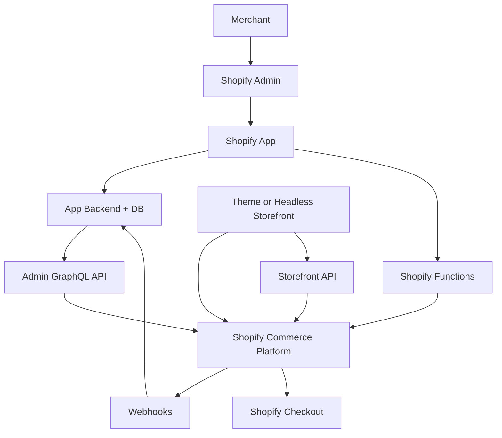

最重要的职责总结：

| 问题 | 首先想到 |
|---|---|
| 前台怎么展示 | Theme / Headless |
| 商家怎么配置业务 | App UI / Admin extension |
| 怎么读写后台数据 | Admin GraphQL API |
| Shopify 数据变化怎么通知我 | Webhooks |
| Checkout 同步商业规则怎么执行 | Shopify Functions |
| 不同买家长期价格上下文 | Markets / Catalogs / Price Lists |
| 活动优惠 | Discounts / Functions |
| 完全自定义 React storefront | Storefront API / Hydrogen |
| 企业级 Checkout / 组织能力 | 检查 Plus / Enterprise feature matrix |

---

# 下一阶段建议：从“会用平台”到“能做生产级 App”

完成 Part 18 后，最值得继续深入的是：

```text
App Database / Prisma 数据设计
→ App Billing
→ Admin UI Extensions / App Home
→ Bulk Operations
→ API idempotency / retries / queues
→ ERP / PIM / OMS 实际同步项目
→ Customer Account API
→ Checkout UI Extensions
→ B2B / Catalog 深入
→ Observability / App Review / Security
```

这个阶段的目标已经不是再记更多 Shopify 名词，而是：

> **能够设计一个长期运行、可安装、可升级、可同步、可恢复、符合 Shopify 平台边界的生产级应用。**

---

# 附录 A：Theme / App / Function / Headless 的职责表

| 需求 | 优先考虑 |
|---|---|
| Product Page UI | Theme |
| Variant Selector | Theme + JS |
| Cart Drawer | Theme + Ajax Cart API |
| Collection Grid / Filter UI | Theme |
| SEO HTML / JSON-LD | Theme |
| 商家后台管理系统 | App |
| ERP / OMS / CRM 集成 | App + Admin GraphQL API |
| Discount 实时规则 | Discount / Shopify Function |
| 自定义 Shopify 后端规则 | Function |
| React / Next.js 独立 Storefront | Storefront API / Headless |
| Checkout | Shopify Checkout / Extensibility |
| 自定义商品数据 | Metafield / Metaobject |

判断问题时建议先问：

```text
这是 UI 问题？
→ Theme

这是 Commerce 数据读写？
→ Shopify API

这是商家后台业务系统？
→ App

这是 Shopify 运行时后端规则？
→ Function

这是独立前端 Storefront？
→ Headless / Storefront API
```

---

# 附录 B：常用 Shopify 官方文档索引

## Theme / Liquid

- [Theme architecture](https://shopify.dev/docs/storefronts/themes/architecture)
- [Templates](https://shopify.dev/docs/storefronts/themes/architecture/templates)
- [Liquid reference](https://shopify.dev/docs/api/liquid)
- [content_for_header](https://shopify.dev/docs/api/liquid/objects/content_for_header)
- [content_for_layout](https://shopify.dev/docs/api/liquid/objects/content_for_layout)

## Product / Variant

- [Liquid product object](https://shopify.dev/docs/api/liquid/objects/product)
- [Liquid variant object](https://shopify.dev/docs/api/liquid/objects/variant)
- [Support product variants](https://shopify.dev/docs/storefronts/themes/product-merchandising/variants)
- [Product template](https://shopify.dev/docs/storefronts/themes/architecture/templates/product/overview)
- [Product media](https://shopify.dev/docs/storefronts/themes/product-merchandising/media)

## Cart / AJAX / Section Rendering

- [Shopify Ajax API](https://shopify.dev/docs/api/ajax)
- [Cart API](https://shopify.dev/docs/api/ajax/reference/cart)
- [Section Rendering API](https://shopify.dev/docs/api/ajax/section-rendering)
- [Liquid cart object](https://shopify.dev/docs/api/liquid/objects/cart)
- [Cart template](https://shopify.dev/docs/storefronts/themes/architecture/templates/cart)

## Search / Collection / Filter

- [Liquid collection object](https://shopify.dev/docs/api/liquid/objects/collection)
- [Storefront search](https://shopify.dev/docs/storefronts/themes/navigation-search/search)
- [Liquid search object](https://shopify.dev/docs/api/liquid/objects/search)
- [Predictive search](https://shopify.dev/docs/storefronts/themes/navigation-search/search/predictive-search)
- [Storefront filtering](https://shopify.dev/docs/storefronts/themes/navigation-search/filtering/storefront-filtering)
- [Support storefront filtering](https://shopify.dev/docs/storefronts/themes/navigation-search/filtering/storefront-filtering/support-storefront-filtering)

## SEO / Performance

- [Shopify Theme SEO](https://shopify.dev/docs/storefronts/themes/seo)
- [SEO metadata](https://shopify.dev/docs/storefronts/themes/seo/metadata)
- [canonical_url](https://shopify.dev/docs/api/liquid/objects/canonical_url)
- [Performance best practices](https://shopify.dev/docs/storefronts/themes/best-practices/performance)

## Metafield / Metaobject

- [About metafields](https://shopify.dev/docs/apps/build/metafields)
- [About metaobjects](https://shopify.dev/docs/apps/build/metaobjects)
- [Data modeling with metafields and metaobjects](https://shopify.dev/docs/apps/build/metaobjects/data-modeling-with-metafields-and-metaobjects)

## Inventory / Order

- [InventoryItem](https://shopify.dev/docs/api/admin-graphql/latest/objects/inventoryitem)
- [Inventory management apps](https://shopify.dev/docs/apps/build/orders-fulfillment/inventory-management-apps)
- [Location](https://shopify.dev/docs/api/admin-graphql/latest/queries/location)
- [Order](https://shopify.dev/docs/api/admin-graphql/2026-01/objects/Order)
- [Orders and fulfillment](https://shopify.dev/docs/apps/build/orders-fulfillment)

## App / Function / Discount

- [About Shopify Functions](https://shopify.dev/docs/apps/build/functions)
- [About discounts](https://shopify.dev/docs/apps/build/discounts)
- [Build a Discount Function](https://shopify.dev/docs/apps/build/discounts/build-discount-function?extension=javascript)

---

## Markets / Pricing / Discounts

- [About Shopify Markets](https://shopify.dev/docs/apps/build/markets)
- [About catalogs in Markets](https://shopify.dev/docs/apps/build/markets/catalogs)
- [Build a catalog](https://shopify.dev/docs/apps/build/markets/build-catalog)
- [Market — Admin GraphQL](https://shopify.dev/docs/api/admin-graphql/latest/objects/Market)
- [PriceList — Admin GraphQL](https://shopify.dev/docs/api/admin-graphql/latest/objects/PriceList)
- [About discounts](https://shopify.dev/docs/apps/build/discounts)

## App / Authentication / Admin GraphQL

- [Scaffold a Shopify app](https://shopify.dev/docs/apps/build/scaffold-app)
- [About app authentication](https://shopify.dev/docs/apps/build/authentication-authorization)
- [Authentication for Shopify CLI apps](https://shopify.dev/docs/apps/build/authentication-authorization/cli-app-authentication)
- [Access tokens](https://shopify.dev/docs/apps/build/authentication-authorization/access-tokens)
- [GraphQL Admin API](https://shopify.dev/docs/api/admin-graphql/latest)
- [GraphQL Admin API rate limits](https://shopify.dev/docs/apps/build/apis/graphql-admin/rate-limits)

## Webhooks / Functions

- [About webhooks](https://shopify.dev/docs/apps/build/webhooks)
- [Verify webhook deliveries](https://shopify.dev/docs/apps/build/webhooks/verify-deliveries)
- [About Shopify Functions](https://shopify.dev/docs/apps/build/functions)
- [Discount Function API](https://shopify.dev/docs/api/functions/2026-07/discount)

## Headless / Hydrogen / Enterprise

- [Storefront API](https://shopify.dev/docs/api/storefront)
- [Contextual Storefront queries](https://shopify.dev/docs/storefronts/headless/building-with-the-storefront-api/in-context)
- [Hydrogen](https://shopify.dev/docs/api/hydrogen/latest)
- [Checkout customization technologies](https://shopify.dev/docs/apps/build/checkout/technologies)
- [Start building for B2B](https://shopify.dev/docs/apps/build/b2b/start-building)

---

# 附录 C：你现在应该具备的心智模型

完成目前这些课程之后，不应该只记住几个 Liquid 属性，而应该在脑中形成下面这张图：

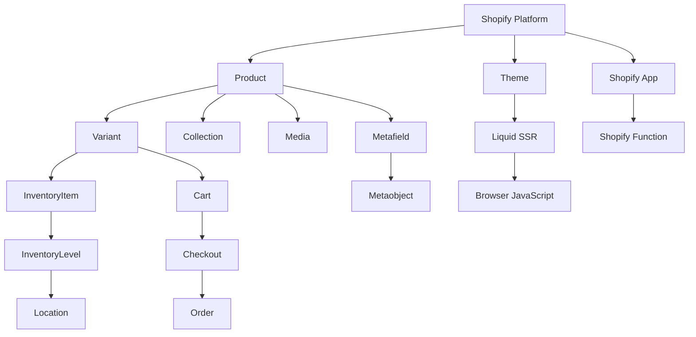

最终用一句话总结整个教程：

> **Shopify Theme 开发的本质，不是“会写 Liquid”，而是理解 Shopify 的 Commerce Data Model，并用 Liquid 做服务端初始渲染、用 JavaScript 做浏览器交互、用 Shopify 提供的 Cart / Search / Section Rendering 等能力完成动态体验，同时把真正的价格、库存、订单、支付、履约等商业规则留在 Shopify 平台可信边界内。**

---


