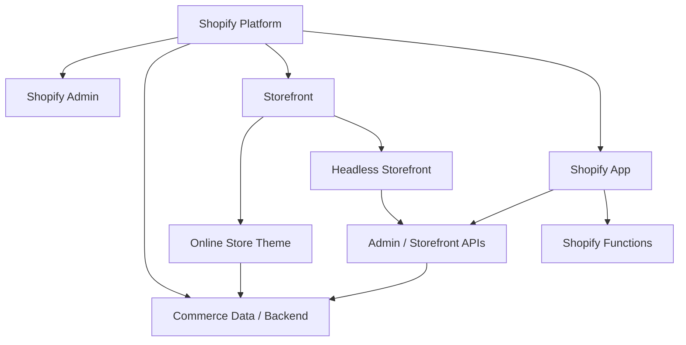
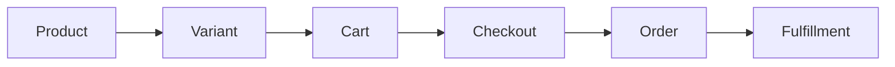

# L0-02 平台全局地图

> **本课目标：** 分清 Store、Theme、App、Admin 与 Storefront。

## Shopify 不是“一个模板系统”


### 从一个真实需求判断应该改哪一层

这是学习 Shopify 最值得尽早建立的能力。面对需求时，先判断“这个需求属于哪一层”，而不是先想着写 JavaScript。

| 需求 | 首选位置 | 为什么 |
|---|---|---|
| 商品页新增一个可配置 Banner | Theme Section / Block | 纯 Storefront UI，商家需要在 Theme Editor 配置 |
| 商品增加“材质”字段 | Product Metafield | 属于 Product 的结构化业务数据 |
| 多个商品共用一个“尺码表”对象 | Metaobject + reference Metafield | 数据是一个可复用、多字段对象 |
| 加购后无刷新打开 Cart Drawer | Theme JS + Ajax Cart API + Section Rendering | 属于前台交互 |
| 满 3 件打 8 折 | Discount / Shopify Function | 价格规则必须由 Shopify 可信后端执行 |
| ERP 同步库存 | App + Admin GraphQL API | 需要后台权限、认证、持久集成 |
| 完全用 Next.js 做商店 | Headless + Storefront API | 不再由 Liquid Theme 负责页面 |

> **判断口诀**：UI 看 Theme；业务数据看 Metafield / Metaobject；后台集成看 App；交易规则看 Function；完全自定义前端看 Headless。


很多前端第一次接触 Shopify，会把它理解成：

```text
Shopify = Liquid + HTML + CSS
```

这个理解太窄。

更准确的模型是：



你可以先这样记：

- **Theme**：消费者看到的店铺前台体验。
- **Admin**：商家管理商品、订单、内容、设置的后台。
- **App**：给商家或 Shopify 平台扩展完整业务能力。
- **Function**：嵌入 Shopify 后端特定业务节点执行的规则逻辑。
- **Storefront API**：给 Headless / React / Hydrogen 等自定义 Storefront 使用。
- **Admin GraphQL API**：给 App、ERP、OMS、PIM、WMS 等后台系统管理 Shopify 数据。

官方入口：

- [Theme architecture](https://shopify.dev/docs/storefronts/themes/architecture)
- [Liquid reference](https://shopify.dev/docs/api/liquid)
- [About Shopify Functions](https://shopify.dev/docs/apps/build/functions)

---

## Shopify 最核心的商业生命周期


### 先区分“资源对象”和“UI”

Shopify 教程里最容易把 UI 名称和数据对象混在一起。例如：

| 名称 | 是 Shopify 数据对象吗？ | 说明 |
|---|---:|---|
| Product | 是 | 商品主体 |
| Variant | 是 | 可购买规格 |
| Cart | 是 | 购物上下文 |
| Cart line | 是 | Cart 中的一条购买记录 |
| Cart Drawer | **不是** | Theme 自己实现的一种购物车 UI |
| Checkout | 是平台交易流程 | Shopify 托管的结账流程 |
| Order | 是 | 成交后的订单资源 |
| Product Card | **不是** | Theme 的展示组件 |

以后看到一个 Shopify 名词，先问自己：**它是数据资源、平台能力，还是 Theme UI？** 很多架构问题会立刻变简单。


先不要考虑代码，先把这一条链背下来：



含义：

- **Product**：这是什么商品？
- **Variant**：具体买哪个规格？
- **Cart**：用户准备买什么？
- **Checkout**：用户正在完成交易。
- **Order**：交易完成后形成的订单。
- **Fulfillment**：订单如何拣货、包装、发货、履约。

后面所有 Theme、库存、订单、App 的知识，最终都会回到这条链。

---

---

## 练习与验收

把“运营修改商品价”“前端修改按钮”“订单同步 ERP”分别放到正确层级。

验收时记录：操作步骤、预期结果、实际结果，以及出现问题时检查的数据和文件。不要只以“页面看起来正常”作为通过依据。
