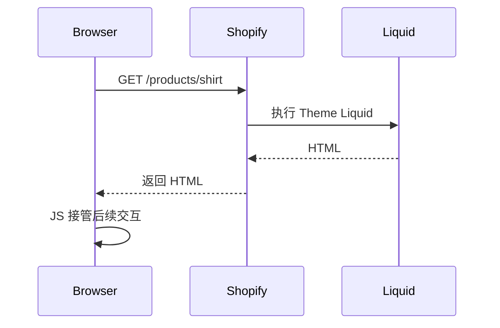

# L1-02 Theme 结构与 Liquid 渲染

> **本课目标：** 解释 Layout、Template、Section、Block、Snippet 和 Assets 的职责。

## 在 Admin 哪里能看到 Theme？

**当前常见入口：** `Shopify Admin → Online Store → Themes`。

你会用到两个入口：

1. **Edit theme / Customize**：进入 Theme Editor，面向商家配置 Section、Block、颜色、字体、App embeds 等。
2. **Edit code**：进入代码编辑器，查看 `layout/`、`templates/`、`sections/`、`blocks/`、`snippets/`、`assets/` 等文件。

官方 Help Center：

- [The theme editor](https://help.shopify.com/en/manual/online-store/themes/customizing-themes/theme-editor)
- [Editing theme code](https://help.shopify.com/en/manual/online-store/themes/customizing-themes/edit-code/edit-theme-code)
- [Theme architecture](https://shopify.dev/docs/storefronts/themes/architecture)

> 开发实践中，先复制一份 Theme 作为开发/备份副本，再改代码，比直接在 live theme 上试错安全得多。


## Theme 的标准目录

### 现代 Theme 中 Section、Block、Snippet 到底差在哪？

它们都像“组件”，但职责不同：

| 概念 | 是否可被商家配置 | 是否有 Schema | 典型粒度 | 类比 |
|---|---:|---:|---|---|
| Section | 是 | 是 | 页面模块 | 页面级业务组件 |
| Theme Block | 是 | 是 | 可嵌套的小模块 | 可视化编辑器中的可复用组件 |
| Section block | 是 | 由 Section schema 定义 | Section 内项目 | 组件内部的配置项 |
| Snippet | 否（自身没有编辑器配置） | 否 | 代码复用 | React helper component / partial |
| Template | 间接 | JSON 描述组合 | 页面类型 | route composition |
| Layout | 否 | 否 | 全站外壳 | Root Layout |

一个实用判断：

- 商家需要在编辑器里“添加/删除/排序/配置” → 优先考虑 **Section / Block**。
- 只是开发者想复用一段渲染逻辑 → 用 **Snippet**。
- 想决定 Product 页面由哪些 Sections 组成 → 看 **`templates/product.json`**。

> 新版 Shopify Theme 架构里还存在独立的 `blocks/` 目录，不要只停留在早期 “Section + Section blocks” 的认知。


Shopify Theme 使用固定的目录结构。典型结构：

```text
theme/
├── layout/
│   └── theme.liquid
├── templates/
│   ├── index.json
│   ├── product.json
│   ├── collection.json
│   ├── search.json
│   └── cart.json
├── sections/
│   ├── header.liquid
│   ├── footer.liquid
│   ├── main-product.liquid
│   └── main-collection-product-grid.liquid
├── snippets/
│   ├── product-card.liquid
│   └── price.liquid
├── assets/
│   ├── theme.css
│   ├── theme.js
│   └── product.js
├── config/
└── locales/
```

官方文档： [Theme architecture](https://shopify.dev/docs/storefronts/themes/architecture)

### 你应该怎样理解它们？

| 概念 | 类比前端框架 | 作用 |
|---|---|---|
| `layout/theme.liquid` | App Shell / Root Layout | 整个店铺 HTML 外壳 |
| Template | Route Page Composition | 决定某类页面由哪些 Section 组成 |
| Section | 可配置业务组件 | 商品主区域、Banner、Collection Grid |
| Block | Section 内的子组件 | 标题、价格、按钮等可配置块 |
| Snippet | 小型可复用组件 | Product Card、Price、Icon |
| Assets | 静态资源 | CSS / JS / 图片等 |
| Config | Theme 配置 | Theme Editor 设置 |
| Locales | i18n | 多语言文本 |

---

## `theme.liquid` 是 Theme 的总入口


### `content_for_header` 为什么不能删？

`{{ content_for_header }}` 不是你自己配置的一段字符串，而是 Shopify 的平台注入点。它可能承载 Shopify 平台和 App 所需的 `<script>`、元信息以及运行时内容。你应该把它当成“平台保留插槽”，而不是依赖它当前输出的具体 HTML。

### `content_for_layout` 又是什么？

它负责把当前 URL 对应 Template 的主体内容放进 Layout。一个简化链路是：

```text
URL
 ↓
Shopify 判断页面类型
 ↓
选择 Template
 ↓
Template 组合 Sections
 ↓
Section 执行 Liquid
 ↓
content_for_layout
 ↓
theme.liquid 的 <body>
```

这也是为什么 `theme.liquid` 很像 Next.js 的 Root Layout，但 **Liquid 的渲染发生在 Shopify 服务器**，不是浏览器 hydration。


一个非常简化的骨架：

```liquid
<!doctype html>
<html>
<head>
  <meta charset="utf-8">
  <meta name="viewport" content="width=device-width, initial-scale=1">

  <title>{{ page_title }}</title>

  
    <meta name="description" content="{{ page_description | escape }}">
  

  <link rel="canonical" href="{{ canonical_url }}">

  {{ content_for_header }}
</head>
<body>
  

  <main>
    {{ content_for_layout }}
  </main>

  
</body>
</html>
```

这里有两个必须理解的特殊对象。

### `{{ content_for_header }}`

它是 Shopify 平台在 `<head>` 中的动态注入入口。官方定义为：动态返回 Shopify 所需脚本等内容，并且 **`theme.liquid` 中必须包含它**。

不要尝试解析、替换它内部输出，因为其内容可能变化。

官方文档： [content_for_header](https://shopify.dev/docs/api/liquid/objects/content_for_header)

### `{{ content_for_layout }}`

它动态返回当前 Template 对应的页面主体内容，应该位于 `<body>` 中。

官方文档： [content_for_layout](https://shopify.dev/docs/api/liquid/objects/content_for_layout)

可以把两者记成：

```text
theme.liquid
│
├── <head>
│     └── content_for_header
│          Shopify / 平台运行时内容
│
└── <body>
      └── content_for_layout
           当前页面 Template / Sections
```

---

## Liquid 到底运行在哪里？

### 一次 Product 请求里发生了什么？

假设浏览器请求：

```text
/products/classic-shirt
```

Shopify 大致执行：

```text
1. 根据 handle 找到 Product
2. 建立当前请求上下文：product / cart / shop / request / localization ...
3. 选择 product template
4. 按 template 渲染 Sections
5. 执行 Liquid tags / filters
6. 生成最终 HTML
7. 浏览器下载 HTML、CSS、JS、图片
8. JavaScript 再接管 Variant 切换、Cart Drawer 等动态行为
```

因此以下代码：

```liquid
<h1>{{ product.title }}</h1>
```

浏览器实际拿到的是：

```html
<h1>Classic T-Shirt</h1>
```

浏览器**不会**拿到 `{{ product.title }}`。这条边界是理解 Liquid + JS 协作方式的基础。


这是 Shopify Theme 最重要的基础概念之一。



Liquid 是 **服务端模板语言**。

所以：

```liquid
{{ product.title }}
```

不是浏览器里的 JavaScript 在运行，而是在 Shopify 服务端渲染 HTML 时执行。

用户在浏览器中点击：

```text
Black → White
```

Liquid **不会自动重新执行**。之后的 Variant 切换、Gallery、Cart Drawer 等交互，要靠 JavaScript，或者重新请求 Shopify 的 HTML（例如 Section Rendering API）。

---

## Liquid 三个核心概念

### 常见 Liquid 数据来源也要分层理解

| 来源 | 示例 | 生命周期 |
|---|---|---|
| 全局对象 | `shop`、`cart`、`request`、`routes`、`localization` | 多数页面可用 |
| 页面对象 | `product`、`collection`、`search`、`article` | 仅对应页面上下文存在 |
| Theme settings | `settings.xxx`、`section.settings.xxx` | 来自 Theme Editor |
| Block settings | `block.settings.xxx` | 当前 Block 配置 |
| Custom data | `product.metafields...`、`metaobjects...` | 来自 Admin 自定义数据 |

**常见错误：**在不是 Product 页面/上下文的位置，默认认为 `product` 一定存在。可复用 Snippet 最好显式传参：

```liquid

```

这样依赖更清楚，也更接近普通前端组件的 props 思维。


### Output

```liquid
{{ product.title }}
```

输出数据。

### Tags / Logic

```liquid

  In stock

```

控制逻辑。

### Filters

```liquid
{{ product.price | money }}
```

将数据转换成适合展示的格式。

官方总参考： [Liquid reference](https://shopify.dev/docs/api/liquid)

---

## 一个 Section 从代码到 Theme Editor 的完整过程

抽象地说“Section 是可配置组件”还不够。下面看它为什么能出现在 Theme Editor。

`sections/promo-banner.liquid`：

```liquid
<section class="promo-banner" style="--space: {{ section.settings.spacing }}px">
  
    <h2>{{ section.settings.heading | escape }}</h2>
  

  
    <a href="{{ section.settings.link }}">
      {{ 'general.shop_now' | t }}
    </a>
  
</section>


  .promo-banner {
    padding-block: var(--space);
  }



{
  "name": "Promo banner",
  "settings": [
    {
      "type": "text",
      "id": "heading",
      "label": "Heading"
    },
    {
      "type": "url",
      "id": "link",
      "label": "Link"
    },
    {
      "type": "range",
      "id": "spacing",
      "min": 0,
      "max": 80,
      "step": 4,
      "unit": "px",
      "label": "Vertical spacing",
      "default": 24
    }
  ],
  "presets": [
    {
      "name": "Promo banner"
    }
  ]
}

```

然后你会在 Theme Editor 中看到对应的 Heading、Link、Spacing 配置。

### 这里的三层数据不要混

```text
section.settings.heading
        ↑
Theme Editor 中这个 Section 实例的配置

product.title
        ↑
Shopify Product 数据

product.metafields.custom.subtitle.value
        ↑
Product 的 Custom Data
```

它们都能输出文本，但**数据所有者完全不同**。

> 生产级 Theme 还应把 schema labels、前台文案放入 locales，并遵循 Theme 的组件规范。上面示例重点是解释 Section → schema → Theme Editor 的连接。

官方：

- [Sections](https://shopify.dev/docs/storefronts/themes/architecture/sections)
- [Section schema](https://shopify.dev/docs/storefronts/themes/architecture/sections/section-schema)
- [Theme blocks quick start](https://shopify.dev/docs/storefronts/themes/architecture/blocks/theme-blocks/quick-start)

---

---

## 练习与验收

在你的主题中找到商品页模板、主 Section 和价格 Snippet，画出调用关系。

验收时记录：操作步骤、预期结果、实际结果，以及出现问题时检查的数据和文件。不要只以“页面看起来正常”作为通过依据。
