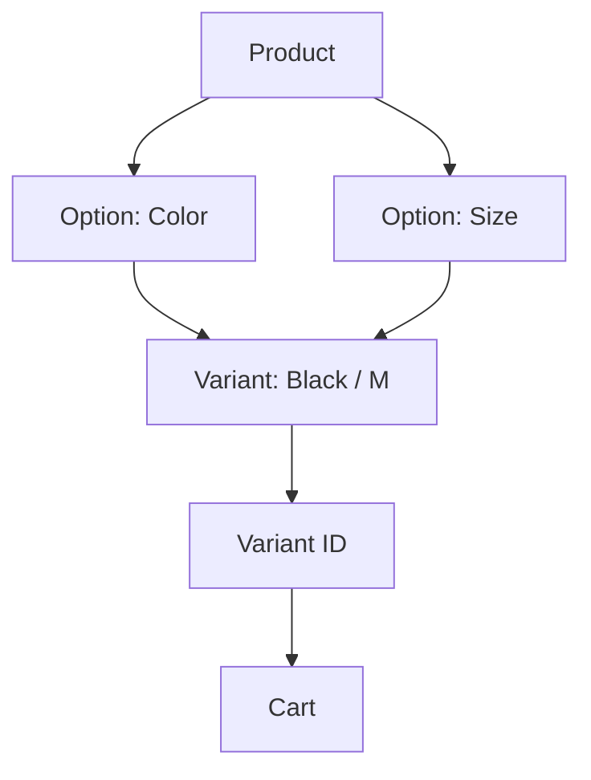

# L2-01 Product、Option 与 Variant 基础

> **本课目标：** 理解商品、选项维度与实际可购买规格。


## Product 在 Shopify Admin 的位置和创建流程

**Admin 位置：** `Products`。

创建一个最基础 Product：

1. 进入 `Shopify Admin → Products`。
2. 点击 **Add product**。
3. 输入 Title；根据业务补充 Description、Media、Category、Vendor、Pricing、Inventory、Shipping、Metafields 等。
4. 如果商品存在 Size / Color 等规格，在 Variants / Options 区域添加选项。
5. 设置 Publishing / Status 后保存。

官方 Help Center：

- [Adding and updating products](https://help.shopify.com/en/manual/products/add-update-products)
- [Products overview](https://help.shopify.com/en/manual/products)

开发文档：

- [Liquid `product` object](https://shopify.dev/docs/api/liquid/objects/product)
- [Liquid `variant` object](https://shopify.dev/docs/api/liquid/objects/variant)


## Product 是什么？

### Product 常用 Liquid 属性

下面不是全部属性，而是 Theme 开发最常碰到的一组。完整定义以官方 `product` object 文档为准。

| 属性 | 含义 | 常见场景 |
|---|---|---|
| `product.id` | Product ID | DOM data 属性、调试、第三方集成 |
| `product.title` | 商品标题 | PDP 标题、Product Card |
| `product.handle` | URL 友好标识 | 构造/理解 `/products/:handle` |
| `product.url` | 当前 Product 相对 URL | 商品链接，优先于手拼 URL |
| `product.description` | HTML 商品描述 | PDP 详情区 |
| `product.vendor` | Vendor | 品牌/供应商展示、筛选 |
| `product.type` | Product type | 分类展示、业务规则 |
| `product.tags` | Tag 数组 | 标记、兼容旧业务逻辑 |
| `product.available` | 是否至少存在可购买 Variant | Product Card 售罄状态 |
| `product.price` | 当前语义下的商品价格值 | 起始价/基础价格展示 |
| `product.price_min` / `price_max` | Variant 最低/最高价 | “From $…” |
| `product.price_varies` | Variant 是否不同价 | 是否展示 price range |
| `product.options_with_values` | Option + values | Variant Selector |
| `product.variants` | Variant 集合 | 规格逻辑；高 Variant 商品要避免过度读取 |
| `product.variants_count` | Variant 总数 | 判断复杂商品 |
| `product.selected_variant` | URL 明确选中的 Variant | `?variant=` 场景 |
| `product.selected_or_first_available_variant` | 已选或第一个可售 Variant | PDP 初始化 |
| `product.featured_media` | 主 Media | 商品首屏 |
| `product.media` | 所有 Media | Gallery |
| `product.collections` | 所属 Collection | 面包屑/关联展示（注意不要据此假设唯一父级） |
| `product.metafields` | Product 自定义数据 | 材质、产地、内容扩展 |

一个典型商品头部：

```liquid


<article data-product-id="{{ product.id }}">
  <h1>{{ product.title | escape }}</h1>

  <p>
    {{ current_variant.price | money }}
  </p>

  
    <p>{{ product.vendor | escape }}</p>
  
</article>
```

> **性能提醒**：现代 Shopify 支持高 Variant 商品。不要因为 `product.variants` 可以访问，就默认把所有 Variant 的完整 JSON 输出到页面；只输出交互真正需要的数据。


Product 是消费者认知上的商品主体。

例如：

```text
Classic T-Shirt
```

它拥有：

```text
Product
├── title
├── description
├── vendor
├── product_type
├── tags
├── options
├── variants
├── media
├── collections
└── metafields
```

Liquid 官方对象： [product](https://shopify.dev/docs/api/liquid/objects/product)

---

## Option 是“选择维度”

### Option 在 Admin 哪里配置？

进入：`Products → 打开某个 Product → Variants / Options`。

如果商品还没有 Option，通常点击类似 **Add options like size or color** 的入口。当前 Shopify 规则下，一个 Product 最多有 **3 个 Options**；例如：

```text
Color
Size
Material
```

Option 的 value 才是：

```text
Color: Black / White
Size: S / M / L
```

官方 Help Center：[Adding variants](https://help.shopify.com/en/manual/products/variants/add-variants)

### `product.options` 和 `product.options_with_values` 对比

| API | 返回重点 | 适合场景 |
|---|---|---|
| `product.options` | Option 名称 | 只想知道有哪些维度 |
| `product.options_with_values` | Option 名称、values、选中/可用信息 | Variant Selector |

Variant Selector 通常优先从 `options_with_values` 渲染 UI，而不是自己从 Variant title 字符串拆 `Black / M`。


例如 T-Shirt：

```text
Color
├── Black
└── White

Size
├── S
├── M
└── L
```

这里：

- `Color` 是一个 Option。
- `Black` / `White` 是 Option Values。
- `Size` 是另一个 Option。

Liquid 中常见：

```liquid
product.options
product.options_with_values
product.options_by_name
```

### `product.options`

概念上：

```json
["Color", "Size"]
```

只有 Option 名称。

### `product.options_with_values`

概念上：

```json
[
  {
    "name": "Color",
    "values": ["Black", "White"]
  },
  {
    "name": "Size",
    "values": ["S", "M", "L"]
  }
]
```

它更适合做 Variant Selector。

---

## Variant 是真正可购买的具体规格

### Variant

在库存链路里 Variant 回答的是：**“哪个具体可购买规格？”**

例如：

```text
Classic T-Shirt / Black / M
SKU: TS-BLK-M
```

它有价格、Option values、SKU 等商品/交易信息，但多 Location 库存不应被简化成 Variant 上的一个全局 `stock` 数字。

#### 在 Admin 里是什么？

进入：`Products → 某个 Product → Variants`，点击具体 Variant 后可以编辑该规格自己的价格、库存、SKU、Barcode、Shipping/Customs 等信息。

Variant 不是“一个选项值”，而是所有选项值的一次具体组合：

```text
Color = Black
Size  = M
       ↓
Variant = Black / M
```

### Variant 常用 Liquid 属性

| 属性 | 含义 | 常见场景 |
|---|---|---|
| `variant.id` | Variant ID | **Add to Cart 最关键的 ID** |
| `variant.title` | 组合标题 | `Black / M` |
| `variant.price` | Variant 当前价格 | 切规格后更新价格 |
| `variant.compare_at_price` | 划线参考价 | Sale UI |
| `variant.available` | 当前是否可购买 | 禁用按钮/售罄状态 |
| `variant.sku` | 商家 SKU | ERP/WMS/后台展示 |
| `variant.barcode` | 条码 | POS、仓储扫描 |
| `variant.options` | 当前 Variant 的 option values | 匹配规格 |
| `variant.options_with_values` | 带结构的 option/value 信息 | 更现代的 Variant UI |
| `variant.featured_media` / `featured_image` | 规格关联媒体 | 选择颜色后切图 |
| `variant.inventory_management` | 库存管理方式 | 库存语义判断 |
| `variant.inventory_policy` | 售罄后是否允许继续售卖等策略 | 可售逻辑理解 |
| `variant.inventory_quantity` | Variant 库存数量语义 | 仅在明确理解库存模型时使用；不要替代多 Location 库存模型 |
| `variant.url` | 该 Variant 对应 URL | 保留规格选择状态 |

官方文档：[Liquid `variant` object](https://shopify.dev/docs/api/liquid/objects/variant)


Color + Size 的组合会形成 Variant：

```text
Black / S
Black / M
Black / L
White / S
White / M
White / L
```

每个 Variant 都可以拥有独立：

- ID
- SKU
- Barcode
- Price
- Compare-at Price
- Availability
- Inventory
- Media

Liquid 官方对象： [variant](https://shopify.dev/docs/api/liquid/objects/variant)

核心关系：



一句话：

> **Option 是用户选择规格的维度；Variant 是这些选择组合后真正可以购买的 SKU。**

---

## Variant 数量限制

截至当前 Shopify 官方资料：

- 一个 Product 最多 **3 个 product options**。
- 一个 Product 最多 **2,048 Variants**。

官方：

- [Adding variants](https://help.shopify.com/en/manual/products/variants/add-variants)
- [2,048 variant limit changelog](https://shopify.dev/changelog/the-product-variant-limit-is-now-2048-for-all-merchants)

> 不要用旧教程里的“100 Variants 上限”继续做架构假设。


当前 Shopify：

- 一个 Product 最多 **3 个 Options**。
- 默认最多 **2,048 个 Variants**。

官方：

- [Support product variants](https://shopify.dev/docs/storefronts/themes/product-merchandising/variants)
- [Shopify Help - Adding variants](https://help.shopify.com/en/manual/products/variants/add-variants)

例如：

```text
Color = 10
Size = 10
Material = 10

10 × 10 × 10 = 1000
```

理论组合 1000，没有超过 2048。

但要注意：

> **Option 的理论组合空间，不一定等于实际创建的 Variant 数量。**

业务可以只创建部分有效组合。

---

## `product.variants` 是什么？

`product.variants` 是当前 Product 的 Variant 集合。

```liquid

  {{ variant.id }}
  {{ variant.title }}
  {{ variant.price | money }}
  {{ variant.available }}

```

对于：

```text
Color = Black
Size = M
```

某个 Variant 概念上：

```js
{
  id: 102,
  title: 'Black / M',
  options: ['Black', 'M'],
  price: 2999,
  available: true
}
```

注意：这只是帮助理解，不是完整官方 JSON Schema。

---

---

## 练习与验收

画出两个 Option 的规格组合，找到 Product ID、Variant ID 和 SKU。

验收时记录：操作步骤、预期结果、实际结果，以及出现问题时检查的数据和文件。不要只以“页面看起来正常”作为通过依据。
