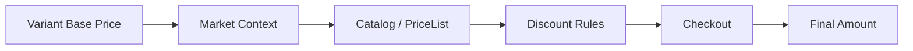

# L6-01 Markets、价格与 Discount 数据模型

> **本课目标：** 区分基础价格、市场上下文、展示价和实际折扣。

这一课一定不要急着写 API。

因为 Shopify 里的“价格”并不是一个 `price` 字段就结束了。

真实跨境电商里，一个商品最终显示给买家的金额，可能同时受到下面几层影响：

```text
Variant 基础价格
        ↓
Market / Catalog 上下文价格
        ↓
Discount
        ↓
Shipping / Tax / Duties
        ↓
Checkout 最终金额
```


如果这几层不区分清楚，后面做 App、促销、Markets、Headless 时非常容易出现这样的错误：

```text
“后台 Price 明明是 $100，为什么加拿大用户看到 CAD 139？”

“Product 页显示 $90，为什么 Checkout 又变成 $81？”

“Compare-at price 是不是 Discount？”

“我可不可以 /cart/add.js 时自己传 price？”
```

答案分别来自不同层。

---

## 先建立五个不同的“价格概念”

先看最重要的对比表。

| 概念 | 它是什么 | 谁配置 | 是否是真正的折扣规则 | 常见用途 |
|---|---|---|---:|---|
| `Variant.price` | 商品 Variant 的基础销售价 | Product / Variant | 否 | 正常商品定价 |
| `compareAtPrice` / `compare_at_price` | 用来表达“原价 / 对比价”的 merchandising 字段 | Product / Variant | **否** | 划线价、Sale badge |
| Market contextual price | 某个 Market / Catalog 上下文下解析后的价格 | Markets / Catalog / Price List | 否 | 国际定价、B2B 定价、市场差异化价格 |
| Discount | 满足条件后产生的价格优惠 | Discounts / App / Function | **是** | 优惠码、自动折扣、满减、买 X 送 Y |
| Checkout final total | 交易上下文最终金额 | Shopify Checkout | 结果，不是单一配置字段 | 商品 + 折扣 + 运费 + 税费 + duties 等 |

这张表里最容易犯的错误是：

> **Sale price 不等于 Discount。**

例如：

```text
Compare-at price = $120
Price            = $90
```

这是商品本身就被定成了 `$90`，Theme 可以展示：

```text
$120  →  $90
```

但 Shopify 并没有因为这两个字段自动创建一个“25% discount rule”。

官方帮助文档：[Setting sale prices for products](https://help.shopify.com/en/manual/products/details/product-pricing/sale-pricing)

---

## 基础价格在哪里配置？

### Admin 位置

```text
Shopify Admin
→ Products
→ 打开 Product
→ Variants
→ 打开某个 Variant
→ Price
```

常见字段：

```text
Price
Compare-at price
Cost per item（如果商店界面提供）
```

例如：

```text
Product: Classic Hoodie
Variant: Black / M

Price:            $80
Compare-at price: $100
```

你可以把它理解成：

```text
Product
└── Variant: Black / M
      ├── price = 80
      └── compareAtPrice = 100
```

### Theme 中

```liquid


<span class="price">
  {{ variant.price | money }}
</span>


  <s class="compare-price">
    {{ variant.compare_at_price | money }}
  </s>

```

这里要理解：Theme 负责的是**展示 Shopify 已经解析好的 storefront 价格上下文**，不是在浏览器里成为价格权威。

官方对象：

- [Liquid `variant`](https://shopify.dev/docs/api/liquid/objects/variant)
- [Admin GraphQL `ProductVariant`](https://shopify.dev/docs/api/admin-graphql/latest/objects/ProductVariant)

---

## Market 到底是什么？

以前很多文章把 Market 讲成：

```text
Market = 国家 / 地区
```

现在这个理解已经不够完整。

当前 Shopify Markets 的概念更接近：

> **Market = 一组满足特定条件的买家，以及 Shopify 为这组买家提供的定制化商业体验。**

条件可以涉及：

```text
Region
Company location（B2B）
POS / retail location
Sales channel
...
```

而 Market 可以控制或参与：

```text
Currency
Pricing
Product availability
Domain / web presence
Language
Taxes / duties context
Theme / storefront contextual experience（按计划和能力）
...
```

官方文档：

- [About Shopify Markets](https://shopify.dev/docs/apps/build/markets)
- [Market GraphQL object](https://shopify.dev/docs/api/admin-graphql/latest/objects/Market)
- [Shopify Help Center: Markets](https://help.shopify.com/en/manual/markets)

---

## Market 在 Admin 哪里？怎么创建？

当前 Shopify Admin 通常可以直接进入：

```text
Shopify Admin
→ Markets
```

> 不要死记旧教程里的 `Settings → Markets`。Shopify Admin 导航会迭代，当前官方 Help Center 直接描述为进入 **Markets** 页面。

### 创建一个 Canada Market

大致步骤：

```text
1. Admin → Markets
2. Create market
3. Name = Canada
4. 选择 Draft / Active
5. Add condition
6. Region → Canada
7. 查看继承的 customizations
8. 修改需要覆盖的 currency / pricing / domain 等配置
9. Save
10. 准备好物流等配置后 Activate
```

官方操作文档：[Creating and activating markets](https://help.shopify.com/en/manual/markets/getting-started/set-up-markets)

注意一个很有用的概念：

```text
Market 设置可能是：

Inherited
    ↓
继承父级 / 商店默认

Customized
    ↓
只在当前 Market 覆盖
```

这和前端里的配置继承非常像。

---

## `Market` 对象身上有哪些常用属性？

从 Admin GraphQL 的角度，最值得先认识这些字段：

| 属性 | 含义 | 常见使用场景 |
|---|---|---|
| `id` | Market GID | API 关联、更新 |
| `name` | 商家可读名称 | 管理 UI |
| `handle` | 稳定 handle | 标识 / 集成 |
| `status` | Market 状态 | 判断是否可用 |
| `type` | Market 类型 | Region / B2B / retail / channel 等场景判断 |
| `conditions` | 哪些买家进入该 Market | 理解 Market 匹配逻辑 |
| `currencySettings` | 货币相关设置 | 国际化价格 |
| `catalogs` | 关联的 Catalog | 商品可见性和价格上下文 |
| `webPresences` | 域名 / Web presence | 国际域名 / 子目录等 |
| `priceInclusions` | 价格包含项相关上下文 | 税费 / duties 展示与定价模型 |

完整字段请看：[Market object](https://shopify.dev/docs/api/admin-graphql/latest/objects/Market)

---

## Catalog / Publication / PriceList：Market 定价真正要理解的三个对象

这里开始进入一个抽象但非常重要的数据模型。

很多开发者第一次看 Markets API，会产生疑问：

> “为什么 Market 不直接有一个 `productPrices` 数组？”

因为 Shopify 把不同职责拆开了。

```text
Market
  ↓
Catalog
  ├── Publication
  │      ↓
  │   哪些商品可见
  │
  └── PriceList
         ↓
      这些商品怎么定价
```

可以类比：

```text
Catalog
≈ 某种买家上下文下的“商品目录合同”

Publication
≈ 这份目录里允许卖哪些商品

PriceList
≈ 这份目录里价格怎么覆盖默认价格
```

官方文档：

- [About catalogs in Markets](https://shopify.dev/docs/apps/build/markets/catalogs)
- [Build a catalog](https://shopify.dev/docs/apps/build/markets/build-catalog)
- [Catalog object](https://shopify.dev/docs/api/admin-graphql/latest/interfaces/Catalog)
- [PriceList object](https://shopify.dev/docs/api/admin-graphql/latest/objects/PriceList)

### `Catalog` 常用属性

| 属性 | 作用 |
|---|---|
| `id` | Catalog ID |
| `title` | 名称 |
| `status` | 状态 |
| `publication` | 控制商品 publication / availability |
| `priceList` | 控制定价覆盖 |

### `PriceList` 常用属性

| 属性 | 作用 |
|---|---|
| `id` | Price List ID |
| `name` | 名称 |
| `currency` | 使用货币 |
| `parent` | 基于哪个基础价格 / adjustment 关系 |
| `prices` | Variant 级价格列表 |
| `fixedPricesCount` | 固定价格数量 |
| `catalog` | 关联的 Catalog |

Price List 可以表达：

```text
默认价格 + percentage adjustment
```

或者：

```text
特定 Variant 的 fixed price
```

所以你不能把 Market pricing 简化成：

```text
USD * 汇率
```

因为真实业务中可能是：

```text
美国：$100
加拿大：CAD 139（固定心理定价）
英国：£89（固定市场价）
B2B Company A：$72（Catalog contract price）
```

---

## 什么叫 Contextual Pricing？

我们以前查询：

```text
variant.price
```

问的是：

> 这个 Variant 的基础价格是什么？

但进入 Markets / B2B 以后，更有意义的问题是：

> **“这个 Variant 在某个买家上下文里到底是多少钱？”**

Shopify Admin GraphQL 的 `ProductVariant.contextualPricing` 就是这个思想。

例如查询加拿大上下文：

```graphql
query VariantContextualPrice($id: ID!, $country: CountryCode!) {
  productVariant(id: $id) {
    id
    price
    compareAtPrice
    contextualPricing(context: { country: $country }) {
      price {
        amount
        currencyCode
      }
      compareAtPrice {
        amount
        currencyCode
      }
    }
  }
}
```

Variables：

```json
{
  "id": "gid://shopify/ProductVariant/123456789",
  "country": "CA"
}
```

你可能得到概念上类似：

```text
Default shop price:
$100 USD

Canada contextual price:
$139 CAD
```

官方字段：[ProductVariant.contextualPricing](https://shopify.dev/docs/api/admin-graphql/latest/objects/ProductVariant#field-ProductVariant.fields.contextualPricing)

这一点以后做 ERP / PIM / 价格同步 App 特别重要：

```text
基础价格 ≠ 买家实际上下文价格
```

---

## Headless 中也必须带 Context

Theme 由 Shopify 帮你承担了大量 storefront context。

但 Headless 时，你自己发 Storefront API 查询，就必须主动理解 context。

例如：

```graphql
query ProductForCountry($handle: String!, $country: CountryCode!)
@inContext(country: $country) {
  product(handle: $handle) {
    id
    title
    priceRange {
      minVariantPrice {
        amount
        currencyCode
      }
    }
    variants(first: 20) {
      nodes {
        id
        title
        price {
          amount
          currencyCode
        }
        compareAtPrice {
          amount
          currencyCode
        }
      }
    }
  }
}
```

这里：

```text
@inContext(country: CA)
```

不是“把美元手动换算成加币”。

而是：

> **让 Shopify 按该买家上下文解析产品、价格、市场规则。**

官方文档：[Contextual queries with `@inContext`](https://shopify.dev/docs/storefronts/headless/building-with-the-storefront-api/in-context)

---

## Discount 又是什么？

Market pricing 解决的是：

```text
这个买家上下文里的“正常价格”是什么？
```

Discount 解决的是：

```text
基于当前购买行为 / 买家资格 / 活动规则，应该再优惠多少？
```

例如：

```text
Canada contextual price = CAD 139
```

然后：

```text
Automatic Discount = 10% off
```

购物车可能变成：

```text
CAD 139
- CAD 13.90
= CAD 125.10
```

这就是为什么：

```text
Market Price ≠ Discounted Price
```

---

## Discount 在 Admin 哪里？

```text
Shopify Admin
→ Discounts
→ Create discount
```

你通常会选择：

```text
Amount off products
Amount off order
Buy X get Y
Free shipping
App-based discount（安装了提供该类型的 App 时）
```

然后再选择：

```text
Method:
Code
or
Automatic
```

官方帮助中心：[Discounts](https://help.shopify.com/en/manual/discounts)

官方开发文档：[About discounts](https://shopify.dev/docs/apps/build/discounts)

---

## Discount 里最容易混的三个维度

很多人会把下面三个东西叫成“discount type”，导致讨论非常混乱。

我们分开：

| 维度 | 例子 | 它回答的问题 |
|---|---|---|
| **Method** | Code / Automatic | “客户怎么触发它？” |
| **Class** | PRODUCT / ORDER / SHIPPING | “优惠作用在哪个金额层级？” |
| **Implementation / Type** | amount off / BXGY / free shipping / app-based Function | “优惠逻辑具体是什么？” |

例如：

```text
SUMMER10
```

可能是：

```text
Method = Code
Class = PRODUCT
Implementation = 10% percentage off
```

而：

```text
订单满 $100 自动免运费
```

可能是：

```text
Method = Automatic
Class = SHIPPING
Implementation = Free shipping rule
```

新版 Discount Function API 甚至可以让一个 Function 同时参与多种 discount classes。

官方：[Discount classes](https://shopify.dev/docs/apps/build/discounts#discount-classes)

---

## `DiscountNode` 数据模型

在 Admin GraphQL 中，你会经常遇到：

```text
DiscountNode
```

先不要把它理解成“某一种 discount”。

它更像 Shopify 给多种 Discount 实现提供的统一节点包装：

```text
DiscountNode
├── id
├── discount → union/interface 下的具体 discount 实现
├── metafields
└── events
```

常用属性：

| 属性 | 含义 |
|---|---|
| `id` | Discount node GID |
| `discount` | 具体 discount 对象 |
| `metafields` | 自定义配置 |
| `events` | 相关事件记录 |

完整官方对象：[DiscountNode](https://shopify.dev/docs/api/admin-graphql/latest/objects/DiscountNode)

以后你的 App 查询 discount 时，经常需要根据具体类型做 GraphQL fragment：

```text
DiscountNode
       ↓
discount
       ↓
... on DiscountCodeBasic
... on DiscountAutomaticBasic
... on DiscountCodeApp
... on DiscountAutomaticApp
...
```

这就是 GraphQL union/interface 思维。

---

## Automatic Discount 和 Code Discount 对比

| | Automatic | Code |
|---|---|---|
| 用户输入 code | 不需要 | 需要 |
| 满足条件自动生效 | 是 | Code + 条件满足后生效 |
| 常见场景 | 全场活动、特定 Collection 活动 | 邮件营销、Affiliate、客服补偿 |
| Admin | Discounts | Discounts |
| App API | automatic discount mutations | code discount mutations |
| Function | 可以做 app-based automatic | 可以做 app-based code discount |

当前帮助中心说明，自动折扣会在 cart / checkout 满足资格条件时应用。官方文档：[Automatic discounts](https://help.shopify.com/en/manual/discounts/discount-methods/automatic-discounts)

---

## 一个完整价格案例

假设：

```text
Classic Hoodie / Black / M
```

后台 Product：

```text
Price = $100 USD
Compare-at = $120 USD
```

### 美国买家

```text
Base / contextual price = $100
Discount = none
Shipping = $5
Tax = $8

Checkout total = $113
```

### 加拿大买家

Market / Catalog 配了：

```text
Fixed price = CAD 139
```

活动：

```text
Automatic discount = 10%
```

那么概念上：

```text
CAD 139.00     Market contextual product price
- CAD 13.90    Discount
+ shipping     Checkout context
+ tax/duties   Checkout context
---------------------------
Final total    Shopify resolves
```

所以一个前端页面上出现：

```text
$100
CAD 139
CAD 125.10
```

并不一定是谁算错了。

它们可能只是**不同层的价格**。

---

## 为什么前端不能自己传活动价？

回到我们前面的 Cart API：

```js
await fetch('/cart/add.js', {
  method: 'POST',
  headers: {
    'Content-Type': 'application/json'
  },
  body: JSON.stringify({
    items: [
      {
        id: variantId,
        quantity: 1
      }
    ]
  })
});
```

你不能设计成：

```js
{
  id: variantId,
  quantity: 1,
  price: 1.99
}
```

然后期待 Shopify 信任浏览器传进来的 `$1.99`。

为什么？

因为：

```text
Browser
= 不可信客户端
= 用户可以 DevTools 修改
= 请求可以自己构造
```

所以价格权威必须在：

```text
Product / Catalog / PriceList
Discount
Shopify Function
Checkout
```

这些可信边界里。

Theme 可以携带：

```text
_campaign = "summer-2026"
```

这样的上下文信息，但：

> **上下文不是授权，更不是价格权威。**

后端规则仍然必须验证。

---

## Market / Discount / Function 到底怎么选？

| 需求 | 应该优先考虑 |
|---|---|
| 加拿大长期卖 CAD 139 | Market / Catalog / PriceList |
| B2B Company A 长期合同价 | Catalog / PriceList / B2B pricing |
| 本周全场 10% off | Discount |
| 输入 `SUMMER10` 减 10% | Code Discount |
| 满 3 件才能打折 | Discount / Function（复杂度决定） |
| 根据 product metafield + customer 条件动态算 | Shopify Function |
| 仅仅显示“原价 $120，现价 $100” | `price + compareAtPrice` |

口诀：

```text
长期上下文定价 → Market / Catalog
促销优惠       → Discount
复杂可信规则   → Function
视觉划线价     → Compare-at price
```

---

## 本课最终心智模型



你以后看到“价格不一致”问题，不要先问：

```text
price 字段是多少？
```

而应该问：

```text
1. 哪个 Variant？
2. 哪个 Market / buyer context？
3. 有没有 Catalog / PriceList？
4. 有没有 Discount / Function？
5. 现在看的是 Product price、Cart cost 还是 Checkout / Order total？
```

这才是平台开发者的排查方式。

---

---

## 练习与验收

选择两个市场，画出价格解析过程，记录货币、税费与折扣的验证位置。

验收时记录：操作步骤、预期结果、实际结果，以及出现问题时检查的数据和文件。不要只以“页面看起来正常”作为通过依据。
