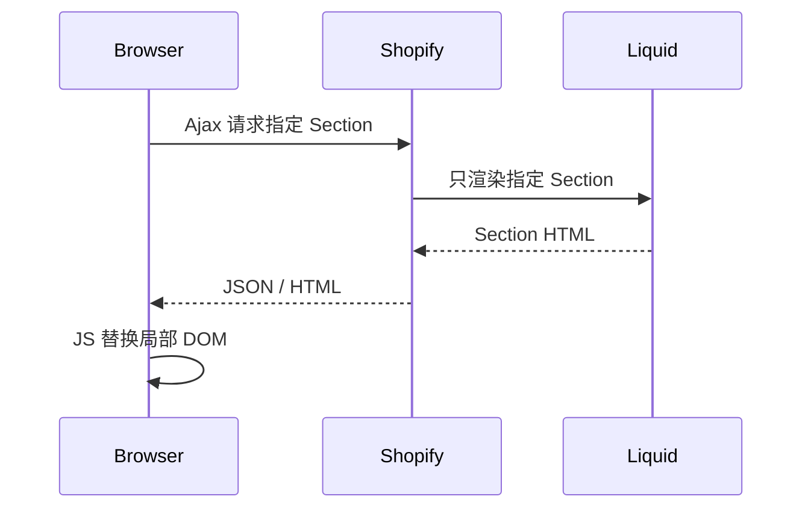
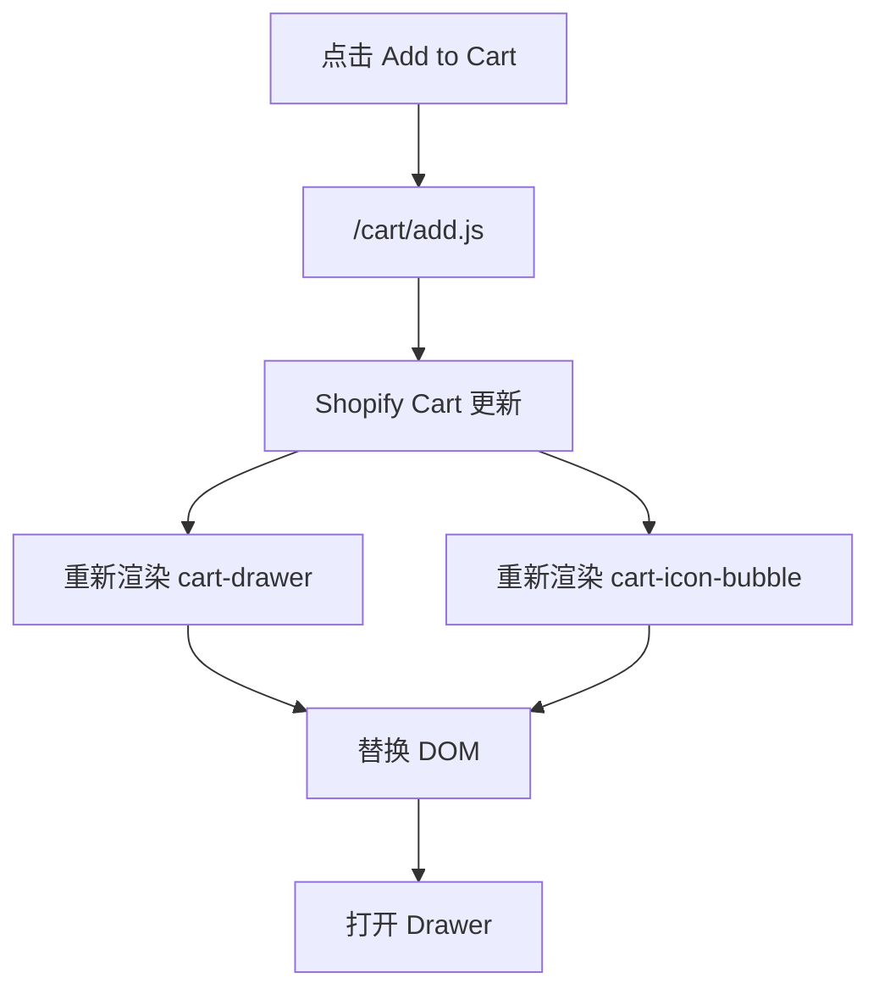

# 参考 6 Cart 与 Checkout 补充参考

> **本课目标：** 按需查询属性、接口和原始案例。


本课 建议始终带着一个问题阅读：**当前代码操作的是 Variant、Cart line，还是 Order line？** 名称看起来都和“商品”有关，但它们处于完全不同的生命周期。


## Theme 中两种典型加购方式

### Product Form 中真正提交的 `id` 是 Variant ID

一个最小 Product Form：

```liquid



  <input type="hidden" name="id" value="{{ current_variant.id }}">
  <input type="number" name="quantity" value="1" min="1">
  <button type="submit" disabled>
    Add to cart
  </button>

```

重点不是记语法，而是理解：

```text
Product 页面
  ↓ 用户选 Option values
Variant
  ↓ variant.id
Product Form / Ajax Cart
  ↓
Cart line
```

官方 Product template 参考：[Product template overview](https://shopify.dev/docs/storefronts/themes/architecture/templates/product/overview)


### 方式一：Product Form

Shopify 提供标准 Product Form。

```liquid

  <input
    type="hidden"
    name="id"
    value="{{ product.selected_or_first_available_variant.id }}"
  >

  <input
    type="number"
    name="quantity"
    value="1"
    min="1"
  >

  <button type="submit">
    Add to cart
  </button>

```

Product Template 官方说明：商品页应该包含 Product Form、Variant Selector、Quantity、Accelerated Checkout、Line Item Properties 等。

官方： [Product template](https://shopify.dev/docs/storefronts/themes/architecture/templates/product/overview)

### 方式二：Ajax Cart API

适合：

```text
点击 Add to Cart
→ 页面不刷新
→ Cart Count 更新
→ Cart Drawer 打开
```

```js
await fetch(
  window.Shopify.routes.root + 'cart/add.js',
  {
    method: 'POST',
    headers: {
      'Content-Type': 'application/json'
    },
    body: JSON.stringify({
      items: [
        {
          id: variantId,
          quantity: 1
        }
      ]
    })
  }
);
```

这里 `id` 是 **Variant ID，不是 Product ID**。

官方： [Cart API reference](https://shopify.dev/docs/api/ajax/reference/cart)

---

## Cart Drawer 是 Shopify 数据，不是 Shopify 通用 UI

非常重要：

> **Cart 是 Shopify 商业数据；Cart Drawer 通常是 Theme 自己实现的 UI。**

传统 Liquid Theme 不存在一个所有主题通用的：

```text
<ShopifyCartDrawer />
```

典型文件：

```text
sections/
└── cart-drawer.liquid

snippets/
└── cart-item.liquid

assets/
├── cart-drawer.js
└── cart-drawer.css
```

职责：

| 能力 | 负责方 |
|---|---|
| Cart 数据 | Shopify |
| Add / Change / Update | Shopify Ajax Cart API |
| Drawer UI | Theme |
| Drawer CSS / 动画 | Theme |
| Drawer 打开关闭 | Theme JS |
| Cart HTML | Liquid / Sections |
| Checkout | Shopify |

---

## Cart API 全家桶

### Locale-aware URL

跨语言 / Markets 店铺不要习惯性硬编码 `/cart/add.js`。Theme JS 更推荐：

```js
const root = window.Shopify.routes.root;

fetch(root + 'cart/add.js', {
  method: 'POST',
  headers: {
    'Content-Type': 'application/json',
    Accept: 'application/json'
  },
  body: JSON.stringify({
    items: [{ id: variantId, quantity: 1 }]
  })
});
```

官方：[Ajax Cart API](https://shopify.dev/docs/api/ajax/reference/cart)


核心接口：

```text
GET  /cart.js
POST /cart/add.js
POST /cart/change.js
POST /cart/update.js
POST /cart/clear.js
```

官方： [Cart API reference](https://shopify.dev/docs/api/ajax/reference/cart)

### `GET /cart.js`

读取当前 Cart。

### `POST /cart/add.js`

添加一个或多个 Variants。

### `POST /cart/change.js`

适合修改**一个现有 Cart Line**。

删除实际上可以看成：

```text
quantity = 0
```

真实项目中识别 Line 时应优先考虑 **line item key**，因为同一个 Variant 在不同 properties 等条件下可能形成不同 Cart Lines；只用 Variant ID 可能产生歧义。

### `POST /cart/update.js`

更适合：

- 批量更新多个 Line。
- 更新 Cart Note。
- 更新 Cart Attributes。
- 某些 Cart 级别设置。

### `POST /cart/clear.js`

清空所有 Line Items。

---

## Cart Line ≠ Variant

### 为什么同一个 Variant 可能出现“不同的购买行”？

因为 Cart line 表示的是一次具体购买上下文，不只是 SKU：

```text
Variant 123 / Black M
├── Cart line A
│   quantity = 1
│   properties = { engraving: "Alice" }
│
└── Cart line B
    quantity = 1
    properties = { engraving: "Bob" }
```

因此修改某一条购物车记录时，很多实现会使用 Shopify 返回的 line key，而不是想当然地只按 Variant ID 操作。


```text
Variant
= 商品规格

Cart Line
= Variant 进入当前购物车后的一条购买记录
```

同一 Variant 可以因为不同 Line Item Properties 等形成不同 Line。

```text
Variant: T-Shirt / Black / M

Line A
quantity = 1
properties: Gift = No

Line B
quantity = 1
properties: Gift = Yes
```

所以：

```text
Variant ID ≠ Cart Line ID/Key
```

---

## Line Item Properties

它解决：

> 额外定制信息，但不需要生成独立 SKU。

例如：

```liquid
<input
  type="text"
  name="properties[Custom Text]"
>
```

Line Item 最终可以拥有：

```text
Variant: Black / M
Quantity: 1
Properties:
  Custom Text = HELLO
```

适合：

- 雕刻文字
- 礼物留言
- 定制姓名
- 用户提供的附加选择

这也解释了为什么“超过三个规格维度”的某些业务，不一定全部都应该设计成 Product Options。

---

## Section Rendering API 不会刷新整个页面


### 它不是 React Client Render

Section Rendering 的关键是：**HTML 仍然由 Shopify 服务器上的 Liquid 生成**。

例如加购时请求同时要求重新渲染购物车区域：

```js
const response = await fetch(window.Shopify.routes.root + 'cart/add.js', {
  method: 'POST',
  headers: {
    'Content-Type': 'application/json',
    Accept: 'application/json'
  },
  body: JSON.stringify({
    items: [{ id: variantId, quantity: 1 }],
    sections: ['cart-drawer', 'cart-icon-bubble']
  })
});

const result = await response.json();

document.querySelector('#cart-drawer').innerHTML =
  result.sections['cart-drawer'];
```

真实 Theme 通常会更谨慎地替换 Section wrapper、恢复事件/自定义元素状态并处理错误。这里的示例只用于解释架构。

官方：

- [Section Rendering API](https://shopify.dev/docs/api/ajax/section-rendering)
- [Use the Section Rendering API for dynamic updates](https://shopify.dev/docs/storefronts/themes/best-practices/performance/use-section-rendering-api)


你之前特别问过这一点。

Section Rendering 的过程是：



它 **不会强制整个页面 reload**。

官方： [Section Rendering API](https://shopify.dev/docs/api/ajax/section-rendering)

例如：

```text
Header          不动
Product Page    不动
Cart Drawer     更新
Cart Bubble     更新
Footer          不动
```

Cart API 还可以配合 **Bundled Section Rendering**，让加购/修改 Cart 与重新渲染 Sections 在同一请求中完成。

---

## Cart Drawer 的标准交互链



数量 `+/-`：

```text
点击 +
→ /cart/change.js
→ Cart 更新
→ Section Rendering
→ Drawer 更新
```

删除：

```text
quantity = 0
```

真实项目还要处理：

- Loading
- 连续点击防抖/禁用
- Error
- Sold out / inventory changes
- Empty cart state
- Focus management / Accessibility

---

## Add to Cart 与 Buy It Now

### Add to Cart

```text
Product
→ Variant
→ Cart
→ Cart Drawer / Cart Page
→ Checkout
```

### Buy It Now / Accelerated Checkout

更接近：

```text
当前购买意图
→ 快速进入 Checkout
```

Product Form 中可以使用：

```liquid
{{ form | payment_button }}
```

官方： [Product template - Accelerated checkout buttons](https://shopify.dev/docs/storefronts/themes/architecture/templates/product/overview)

具体按钮可能依据商店和买家环境显示 Buy it now / Shop Pay 等。

---

## Checkout 一般不需要 Theme 自己写

这是 Shopify 与“自己搭电商后端”最大的区别之一。

Theme 一般负责：

```text
Product UI
Variant Selector
Cart
Cart Drawer
Checkout Entry
```

Shopify Checkout 负责：

```text
地址
配送
税
折扣
支付
最终订单
```

如果是 Headless Storefront，当前模型也是：

```text
Storefront Cart
→ checkoutUrl
→ Shopify Web Checkout
```

Storefront API Cart： [Cart](https://shopify.dev/docs/api/storefront/latest/objects/Cart)

不要按照旧教程去构建已淘汰的老 Checkout API 流程。

---

---

## 使用提示

此页与主线对应课程存在概念交集；需要查具体接口时再使用，无需顺序重复阅读。

