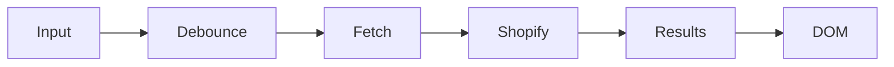

# 参考 10 Search API 补充参考

> **本课目标：** 按需查询属性、接口和原始案例。

## Search 的 Admin 与平台位置

Storefront 的完整搜索页面通常是 `/search?q=...`；搜索行为还可以受 Shopify **Search & Discovery** App 配置影响。

相关入口：

- `Apps → Search & Discovery`：过滤、搜索和推荐相关配置；
- Theme 的 `search` template：控制结果页 UI；
- Predictive Search API：实现输入即建议。

官方：

- [Storefront search](https://shopify.dev/docs/storefronts/themes/navigation-search/search)
- [Liquid `search` object](https://shopify.dev/docs/api/liquid/objects/search)
- [Predictive Search API](https://shopify.dev/docs/api/ajax/reference/predictive-search)


## Full Search

### `search.results` 不等于 Product[]

搜索结果可能包含多种资源，所以渲染时需要考虑 `object_type` / 资源类型语义，而不是默认每一条都有 `price`。

简化思路：

```liquid

  <p>{{ search.results_count }} results</p>

  
    
      
        
      
        <a href="{{ result.url }}">{{ result.title }}</a>
      
        <a href="{{ result.url }}">{{ result.title }}</a>
    
  

```

完整结果类型和字段以当前 [`search` object](https://shopify.dev/docs/api/liquid/objects/search) 为准。


URL：

```text
/search?q=shirt
```

Liquid：

```liquid
search.terms
search.results
search.results_count
search.performed
```

官方：

- [Storefront search](https://shopify.dev/docs/storefronts/themes/navigation-search/search)
- [Liquid search object](https://shopify.dev/docs/api/liquid/objects/search)

### 一个重要修正

完整 Search 的 `search.results` 当前主要是：

```text
article
page
product
```

不要把完整 Search 的结果集合与 Predictive Search 混为一谈。

---

## Predictive Search

### Theme 中最小请求结构

使用 locale-aware URL：

```js
const params = new URLSearchParams({
  q: query,
  'resources[type]': 'product,collection,page,article'
});

const url = `${window.Shopify.routes.root}search/suggest.json?${params}`;

const response = await fetch(url);
const data = await response.json();
```

Predictive Search 的目的不是替代完整 Search，而是降低输入成本：

```text
输入 “run”
 ↓
快速建议 Products / Collections / Queries ...
 ↓
用户点击建议
或 Enter 进入完整 Search
```

官方 UX 还强调键盘、关闭行为、mobile focus、empty state 等可访问性细节：
[Predictive search UX guidelines](https://shopify.dev/docs/storefronts/themes/navigation-search/search/predictive-search-ux)


Predictive Search 可以在用户输入时即时建议：

- Products
- Collections
- Queries
- Pages
- Articles

官方： [Add predictive search to your theme](https://shopify.dev/docs/storefronts/themes/navigation-search/search/predictive-search)

基本模型：



真实实现应考虑：

- Debounce
- AbortController
- Race Condition
- Loading
- Empty State
- Keyboard Navigation
- ARIA / Accessibility

---

## Race Condition

### 为什么要 AbortController？

用户连续输入：

```text
s
sh
sho
shoe
```

网络响应不保证按请求顺序回来。旧请求可能最后返回，反而覆盖新查询结果。

```js
let controller;

async function predictiveSearch(query) {
  controller?.abort();
  controller = new AbortController();

  const url = `${window.Shopify.routes.root}search/suggest.json?q=${encodeURIComponent(query)}`;

  const response = await fetch(url, {
    signal: controller.signal
  });

  return response.json();
}
```

Debounce 解决“请求太频繁”，AbortController 解决“旧请求还在飞”。它们解决的是两个不同问题。


例如用户快速输入：

```text
shirt
shoes
```

`shirt` 请求可能后返回，覆盖掉 `shoes` 的结果。

可以使用 `AbortController`：

```js
let controller;

async function search(query) {
  controller?.abort();
  controller = new AbortController();

  const response = await fetch(url, {
    signal: controller.signal
  });

  return response.json();
}
```

这不是 Shopify 特有问题，而是标准前端异步竞态问题。

---

---

## 使用提示

此页与主线对应课程存在概念交集；需要查具体接口时再使用，无需顺序重复阅读。

