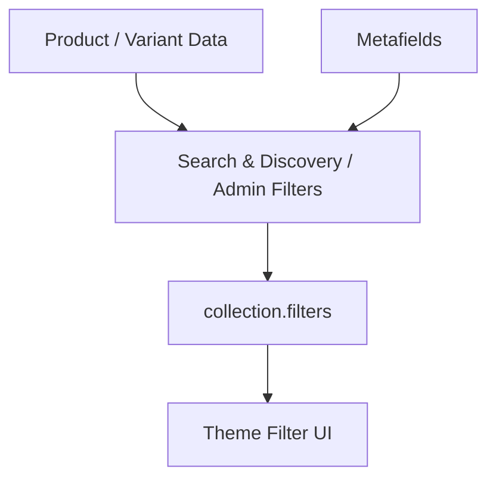

# 参考 11 Filter / Sort API 补充参考

> **本课目标：** 按需查询属性、接口和原始案例。


## Filter 的 Admin 配置位置

常见流程：

```text
Shopify Admin
  → Apps
  → Search & Discovery
  → Filters
  → Add filter
  → 选择 Source
```

官方 Help Center：[Adding filters with Shopify Search & Discovery](https://help.shopify.com/en/manual/online-store/storefront-search/search-and-discovery-filters)

Theme 负责读取 `collection.filters` / `search.filters` 并渲染；**Theme 不负责凭空定义商家有哪些 filter source**。


## Filter 从哪里来？

### 三层模型再展开一次

```text
第 1 层：商品数据
Price / Availability / Vendor / Product type / Option / Metafield
       ↓
第 2 层：Search & Discovery 配置
商家选择哪些 source 暴露成 storefront filter
       ↓
第 3 层：Theme
collection.filters → HTML controls → URL params
```

因此“我创建了 `custom.material`，为什么页面没出现 Material Filter？”的排查顺序是：

1. Product 是否真的填写了 metafield value？
2. Metafield type 是否适合过滤？
3. Search & Discovery 是否添加为 Filter？
4. Theme 是否支持/渲染 Storefront filtering？
5. 当前 Collection 的商品里是否存在相关值？


这是你追问后我们重点补全的一层。

`collection.filters` **不是 Theme 自己凭空定义的字段**。

完整链路：



官方：

- [Storefront filtering](https://shopify.dev/docs/storefronts/themes/navigation-search/filtering/storefront-filtering)
- [Support storefront filtering](https://shopify.dev/docs/storefronts/themes/navigation-search/filtering/storefront-filtering/support-storefront-filtering)

Shopify 当前支持基于：

- Availability
- Category
- Price
- Product Tags
- Product Type
- Vendor
- Variant Options
- Metafields

创建 Storefront Filters。

---

## 实例：Price / Color / Material / Origin

### 数据建模建议

| 筛选维度 | 优先数据源 | 原因 |
|---|---|---|
| Price | Shopify 原生 price | 天然是交易数据 |
| Availability | Shopify 原生 availability | 与 Variant 可售状态相关 |
| Color | Product Option / category metafield / metaobject based visual attribute | 如果 Color 决定 SKU，则应该是 Option；视觉色板可结合标准属性 |
| Size | Product Option | 通常决定 Variant |
| Material | Product/category Metafield | 通常是描述属性，不一定生成 SKU |
| Origin | Product Metafield | 通常是 Product 级属性 |

不要为了“想要一个 Filter”就反过来扭曲商品数据模型。**先建模，再决定是否把这个字段暴露为 Filter。**


推荐建模：

| Filter | 数据来源 |
|---|---|
| Price | Shopify 原生价格 |
| Color | Product Option / Category Metafield |
| Material | Product Metafield `custom.material` |
| Origin | Product Metafield `custom.origin` |

例如 Material：

```text
Settings
→ Custom data
→ Products
→ Add definition

custom.material
Type: Single line text
```

商品数据：

```text
Product A → Leather
Product B → Mesh
Product C → Cotton
```

再把它配置为 Storefront Filter。

Theme 最终通过：

```liquid

  {{ filter.label }}

```

读取。

结论：

> **Metafield 是数据；Storefront Filter 是基于这些数据创建出来的用户筛选能力。**

---

## Filter 的逻辑

### 官方默认逻辑与可配置 operator

Shopify Storefront filtering 的基础规则是：

```text
不同 filters：AND
同一 filter 的多个 values：通常 OR
```

例如：

```text
Color = Black OR White
AND
Size = M OR L
```

表示商品需要同时满足“颜色组”和“尺码组”。

但部分 filter 类型（例如 Product tags、某些 list metafields / metaobject reference lists）可以通过 Search & Discovery 配置 AND 行为。Liquid `filter.operator` 能反映相关逻辑。

所以不要把“同组永远 OR”写死成自己的前端业务规则；以 Shopify 返回的 Filter 数据和当前 Search & Discovery 配置为准。

### `filter` / `filter_value` 常用字段

| 对象 | 字段 | 含义 |
|---|---|---|
| `filter` | `label` | 展示名称 |
| `filter` | `type` | `list` / `price_range` / boolean 等语义 |
| `filter` | `values` | 可选 values |
| `filter` | `active_values` | 当前已选 values |
| `filter` | `param_name` | URL 参数名称（适用时） |
| `filter` | `url_to_remove` | 移除该 filter 的 URL |
| `filter_value` | `label` | value 展示文案 |
| `filter_value` | `value` | value 值 |
| `filter_value` | `count` | 该 value 对应结果数量 |
| `filter_value` | `active` | 是否已激活 |
| `filter_value` | `param_name` | 表单 input name |
| `filter_value` | `url_to_remove` | 移除该 value 的 URL |

官方：[Liquid `filter` object](https://shopify.dev/docs/api/liquid/objects/filter)

### 一个最小 List Filter 表单

```liquid
<form method="get">
  
    
      <fieldset>
        <legend>{{ filter.label | escape }}</legend>

        
          <label>
            <input
              type="checkbox"
              name="{{ value.param_name }}"
              value="{{ value.value }}"
              checked
              disabled
            >
            {{ value.label | escape }} ({{ value.count }})
          </label>
        
      </fieldset>
    
  

  <button type="submit">Apply</button>
</form>
```

生产实现还需要处理 `price_range`、保留 sort/query 参数、可访问性、移动端 drawer 等。

官方完整实现参考：
[Support storefront filtering](https://shopify.dev/docs/storefronts/themes/navigation-search/filtering/storefront-filtering/support-storefront-filtering)


当前 Storefront filtering 官方文档说明最多可以配置 **25 个 filters**。同时，不同 filter source 之间与同一 filter 内多个 values 的逻辑需要按具体 filter type / Search & Discovery 配置理解，不能把所有情况死记成一个固定 AND/OR 规则。

官方：[Storefront filtering](https://shopify.dev/docs/storefronts/themes/navigation-search/filtering/storefront-filtering)


通常：

```text
不同 Filter 之间 → AND
同一个 Filter 多值 → OR
```

例如：

```text
Color = Black
AND
Size = M
```

而：

```text
Color = Black OR White
```

官方： [Storefront filtering](https://shopify.dev/docs/storefronts/themes/navigation-search/filtering/storefront-filtering)

---

## Filter 会进入 URL

### 为什么 URL State 很重要？

URL 同时服务：

- 刷新后恢复状态；
- 浏览器前进/后退；
- 分享链接；
- 无 JS fallback；
- Shopify 服务器理解筛选条件；
- SEO/analytics 能看到页面状态。

因此不要只维护：

```js
const state = { color: 'black' };
```

却让地址栏永远停留在 `/collections/shoes`。对于 Shopify Theme，**URL 是筛选/排序/分页的重要公共状态容器**。


例如：

```text
/collections/shoes
?filter.v.option.color=black
&filter.v.option.size=M
```

为什么 URL 化很重要？

- 刷新后状态存在
- 可分享
- 浏览器 Back / Forward 正常
- Progressive Enhancement
- 服务端可理解当前查询状态

---

## Sort 与 Filter 完全不同

```text
Filter
= 哪些商品应该留下？

Sort
= 留下的这些商品按什么顺序排列？
```

例如：

```text
1000 products
→ Color=Black
→ 300
→ Material=Leather
→ 80
→ Price Low to High
→ 仍然 80，只是顺序改变
```

---

## Shopify 原生 Collection Sort

### 为什么用 `collection.sort_options` 比硬编码更稳？

Theme 最好根据 Shopify 给出的可用排序项渲染：

```liquid


<select data-sort-by>
  
    <option
      value="{{ option.value }}"
      selected
    >
      {{ option.name }}
    </option>
  
</select>
```

然后 JS 只操作 URL：

```js
document.querySelector('[data-sort-by]').addEventListener('change', (event) => {
  const url = new URL(window.location.href);
  url.searchParams.set('sort_by', event.target.value);
  url.searchParams.delete('page');
  window.location.href = url;
});
```

这样 Theme 不需要自己维护 Shopify 当前支持的完整排序文案列表。


常见原生排序包括：

- Manual / Featured
- Best Selling
- Title A-Z / Z-A
- Price Low-High / High-Low
- Created Old-New / New-Old

所以“最新上架”不需要自己创建字段，对应 `created-descending`。

Liquid 使用：

```liquid
collection.sort_options
collection.sort_by
collection.default_sort_by
```

官方对象： [collection](https://shopify.dev/docs/api/liquid/objects/collection)

---

## 为什么不能原生按 Rating 排序？

即使你有：

```text
custom.rating = 4.9
```

也不能直接：

```text
?sort_by=rating-descending
```

原因：

> Shopify 原生 Collection Sort 是固定排序键，不是“任意 Metafield Sort”。

因此：

```text
Metafield → Filter ✅
Metafield → 任意原生 Collection Sort ❌
```

想做 Rating / Recommendation Score / Margin 等排序，通常需要：

- App / 后端计算
- 预计算后维护 Collection `manual` 排序
- 自定义 Storefront / Headless 查询架构

---

## 普通 Page 中的一组商品能否使用 Shopify 原生 Sort？

核心边界：

> `sort_by` 是 Collection 查询/排序能力，不是对任意 Liquid Product 数组调用的通用排序函数。

例如 Landing Page 有 20 个活动商品，并且要支持：

```text
Newest
Best Selling
Price Low-High
```

推荐做法：

```text
Landing Page
→ 绑定一个 Collection
→ 使用 Collection 的原生排序能力
```

页面 URL 可以仍然是：

```text
/pages/summer-sale
```

数据来源使用一个 Collection。

如果是简单属性排序，Liquid 有 `sort` 一类能力，但它不等价于 Shopify 后端的 `best-selling` 等 Collection Sort。

---

## Pagination + Sort + Filter 是同一个 URL State

### 三条状态规则

| 用户动作 | Filter | Sort | Page |
|---|---|---|---|
| 改 Filter | 保留/修改 | 保留 | **删除，回第 1 页** |
| 改 Sort | 保留 | 修改 | **删除，回第 1 页** |
| 点 Page 3 | 保留 | 保留 | 改成 3 |

原因很简单：筛选或排序后，原来的 Page 5 很可能已经没有相同含义；而分页本身不应该丢掉用户已经选好的 Filter / Sort。


例如：

```text
/collections/shoes
?filter.v.option.color=black
&sort_by=price-ascending
&page=2
```

三者组成：

```text
Collection Page State
├── Filter
├── Sort
└── Page
```

规则建议：

```text
改变 Filter → reset page
改变 Sort   → reset page
改变 Page   → 保留 Filter 和 Sort
```

原因：改变筛选/排序后，原来的第 5 页已经不再代表同一个结果空间。

---

## AJAX 增强但保留 URL

### Progressive enhancement 版本流程

```text
用户改 Filter
 ↓
更新 URLSearchParams，删除 page
 ↓
请求当前 URL + sections=product-grid
 ↓
Shopify 根据新 URL 重新执行 Liquid
 ↓
返回 product grid + pagination HTML
 ↓
replace DOM
 ↓
history.pushState(newUrl)
```

这样同时获得：

- 无整页刷新体验；
- URL 可复制；
- Back/Forward 有意义；
- 服务器仍是 Product Grid 的渲染权威。


可以通过 Section Rendering：

```text
点击 Page 2
→ Fetch Shopify Section
→ 返回新的 Product Grid HTML
→ 替换局部 DOM
→ history.pushState 更新 URL
```

这样同时拥有：

- 无整页刷新体验
- 正确 URL
- Back/Forward
- Progressive Enhancement

官方： [Section Rendering API](https://shopify.dev/docs/api/ajax/section-rendering)

---

---

## 使用提示

此页与主线对应课程存在概念交集；需要查具体接口时再使用，无需顺序重复阅读。

