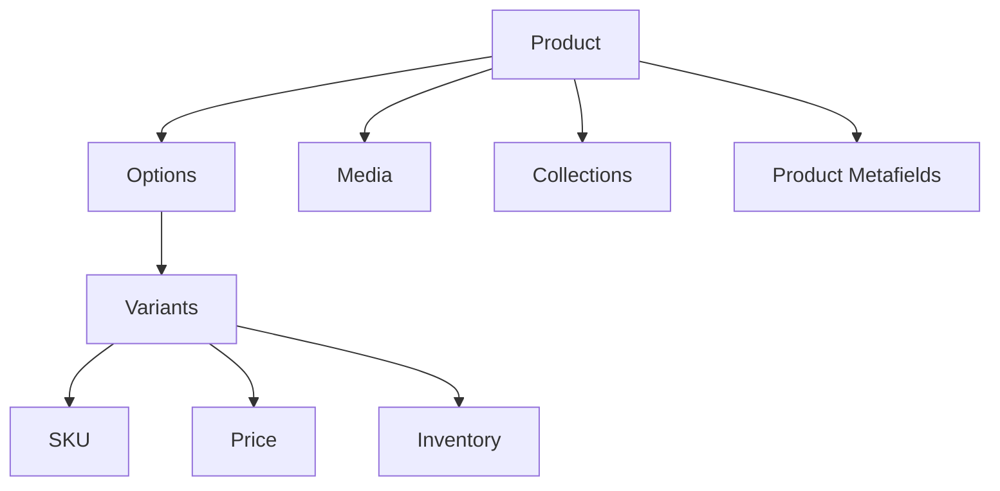
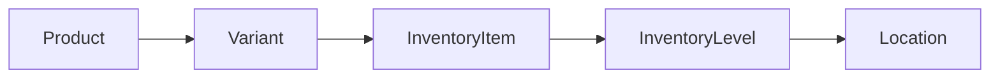
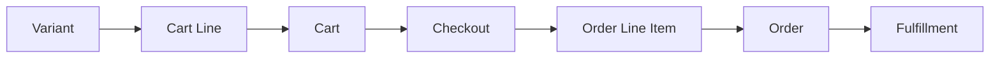

# 参考 14 商品与库存属性参考

> **本课目标：** 按需查询属性、接口和原始案例。

本课 建议把它当成“电商数据库建模课”。Theme 只是这些对象的一种消费端；App、Admin API、ERP、WMS、OMS 也都围绕同一批 Commerce resources 工作。


## Product / Variant 深入

### 从 Admin、Theme、API 三个视角看同一个 Product

| 视角 | 你看到什么 | 关注重点 |
|---|---|---|
| Shopify Admin | Products 页面 | 商家编辑商品、Variant、Media、Metafields |
| Liquid Theme | `product` / `variant` objects | Storefront 渲染和购买 UI |
| Admin GraphQL API | Product / ProductVariant resources | App 管理商品、同步外部系统 |

重要原则：**同一个业务概念在不同 API surface 上字段名和能力不一定一一相同。** 不要拿 Liquid object 的属性表去猜 Admin GraphQL 字段，反之亦然。

官方：

- [Liquid product](https://shopify.dev/docs/api/liquid/objects/product)
- [Liquid variant](https://shopify.dev/docs/api/liquid/objects/variant)
- [Admin GraphQL Product](https://shopify.dev/docs/api/admin-graphql/latest/objects/Product)
- [Admin GraphQL ProductVariant](https://shopify.dev/docs/api/admin-graphql/latest/objects/ProductVariant)


最核心的关系：



Product 是商品主体。

Variant 是真正交易单位。

最终加购：

```text
Variant ID + Quantity
```

而不是：

```text
Product ID + Quantity
```

官方：

- [Liquid product](https://shopify.dev/docs/api/liquid/objects/product)
- [Liquid variant](https://shopify.dev/docs/api/liquid/objects/variant)
- [Admin GraphQL Product](https://shopify.dev/docs/api/admin-graphql/latest/objects/product)

---

## Collection 数据模型

### Collection 自己也可以有 Metafields

例如营销团队希望每个 Collection Hero 都有：

```text
subtitle
hero_background
campaign_badge
seo_intro
```

这些不一定适合写死在 Theme settings，因为它们是“Collection 自己的数据”。可以定义 Collection owner 的 metafields：

```liquid
{{ collection.metafields.custom.subtitle.value }}
```

这个例子很好地说明了：**Theme setting 是主题配置；Metafield 是资源数据。**


Collection 是一个 Product 集合。

从业务思维可以区分：

```text
Manual Collection
→ 人工挑选商品

Automated / Smart Collection
→ 根据条件自动匹配商品
```

它解决的是：

> 哪些商品属于这一组？

Filter 则是在 Collection 结果里继续缩小。

```text
Store Catalog
→ Collection
→ Filters
→ Sort
→ Pagination
```

Liquid： [collection](https://shopify.dev/docs/api/liquid/objects/collection)

---

## Inventory / Location：库存不是简单挂在 Variant 上


## Inventory 在 Admin 哪里？

主要入口：

- `Products → Inventory`：查看/编辑各 Variant 的库存状态；
- `Products → 某 Product / Variant → Inventory`：查看单个商品库存；
- `Settings → Locations`：管理仓库、零售店、3PL / fulfillment location 等 Location。

官方 Help Center：

- [Viewing inventory](https://help.shopify.com/en/manual/products/inventory/adjusting-inventory/viewing-inventory)
- [Setting up inventory for the first time](https://help.shopify.com/en/manual/products/inventory/setup/initial-inventory-setup)
- [Setting up and managing locations](https://help.shopify.com/en/manual/fulfillment/setup/locations/setup)

开发文档：

- [Manage inventory quantities and states](https://shopify.dev/docs/apps/build/orders-fulfillment/inventory-management-apps/manage-quantities-states)


这是 Shopify 数据模型中非常重要的一条链：



### 库存链路中的 Variant

表示：

```text
Nike Air Max / Black / 9
```

### InventoryItem

InventoryItem 是 Variant 对应的库存管理对象。你可以把它理解成“这个 SKU 的库存身份”。

常见关注：

- 是否 tracking inventory；
- SKU / inventory-related metadata；
- 它在多个 Location 下对应的 InventoryLevel。

开发时，如果你要做 ERP/WMS 库存同步，脑内链路应该是：

```text
ProductVariant
   ↓ inventoryItem
InventoryItem
   ↓ inventoryLevels
InventoryLevel[]
```


是这个 Variant 对应的库存管理对象。

官方： [InventoryItem](https://shopify.dev/docs/api/admin-graphql/latest/objects/inventoryitem)

### InventoryLevel

InventoryLevel 连接：

```text
InventoryItem + Location
```

因此同一个 SKU 可以得到多条库存记录：

```text
TS-BLK-M @ LA Warehouse
TS-BLK-M @ NY Store
TS-BLK-M @ 3PL
```

它不是“一个商品有几个库存”的简单字段，而是**地点维度上的库存状态**。


把：

```text
InventoryItem + Location
```

连接起来，记录某地点的库存状态。

### Location

Location 可以代表：

- Warehouse；
- Retail store；
- Popup / physical location；
- 某些 fulfillment service / app 管理位置。

而且“这个 Location 有库存”不必然意味着“这个库存参与 Online Store 履约”。后台还存在 location fulfillment / routing 配置。

官方：[Setting up order fulfillment for locations](https://help.shopify.com/en/manual/fulfillment/setup/locations/fulfillment)


可以是：

- Warehouse
- Retail Store
- Fulfillment Center
- Popup
- Dropshipper

官方： [Location](https://shopify.dev/docs/api/admin-graphql/latest/queries/location)

---

## 多仓库存为什么需要 InventoryLevel？

### `available`、`on_hand`、`committed` 不应混成一个 stock

在现代 Shopify Inventory 中，你会看到多个 quantity state。常用理解：

| 状态 | 直觉解释 |
|---|---|
| `on_hand` | 物理上/系统账面现有库存 |
| `available` | 当前可继续分配给新销售的库存 |
| `committed` | 已经被订单等需求占用 |
| `incoming` | 正在到货/转移途中 |
| 其他 unavailable states | 可能包括 damaged、reserved、quality control、safety stock 等 |

真实数量关系和可售策略要以当前 Inventory API 规则为准，不建议自己写一个 `on_hand - committed = available` 就当成 Shopify 的完整算法。


例如同一 Variant：

```text
Black / 9
```

库存：

```text
San Jose      → 20
Los Angeles   → 15
New York      → 8
```

所以库存不是一个简单：

```text
inventory = 43
```

因为履约时必须知道库存在哪里。

---

## `available` ≠ 具体库存数量

### Theme 为什么通常只关心“可不可以卖”？

Storefront 的核心问题通常是：

```text
这个 Variant 现在能不能 Add to Cart？
```

所以 Theme 经常使用：

```liquid

  In stock

  Sold out

```

而 ERP/WMS 的问题是：

```text
LA warehouse on_hand 多少？
NY committed 多少？
3PL available 多少？
```

后者属于 Admin API / inventory integration 的职责。**不要强迫 Theme Liquid 承担后台库存系统的职责。**


Theme 中：

```liquid
variant.available
```

是可购买状态。

它不等于：

```text
库存数量 = 5
```

现代 Shopify Inventory 还存在多种状态，例如 available、on_hand、committed 等。

库存 App 官方概览： [Apps in inventory management](https://shopify.dev/docs/apps/build/orders-fulfillment/inventory-management-apps)

---

## Cart / Checkout / Order 数据生命周期

### Cart

**Admin 里通常没有一个等价于 Orders 的“Cart 列表让商家管理所有在线购物车”页面。** Cart 更像 Storefront 购物上下文；对于 Headless，Storefront API 也有独立 Cart 模型。

Theme 场景主要通过：

- Liquid `cart` object；
- Ajax Cart API；
- Product Form；
- Section Rendering API；

进行交互。
 在 Liquid 中常用什么？

官方：[Liquid `cart` object](https://shopify.dev/docs/api/liquid/objects/cart)

| 属性 | 含义 | 常见场景 |
|---|---|---|
| `cart.items` | Cart line items | Cart page / drawer |
| `cart.item_count` | 商品数量总计语义 | Cart badge |
| `cart.total_price` | 当前 Cart 总价 | Cart summary |
| `cart.original_total_price` | 折扣前等原始总价语义 | Discount UI |
| `cart.cart_level_discount_applications` | Cart-level discounts | 折扣说明 |
| `cart.note` | Cart note | 买家留言 |
| `cart.attributes` | Cart attributes | Cart-level 自定义上下文 |

> Cart 的 cost 仍然不是“永远等于最终 Order total”的保证；Checkout 还可能受到 shipping、tax、discount、market context 等影响。




### 生命周期中的 Cart

用户准备购买的商品集合。

Liquid： [cart](https://shopify.dev/docs/api/liquid/objects/cart)

Storefront API： [Cart](https://shopify.dev/docs/api/storefront/latest/objects/Cart)

### Checkout

Checkout 负责把购物意图变成交易，涉及：

```text
buyer / contact
shipping address
shipping / delivery options
discounts
税费
total
payment
```

对于标准 Shopify Theme，通常不是让你“自己写一个信用卡页面”，而是把买家导向 Shopify Checkout，并在 Shopify 允许的 extensibility surface 上扩展。


负责最终交易确认：

```text
Shipping
Tax
Discount
Payment
Buyer details
```

### Order

**Admin：** `Orders`。

订单形成后，商家可以在 Orders 页面管理付款、编辑订单、退款/退货以及 Fulfillment。

官方 Help Center：

- [Managing orders](https://help.shopify.com/en/manual/fulfillment/managing-orders)
- [Order management and fulfillment](https://help.shopify.com/en/manual/fulfillment)

开发文档：[Admin GraphQL Order](https://shopify.dev/docs/api/admin-graphql/latest/objects/Order)


用户完成 Checkout 后形成的正式购买结果。

官方： [Order - GraphQL Admin](https://shopify.dev/docs/api/admin-graphql/2026-01/objects/Order)

---

## Cart Line ≠ Order Line Item

### 为什么 Order Line Item 不能永远“回头读 Product 当前值”代替？

订单是一笔历史交易。假设下单后商家把 Product title 从：

```text
Classic T-Shirt
```

改成：

```text
Classic Cotton Tee 2027
```

历史订单仍需要保留成交时的商品上下文、价格、数量等订单数据。Order line item 是订单生命周期里的记录，不等于“实时 Product Card”。


生命周期不同：

```text
购物阶段
→ Cart Line

购买完成
→ Order Line Item
```

不要把 Cart 数据直接当成 Order 数据。

---

---

## 使用提示

此页与主线对应课程存在概念交集；需要查具体接口时再使用，无需顺序重复阅读。

